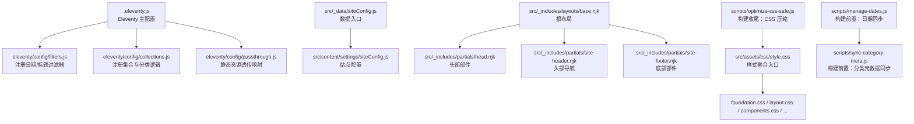
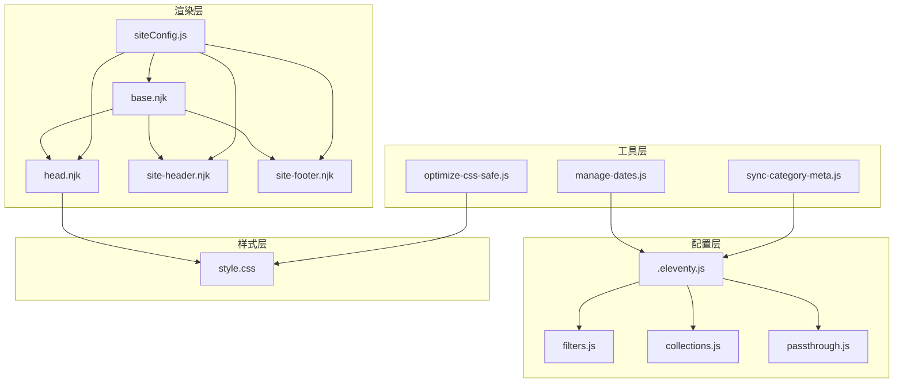
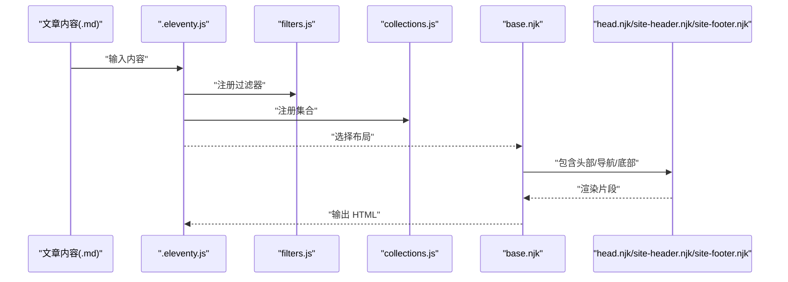
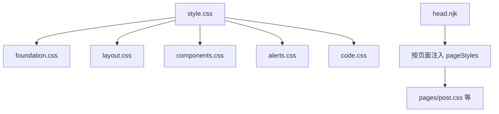
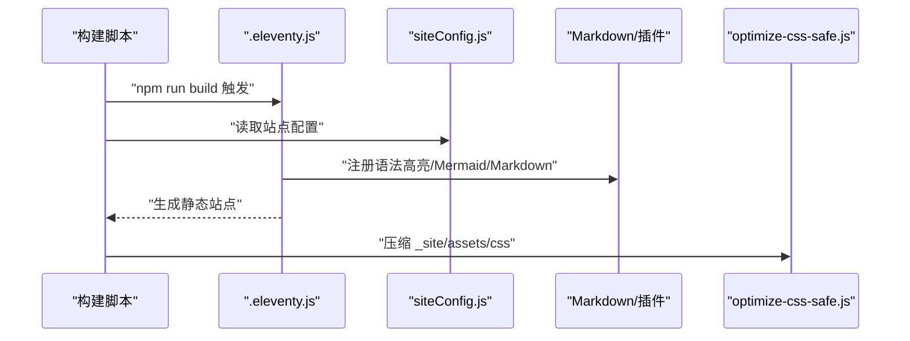
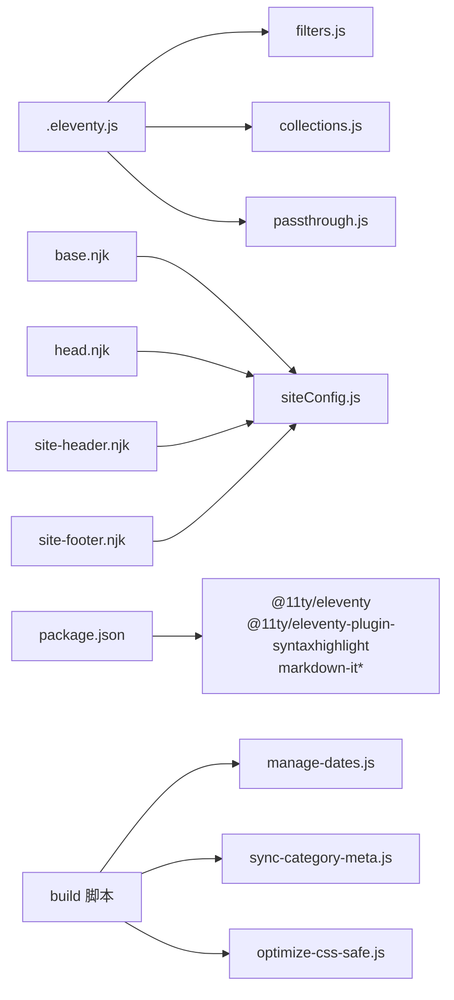

# 模块化设计

<cite>
**本文引用的文件**
- [.eleventy.js](file://.eleventy.js)
- [package.json](file://package.json)
- [eleventy/config/filters.js](file://eleventy/config/filters.js)
- [eleventy/config/collections.js](file://eleventy/config/collections.js)
- [eleventy/config/passthrough.js](file://eleventy/config/passthrough.js)
- [src/_data/siteConfig.js](file://src/_data/siteConfig.js)
- [src/content/settings/siteConfig.js](file://src/content/settings/siteConfig.js)
- [src/_includes/layouts/base.njk](file://src/_includes/layouts/base.njk)
- [src/_includes/partials/head.njk](file://src/_includes/partials/head.njk)
- [src/_includes/partials/site-header.njk](file://src/_includes/partials/site-header.njk)
- [src/_includes/partials/site-footer.njk](file://src/_includes/partials/site-footer.njk)
- [src/assets/css/style.css](file://src/assets/css/style.css)
- [scripts/optimize-css-safe.js](file://scripts/optimize-css-safe.js)
- [scripts/sync-category-meta.js](file://scripts/sync-category-meta.js)
- [scripts/manage-dates.js](file://scripts/manage-dates.js)
</cite>

## 目录
1. [引言](#引言)
2. [项目结构](#项目结构)
3. [核心组件](#核心组件)
4. [架构总览](#架构总览)
5. [详细组件分析](#详细组件分析)
6. [依赖分析](#依赖分析)
7. [性能考量](#性能考量)
8. [故障排查指南](#故障排查指南)
9. [结论](#结论)
10. [附录](#附录)

## 引言
本文件针对 11ty RainyNight 项目的模块化设计进行系统性梳理，围绕“模板模块化、样式模块化、功能模块化”三大原则展开，结合 Eleventy 配置、Nunjucks 模板、CSS 分层与构建脚本，阐明模块边界、职责划分与交互方式，并给出模块依赖图与接口设计说明，帮助读者高效理解与扩展该项目。

## 项目结构
项目采用以功能域为中心的目录组织方式：
- Eleventy 配置模块：eleventy/config 下按职责拆分过滤器、集合、透传路径等
- 数据与配置：src/_data 与 src/content/settings 提供全局配置与数据
- 模板系统：src/_includes 下按布局与部件组织
- 样式系统：src/assets/css 按层次与页面维度拆分
- 构建与工具：scripts 目录封装构建期任务（日期同步、分类元数据同步、CSS 压缩）

图表来源
- [.eleventy.js:12-153](file://.eleventy.js#L12-L153)
- [eleventy/config/filters.js:7-46](file://eleventy/config/filters.js#L7-L46)
- [eleventy/config/collections.js:219-371](file://eleventy/config/collections.js#L219-L371)
- [eleventy/config/passthrough.js:1-7](file://eleventy/config/passthrough.js#L1-L7)
- [src/_data/siteConfig.js:1-2](file://src/_data/siteConfig.js#L1-L2)
- [src/content/settings/siteConfig.js:1-168](file://src/content/settings/siteConfig.js#L1-L168)
- [src/_includes/layouts/base.njk:1-20](file://src/_includes/layouts/base.njk#L1-L20)
- [src/_includes/partials/head.njk:1-27](file://src/_includes/partials/head.njk#L1-L27)
- [src/_includes/partials/site-header.njk:1-44](file://src/_includes/partials/site-header.njk#L1-L44)
- [src/_includes/partials/site-footer.njk:1-13](file://src/_includes/partials/site-footer.njk#L1-L13)
- [src/assets/css/style.css:1-6](file://src/assets/css/style.css#L1-L6)
- [scripts/manage-dates.js:1-85](file://scripts/manage-dates.js#L1-L85)
- [scripts/sync-category-meta.js:36-205](file://scripts/sync-category-meta.js#L36-L205)
- [scripts/optimize-css-safe.js:82-112](file://scripts/optimize-css-safe.js#L82-L112)

章节来源
- [.eleventy.js:12-153](file://.eleventy.js#L12-L153)
- [package.json:6-16](file://package.json#L6-L16)

## 核心组件
- Eleventy 主配置与插件集成：注册语法高亮、Mermaid、Markdown 扩展库，设置输入输出目录与 includes/data 目录，注册过滤器、集合与透传路径
- 过滤器模块：提供日期格式化、标题拼接、编码等通用过滤器
- 集合模块：提供文章、分类树、分类详情分页、按文件夹分组等集合，支撑页面渲染与导航
- 模板模块：布局与部件（head、header、footer）通过 Nunjucks include 组织，形成可复用的页面骨架
- 样式模块：foundation/layout/components 等分层 CSS 与页面级样式按需引入，style.css 聚合
- 构建脚本模块：日期同步、分类元数据同步、CSS 压缩等独立脚本，通过 npm scripts 组织执行顺序

章节来源
- [.eleventy.js:21-28](file://.eleventy.js#L21-L28)
- [eleventy/config/filters.js:7-46](file://eleventy/config/filters.js#L7-L46)
- [eleventy/config/collections.js:219-371](file://eleventy/config/collections.js#L219-L371)
- [src/_includes/layouts/base.njk:1-20](file://src/_includes/layouts/base.njk#L1-L20)
- [src/assets/css/style.css:1-6](file://src/assets/css/style.css#L1-L6)
- [package.json:6-16](file://package.json#L6-L16)

## 架构总览
模块化架构遵循“配置即代码、职责单一、可组合”的原则：
- 配置层：.eleventy.js 作为装配中心，导入各模块并注册到 Eleventy
- 渲染层：模板与数据通过集合与过滤器生成最终 HTML
- 样式层：分层 CSS 与页面样式按需加载，head.njk 支持按页面注入额外样式
- 工具层：构建脚本独立运行，保证构建流程可控且可扩展

图表来源
- [.eleventy.js:12-153](file://.eleventy.js#L12-L153)
- [eleventy/config/filters.js:7-46](file://eleventy/config/filters.js#L7-L46)
- [eleventy/config/collections.js:219-371](file://eleventy/config/collections.js#L219-L371)
- [eleventy/config/passthrough.js:1-7](file://eleventy/config/passthrough.js#L1-L7)
- [src/_includes/layouts/base.njk:1-20](file://src/_includes/layouts/base.njk#L1-L20)
- [src/_includes/partials/head.njk:1-27](file://src/_includes/partials/head.njk#L1-L27)
- [src/_includes/partials/site-header.njk:1-44](file://src/_includes/partials/site-header.njk#L1-L44)
- [src/_includes/partials/site-footer.njk:1-13](file://src/_includes/partials/site-footer.njk#L1-L13)
- [src/assets/css/style.css:1-6](file://src/assets/css/style.css#L1-L6)
- [scripts/manage-dates.js:1-85](file://scripts/manage-dates.js#L1-L85)
- [scripts/sync-category-meta.js:36-205](file://scripts/sync-category-meta.js#L36-L205)
- [scripts/optimize-css-safe.js:82-112](file://scripts/optimize-css-safe.js#L82-L112)

## 详细组件分析

### 模板系统的模块化设计
- 布局组件：base.njk 作为根布局，统一引入 head、header、footer 与全局脚本，确保页面骨架一致
- 部分模板：head.njk 负责 SEO 元信息、字体与样式表引入；site-header.njk 与 site-footer.njk 提供可配置的导航与版权信息
- 自定义过滤器：filters.js 注册日期格式化、标题拼接、编码等过滤器，供模板中调用，提升可读性与一致性

图表来源
- [.eleventy.js:26-28](file://.eleventy.js#L26-L28)
- [eleventy/config/filters.js:7-46](file://eleventy/config/filters.js#L7-L46)
- [eleventy/config/collections.js:219-371](file://eleventy/config/collections.js#L219-L371)
- [src/_includes/layouts/base.njk:1-20](file://src/_includes/layouts/base.njk#L1-L20)
- [src/_includes/partials/head.njk:1-27](file://src/_includes/partials/head.njk#L1-L27)
- [src/_includes/partials/site-header.njk:1-44](file://src/_includes/partials/site-header.njk#L1-L44)
- [src/_includes/partials/site-footer.njk:1-13](file://src/_includes/partials/site-footer.njk#L1-L13)

章节来源
- [src/_includes/layouts/base.njk:1-20](file://src/_includes/layouts/base.njk#L1-L20)
- [src/_includes/partials/head.njk:1-27](file://src/_includes/partials/head.njk#L1-L27)
- [src/_includes/partials/site-header.njk:1-44](file://src/_includes/partials/site-header.njk#L1-L44)
- [src/_includes/partials/site-footer.njk:1-13](file://src/_includes/partials/site-footer.njk#L1-L13)
- [eleventy/config/filters.js:7-46](file://eleventy/config/filters.js#L7-L46)

### 样式系统的模块化结构
- 分层组织：foundation.css、layout.css、components.css 等分层文件各自负责基础、布局与组件，避免样式耦合
- 页面级样式：pages 子目录按页面维度拆分样式，head.njk 中通过 pageStyles 注入页面所需样式
- 聚合入口：style.css 使用 @import 聚合分层样式，便于开发期统一引入

图表来源
- [src/assets/css/style.css:1-6](file://src/assets/css/style.css#L1-L6)
- [src/_includes/partials/head.njk:22-26](file://src/_includes/partials/head.njk#L22-L26)

章节来源
- [src/assets/css/style.css:1-6](file://src/assets/css/style.css#L1-L6)
- [src/_includes/partials/head.njk:22-26](file://src/_includes/partials/head.njk#L22-L26)

### 功能模块的封装方式
- 构建脚本：manage-dates.js 在构建前自动补全/清理文章日期；sync-category-meta.js 同步分类与子分类元数据；optimize-css-safe.js 在构建收尾阶段压缩 CSS
- 配置文件：siteConfig.js 集中管理品牌、导航、页脚、元信息、主题与分页等配置，供模板与集合使用
- 插件系统：.eleventy.js 注册语法高亮、Mermaid、Markdown 扩展库，统一在主配置中装配

图表来源
- [package.json:6-16](file://package.json#L6-L16)
- [scripts/manage-dates.js:1-85](file://scripts/manage-dates.js#L1-L85)
- [scripts/sync-category-meta.js:36-205](file://scripts/sync-category-meta.js#L36-L205)
- [scripts/optimize-css-safe.js:82-112](file://scripts/optimize-css-safe.js#L82-L112)
- [.eleventy.js:21-28](file://.eleventy.js#L21-L28)
- [src/content/settings/siteConfig.js:1-168](file://src/content/settings/siteConfig.js#L1-L168)

章节来源
- [package.json:6-16](file://package.json#L6-L16)
- [scripts/manage-dates.js:1-85](file://scripts/manage-dates.js#L1-L85)
- [scripts/sync-category-meta.js:36-205](file://scripts/sync-category-meta.js#L36-L205)
- [scripts/optimize-css-safe.js:82-112](file://scripts/optimize-css-safe.js#L82-L112)
- [.eleventy.js:21-28](file://.eleventy.js#L21-L28)
- [src/content/settings/siteConfig.js:1-168](file://src/content/settings/siteConfig.js#L1-L168)

## 依赖分析
- 配置到模块：.eleventy.js 依赖 filters.js、collections.js、passthrough.js，形成装配链
- 模板到数据：base.njk 与各部件依赖 siteConfig.js 提供的全局配置
- 构建到工具：build 脚本顺序依赖 manage-dates.js 与 sync-category-meta.js 的前置执行，以及 optimize-css-safe.js 的收尾执行
- 外部依赖：Markdown 生态与 Eleventy 插件由 package.json 管理

图表来源
- [.eleventy.js:7-9](file://.eleventy.js#L7-L9)
- [eleventy/config/filters.js:1-3](file://eleventy/config/filters.js#L1-L3)
- [eleventy/config/collections.js:3](file://eleventy/config/collections.js#L3)
- [eleventy/config/passthrough.js:1-7](file://eleventy/config/passthrough.js#L1-L7)
- [src/_includes/layouts/base.njk:2](file://src/_includes/layouts/base.njk#L2)
- [src/_includes/partials/head.njk:3](file://src/_includes/partials/head.njk#L3)
- [src/_includes/partials/site-header.njk:3](file://src/_includes/partials/site-header.njk#L3)
- [src/_includes/partials/site-footer.njk:2](file://src/_includes/partials/site-footer.njk#L2)
- [src/_data/siteConfig.js:1](file://src/_data/siteConfig.js#L1)
- [package.json:22-33](file://package.json#L22-L33)
- [package.json:6-16](file://package.json#L6-L16)

章节来源
- [.eleventy.js:7-9](file://.eleventy.js#L7-L9)
- [package.json:22-33](file://package.json#L22-L33)
- [package.json:6-16](file://package.json#L6-L16)

## 性能考量
- 构建期优化：optimize-css-safe.js 对 _site 输出目录中的 CSS 进行安全压缩，减少体积并统计节省字节与百分比
- 内容更新策略：manage-dates.js 仅在显著修改时更新 updated 字段，避免冗余写入
- 分类元数据同步：sync-category-meta.js 仅在必要时增删子分类条目，保持描述文件最小变更

章节来源
- [scripts/optimize-css-safe.js:82-112](file://scripts/optimize-css-safe.js#L82-L112)
- [scripts/manage-dates.js:32-55](file://scripts/manage-dates.js#L32-L55)
- [scripts/sync-category-meta.js:160-188](file://scripts/sync-category-meta.js#L160-L188)

## 故障排查指南
- 文章命名规范：postValidator 集合要求文章文件名必须包含 @ 符号，否则抛出错误提示
- 文件权限与路径：构建脚本需确保目标目录存在，否则会输出相应日志或跳过处理
- Markdown 库配置：若渲染异常，检查 .eleventy.js 中的 markdown-it 配置与插件启用状态

章节来源
- [.eleventy.js:30-46](file://.eleventy.js#L30-L46)
- [scripts/optimize-css-safe.js:82-87](file://scripts/optimize-css-safe.js#L82-L87)
- [.eleventy.js:133-143](file://.eleventy.js#L133-L143)

## 结论
RainyNight 项目通过清晰的模块边界与职责分离，实现了模板、样式与功能的高内聚低耦合。Eleventy 主配置作为装配中心，将过滤器、集合与透传路径统一注册；模板与数据通过配置驱动，保证一致性；构建脚本以独立模块形式参与流程，既可扩展又易维护。该模块化设计有效提升了可维护性与可扩展性，便于后续按需新增页面类型、样式层级或构建任务。

## 附录
- 接口与职责概览
  - 过滤器模块：提供日期、标题、编码等过滤器，供模板调用
  - 集合模块：提供文章、分类树、分页等集合，支撑页面渲染
  - 模板模块：布局与部件通过 include 组织，head.njk 支持按页面注入样式
  - 样式模块：分层 CSS 与页面样式聚合，head.njk 动态注入
  - 构建脚本：日期同步、分类元数据同步、CSS 压缩，通过 npm scripts 组织执行顺序

章节来源
- [eleventy/config/filters.js:7-46](file://eleventy/config/filters.js#L7-L46)
- [eleventy/config/collections.js:219-371](file://eleventy/config/collections.js#L219-L371)
- [src/_includes/layouts/base.njk:1-20](file://src/_includes/layouts/base.njk#L1-L20)
- [src/_includes/partials/head.njk:22-26](file://src/_includes/partials/head.njk#L22-L26)
- [src/assets/css/style.css:1-6](file://src/assets/css/style.css#L1-L6)
- [package.json:6-16](file://package.json#L6-L16)