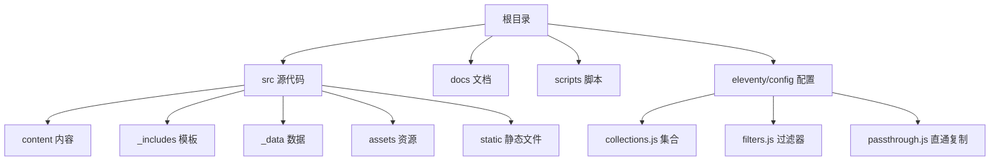
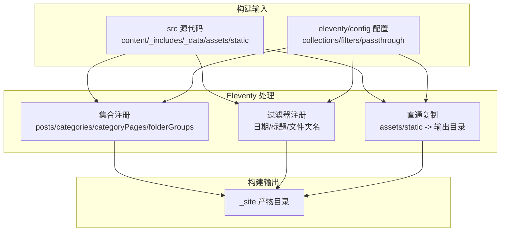
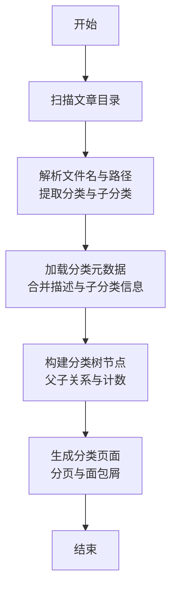
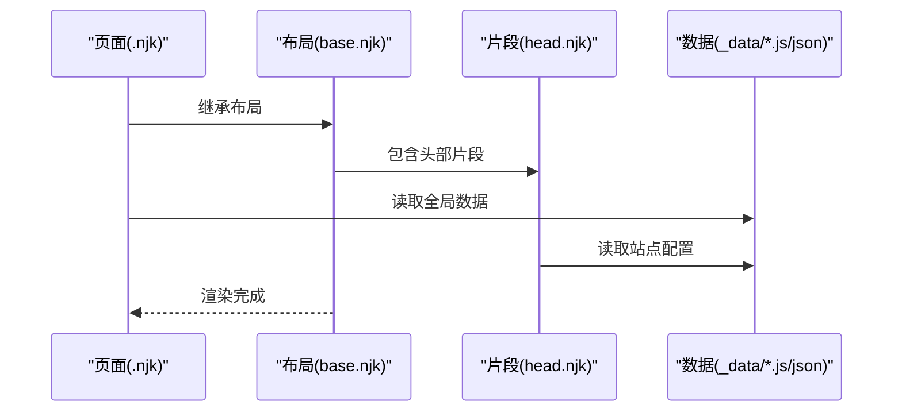
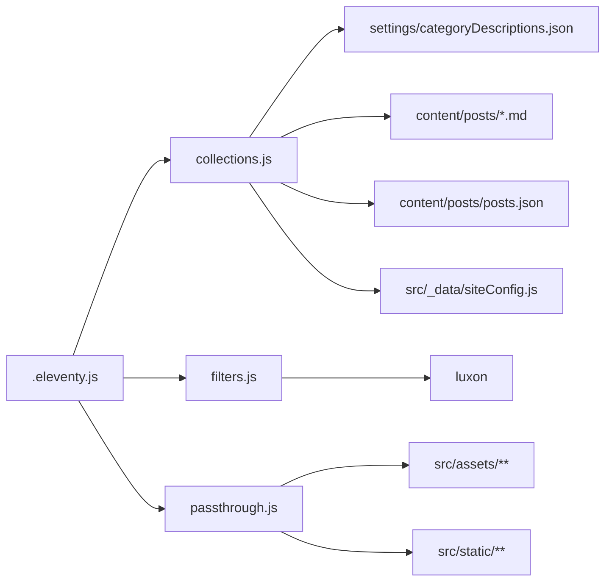

# 目录结构设计

<cite>
**本文档引用的文件**
- [.eleventy.js](file://.eleventy.js)
- [package.json](file://package.json)
- [eleventy/config/collections.js](file://eleventy/config/collections.js)
- [eleventy/config/filters.js](file://eleventy/config/filters.js)
- [eleventy/config/passthrough.js](file://eleventy/config/passthrough.js)
- [src/_data/siteConfig.js](file://src/_data/siteConfig.js)
- [src/_data/moments.json](file://src/_data/moments.json)
- [src/_includes/layouts/base.njk](file://src/_includes/layouts/base.njk)
- [src/_includes/partials/head.njk](file://src/_includes/partials/head.njk)
- [src/content/settings/categoryDescriptions.json](file://src/content/settings/categoryDescriptions.json)
- [src/content/posts/posts.json](file://src/content/posts/posts.json)
- [src/assets/js/main.js](file://src/assets/js/main.js)
- [src/static/robots.txt](file://src/static/robots.txt)
- [src/content/pages/index.njk](file://src/content/pages/index.njk)
- [scripts/sync-category-meta.js](file://scripts/sync-category-meta.js)
</cite>

## 目录

1. [引言](#引言)
2. [项目结构概览](#项目结构概览)
3. [核心目录职责与设计原则](#核心目录职责与设计原则)
4. [架构总览](#架构总览)
5. [详细组件分析](#详细组件分析)
6. [依赖关系分析](#依赖关系分析)
7. [性能考量](#性能考量)
8. [故障排查指南](#故障排查指南)
9. [结论](#结论)
10. [附录](#附录)

## 引言

本文件面向11ty RainyNight项目的维护者与贡献者，系统化阐述项目的目录结构设计与组织原则，解释各顶级目录的职责边界、命名约定与数据流向，并给出可扩展性与维护性的实践建议。通过结合Eleventy配置、集合（collections）与过滤器（filters）的实现，帮助读者快速理解“如何在RainyNight中新增页面、文章、样式与脚本”，并确保后续演进的一致性与可维护性。

## 项目结构概览

项目采用“按职责分层”的目录组织方式，核心目录包括：

- src：核心源代码目录，包含内容、模板、数据、静态资源与样式
- docs：项目文档
- scripts：构建与维护脚本
- eleventy/config：Eleventy配置与扩展

图表来源
- [.eleventy.js:172-179](file://.eleventy.js#L172-L179)
- [eleventy/config/collections.js:219-371](file://eleventy/config/collections.js#L219-L371)
- [eleventy/config/filters.js:1-43](file://eleventy/config/filters.js#L1-L43)
- [eleventy/config/passthrough.js:1-7](file://eleventy/config/passthrough.js#L1-L7)

章节来源
- [.eleventy.js:172-179](file://.eleventy.js#L172-L179)
- [package.json:6-17](file://package.json#L6-L17)

## 核心目录职责与设计原则

### src 目录：核心源代码目录

src是Eleventy的输入根目录，负责承载所有需要被构建的内容与资源。其内部遵循“内容/模板/数据/资源”清晰分离的设计原则，便于维护与扩展。

- content：存放所有内容文件（页面与文章），采用语义化子目录组织（如 pages、posts），并辅以11tydata文件进行默认字段注入与全局数据共享。
- _includes：存放Nunjucks模板与布局，采用layouts与partials分层，统一站点结构与可复用片段。
- _data：存放全局数据文件（如站点配置、动态数据），供模板与集合读取。
- assets：存放构建产物（CSS/JS），按功能模块拆分，便于按需加载与版本化。
- static：存放无需处理的静态文件（如robots.txt），通过直通复制规则直接输出到根路径。

设计原则
- 分层清晰：内容、模板、数据、资源分离，降低耦合
- 命名约定：使用小写字母与连字符，避免大小写敏感问题
- 可扩展性：新增页面/文章只需遵循现有目录与命名约定
- 可维护性：通过11tydata与集合统一处理默认值与元数据

章节来源
- [.eleventy.js:172-179](file://.eleventy.js#L172-L179)
- [src/_data/siteConfig.js:1-2](file://src/_data/siteConfig.js#L1-L2)
- [src/_data/moments.json:1-123](file://src/_data/moments.json#L1-L123)
- [src/content/posts/posts.json:1-6](file://src/content/posts/posts.json#L1-L6)
- [src/_includes/layouts/base.njk:1-20](file://src/_includes/layouts/base.njk#L1-L20)
- [src/_includes/partials/head.njk:1-27](file://src/_includes/partials/head.njk#L1-L27)
- [src/static/robots.txt:1-2](file://src/static/robots.txt#L1-L2)

### docs 目录：项目文档

docs用于存放项目文档，建议采用Markdown格式，便于版本化与在线阅读。推荐按主题分层（如“使用指南”、“开发规范”、“部署说明”等），并与CI/CD流程结合，实现文档的自动生成与发布。

### scripts 目录：构建与维护脚本

scripts目录存放构建与维护脚本，涵盖清理、元数据同步、性能检查、CSS优化等任务。通过package.json中的npm脚本统一调度，保证构建流程的可重复性与可审计性。

- clean-site.js：清理构建输出目录
- sync-category-meta.js：扫描文章目录，同步分类与子分类元数据至设置文件
- perf-self-check.js：性能自检
- optimize-css-safe.js：CSS安全优化
- manage-dates.js：日期更新工具

章节来源
- [package.json:6-17](file://package.json#L6-L17)
- [scripts/sync-category-meta.js:1-205](file://scripts/sync-category-meta.js#L1-L205)

### eleventy/config 目录：Eleventy配置文件

eleventy/config目录集中存放Eleventy的配置与扩展逻辑，包括集合注册、过滤器注册、直通复制规则等，确保构建行为的一致性与可配置性。

- collections.js：定义集合（如posts、categories、categoryPages、folderGroups），并处理分类树与分页
- filters.js：注册日期与标题格式化等过滤器
- passthrough.js：定义静态资源直通复制映射

章节来源
- [.eleventy.js:9-11](file://.eleventy.js#L9-L11)
- [eleventy/config/collections.js:219-371](file://eleventy/config/collections.js#L219-L371)
- [eleventy/config/filters.js:1-43](file://eleventy/config/filters.js#L1-L43)
- [eleventy/config/passthrough.js:1-7](file://eleventy/config/passthrough.js#L1-L7)

## 架构总览

下图展示了从源码到构建产物的关键流程：Eleventy读取src目录，应用集合与过滤器，结合直通复制规则输出到_site目录；同时通过脚本完成元数据同步与性能优化。

图表来源
- [.eleventy.js:36-181](file://.eleventy.js#L36-L181)
- [eleventy/config/collections.js:219-371](file://eleventy/config/collections.js#L219-L371)
- [eleventy/config/filters.js:6-30](file://eleventy/config/filters.js#L6-L30)
- [eleventy/config/passthrough.js:1-7](file://eleventy/config/passthrough.js#L1-L7)

## 详细组件分析

### Eleventy 配置与目录映射

- 输入/输出/包含/数据目录在根配置中统一声明，确保Eleventy按约定解析src下的内容与模板。
- 集合与过滤器在配置文件中注册，实现跨页面的数据一致性与模板复用。
- 直通复制规则将assets与static目录直接映射到输出根路径，简化资源引用。

章节来源
- [.eleventy.js:172-179](file://.eleventy.js#L172-L179)
- [.eleventy.js:47-54](file://.eleventy.js#L47-L54)
- [eleventy/config/passthrough.js:1-7](file://eleventy/config/passthrough.js#L1-L7)

### 集合与分类系统

集合系统负责从文章目录中提取数据，构建分类树、分页与面包屑，并支持子分类描述与排序规则。核心要点如下：

- 文章目录扫描与分类提取：根据文章路径推导分类层级，支持多级分类与子分类。
- 元数据同步：通过脚本扫描文章，同步分类与子分类描述至设置文件，避免硬编码。
- 分类页面生成：按分页大小生成分类页面，支持多级面包屑与子分类列表。
- 排序规则：优先按自定义排序字段，其次按日期，最后按标题本地化排序。

图表来源
- [eleventy/config/collections.js:31-40](file://eleventy/config/collections.js#L31-L40)
- [eleventy/config/collections.js:145-217](file://eleventy/config/collections.js#L145-L217)
- [eleventy/config/collections.js:253-316](file://eleventy/config/collections.js#L253-L316)
- [scripts/sync-category-meta.js:36-205](file://scripts/sync-category-meta.js#L36-L205)

章节来源
- [eleventy/config/collections.js:219-371](file://eleventy/config/collections.js#L219-L371)
- [src/content/settings/categoryDescriptions.json:1-60](file://src/content/settings/categoryDescriptions.json#L1-L60)
- [scripts/sync-category-meta.js:1-205](file://scripts/sync-category-meta.js#L1-L205)

### 模板与数据流

- 布局与片段：base.njk作为根布局，head.njk注入通用元信息与样式，确保全站风格一致。
- 页面数据：index.njk等页面通过11tydata文件注入默认字段（如permalink、layout、bodyClass、pageStyles），减少重复配置。
- 动态数据：moments.json提供动态时间线数据，供页面渲染使用。

图表来源
- [src/_includes/layouts/base.njk:1-20](file://src/_includes/layouts/base.njk#L1-L20)
- [src/_includes/partials/head.njk:1-27](file://src/_includes/partials/head.njk#L1-L27)
- [src/_data/siteConfig.js:1-2](file://src/_data/siteConfig.js#L1-L2)
- [src/content/pages/index.njk:1-94](file://src/content/pages/index.njk#L1-L94)
- [src/content/posts/posts.json:1-6](file://src/content/posts/posts.json#L1-L6)

章节来源
- [src/_includes/layouts/base.njk:1-20](file://src/_includes/layouts/base.njk#L1-L20)
- [src/_includes/partials/head.njk:1-27](file://src/_includes/partials/head.njk#L1-L27)
- [src/_data/siteConfig.js:1-2](file://src/_data/siteConfig.js#L1-L2)
- [src/_data/moments.json:1-123](file://src/_data/moments.json#L1-L123)
- [src/content/posts/posts.json:1-6](file://src/content/posts/posts.json#L1-L6)

### 资源与脚本集成

- 资源加载：head.njk中按需引入基础样式与页面级样式数组，支持按页面动态注入。
- 主脚本：main.js提供文章交互（目录、回到顶部、脚注预览、图片灯箱等），通过DOM Ready与事件监听实现。
- 静态文件：robots.txt等无需处理的文件通过直通复制直接输出。

章节来源
- [src/_includes/partials/head.njk:22-26](file://src/_includes/partials/head.njk#L22-L26)
- [src/assets/js/main.js:1-800](file://src/assets/js/main.js#L1-L800)
- [src/static/robots.txt:1-2](file://src/static/robots.txt#L1-L2)

## 依赖关系分析

- Eleventy配置依赖集合与过滤器模块，后者进一步依赖站点配置与设置文件。
- 集合系统依赖文章目录结构与11tydata文件，通过文件名约定（标题@分类）解析元数据。
- 构建脚本与集合系统存在双向依赖：脚本负责同步分类元数据，集合负责消费这些元数据生成页面。
- 直通复制规则将assets与static目录映射到输出根路径，简化资源引用。

图表来源
- [.eleventy.js:36-181](file://.eleventy.js#L36-L181)
- [eleventy/config/collections.js:1-377](file://eleventy/config/collections.js#L1-L377)
- [eleventy/config/filters.js:1-43](file://eleventy/config/filters.js#L1-L43)
- [eleventy/config/passthrough.js:1-7](file://eleventy/config/passthrough.js#L1-L7)
- [src/content/settings/categoryDescriptions.json:1-60](file://src/content/settings/categoryDescriptions.json#L1-L60)
- [src/content/posts/posts.json:1-6](file://src/content/posts/posts.json#L1-L6)
- [src/_data/siteConfig.js:1-2](file://src/_data/siteConfig.js#L1-L2)

章节来源
- [.eleventy.js:36-181](file://.eleventy.js#L36-L181)
- [eleventy/config/collections.js:1-377](file://eleventy/config/collections.js#L1-L377)
- [eleventy/config/filters.js:1-43](file://eleventy/config/filters.js#L1-L43)
- [eleventy/config/passthrough.js:1-7](file://eleventy/config/passthrough.js#L1-L7)

## 性能考量

- 资源直通复制：通过直通复制避免不必要的处理开销，提高构建速度。
- 按需样式：页面级样式数组仅在需要时加载，减少初始渲染负担。
- 脚本优化：构建流程中包含CSS优化与性能自检脚本，确保产物质量。
- 分类分页：合理设置分页大小，平衡加载性能与可浏览性。

## 故障排查指南

常见问题与定位思路
- 文章未生成或分类异常：检查文章文件名是否符合“标题@分类标识.md”格式，集合会基于此解析标题与子分类。
- 分类页面缺失或描述为空：运行元数据同步脚本，确保分类描述文件已生成并包含对应条目。
- 样式未生效：确认head片段中是否正确注入页面级样式数组，或检查直通复制规则是否覆盖目标路径。
- 构建失败：查看Eleventy配置中的集合与过滤器注册是否正确，必要时开启调试模式。

章节来源
- [.eleventy.js:56-72](file://.eleventy.js#L56-L72)
- [scripts/sync-category-meta.js:36-205](file://scripts/sync-category-meta.js#L36-L205)
- [src/_includes/partials/head.njk:22-26](file://src/_includes/partials/head.njk#L22-L26)

## 结论

RainyNight的目录结构以src为核心，围绕内容、模板、数据与资源进行清晰分层，配合Eleventy配置与脚本工具，实现了高可维护性与强扩展性。通过统一的命名约定与集合/过滤器机制，项目能够在不破坏整体结构的前提下持续演进。建议在新增功能时遵循既有约定，优先利用集合与过滤器抽象公共逻辑，减少重复配置与维护成本。

## 附录

### 目录职责分配表

- src/content：内容文件（页面与文章）
- src/_includes：模板与布局（layouts与partials）
- src/_data：全局数据（站点配置、动态数据）
- src/assets：构建产物（CSS/JS）
- src/static：静态文件（robots.txt等）
- docs：项目文档
- scripts：构建与维护脚本
- eleventy/config：Eleventy配置与扩展

章节来源
- [.eleventy.js:172-179](file://.eleventy.js#L172-L179)
- [package.json:6-17](file://package.json#L6-L17)