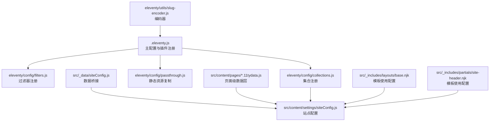
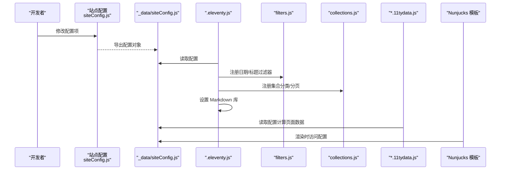
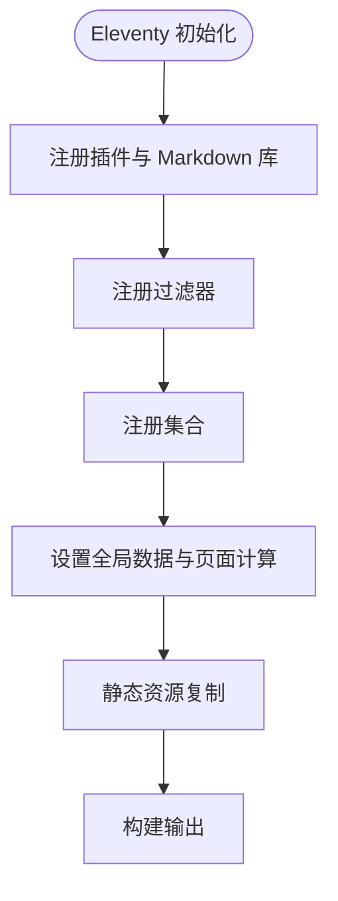
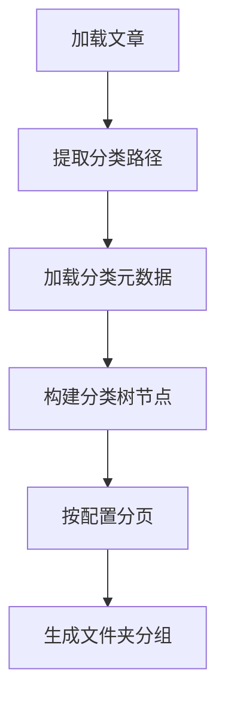
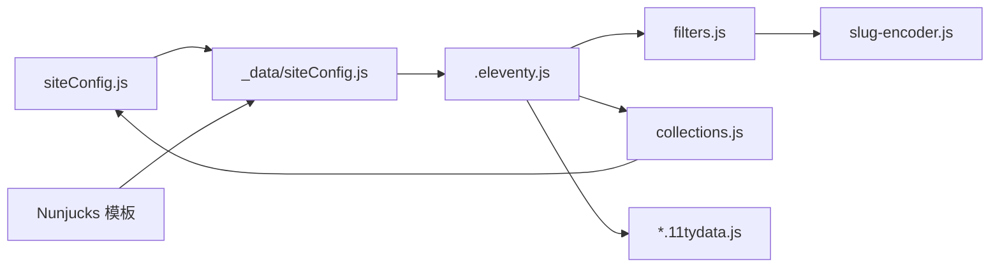

# 配置系统设计

<cite>
**本文档引用的文件**
- [.eleventy.js](file://.eleventy.js)
- [package.json](file://package.json)
- [src/_data/siteConfig.js](file://src/_data/siteConfig.js)
- [src/content/settings/siteConfig.js](file://src/content/settings/siteConfig.js)
- [src/content/settings/categoryDescriptions.json](file://src/content/settings/categoryDescriptions.json)
- [src/content/pages/archive.11tydata.js](file://src/content/pages/archive.11tydata.js)
- [src/content/pages/pages.11tydata.js](file://src/content/pages/pages.11tydata.js)
- [eleventy/config/collections.js](file://eleventy/config/collections.js)
- [eleventy/config/filters.js](file://eleventy/config/filters.js)
- [eleventy/config/passthrough.js](file://eleventy/config/passthrough.js)
- [eleventy/utils/slug-encoder.js](file://eleventy/utils/slug-encoder.js)
- [src/_includes/layouts/base.njk](file://src/_includes/layouts/base.njk)
- [src/_includes/partials/site-header.njk](file://src/_includes/partials/site-header.njk)
</cite>

## 目录
1. [简介](#简介)
2. [项目结构](#项目结构)
3. [核心组件](#核心组件)
4. [架构概览](#架构概览)
5. [详细组件分析](#详细组件分析)
6. [依赖关系分析](#依赖关系分析)
7. [性能考量](#性能考量)
8. [故障排查指南](#故障排查指南)
9. [结论](#结论)
10. [附录](#附录)

## 简介
本设计文档围绕 11ty RainyNight 项目的配置系统展开，系统采用“配置驱动”的架构模式，通过集中式配置文件控制站点行为与外观，并以 Eleventy 的插件、过滤器、集合与全局数据机制实现可扩展与可定制化。文档重点解析以下方面：
- 配置文件的层次结构与优先级规则
- siteConfig.js 的配置项设计与使用方式
- Eleventy 配置文件的组织方式与注册流程
- 配置对构建过程的影响与注意事项
- 配置项参考与使用示例

## 项目结构
配置系统主要分布在以下位置：
- 站点级配置：src/content/settings/siteConfig.js
- 数据桥接：src/_data/siteConfig.js（导出实际配置）
- Eleventy 主配置：.eleventy.js
- 集合与过滤器配置：eleventy/config/collections.js、eleventy/config/filters.js、eleventy/config/passthrough.js
- 页面级数据层：src/content/pages/*.11tydata.js
- 工具与编码器：eleventy/utils/slug-encoder.js
- 模板中使用配置：src/_includes/layouts/base.njk、src/_includes/partials/site-header.njk

图表来源
- [.eleventy.js:37-187](file://.eleventy.js#L37-L187)
- [src/_data/siteConfig.js:1-2](file://src/_data/siteConfig.js#L1-L2)
- [src/content/settings/siteConfig.js:1-168](file://src/content/settings/siteConfig.js#L1-L168)
- [eleventy/config/collections.js:219-371](file://eleventy/config/collections.js#L219-L371)
- [eleventy/config/filters.js:7-48](file://eleventy/config/filters.js#L7-L48)
- [eleventy/config/passthrough.js:1-7](file://eleventy/config/passthrough.js#L1-L7)
- [src/content/pages/archive.11tydata.js:1-22](file://src/content/pages/archive.11tydata.js#L1-L22)
- [src/content/pages/pages.11tydata.js:1-31](file://src/content/pages/pages.11tydata.js#L1-L31)
- [eleventy/utils/slug-encoder.js:49-64](file://eleventy/utils/slug-encoder.js#L49-L64)
- [src/_includes/layouts/base.njk:1-20](file://src/_includes/layouts/base.njk#L1-L20)
- [src/_includes/partials/site-header.njk:1-44](file://src/_includes/partials/site-header.njk#L1-L44)

章节来源
- [.eleventy.js:37-187](file://.eleventy.js#L37-L187)
- [src/_data/siteConfig.js:1-2](file://src/_data/siteConfig.js#L1-L2)
- [src/content/settings/siteConfig.js:1-168](file://src/content/settings/siteConfig.js#L1-L168)
- [eleventy/config/collections.js:219-371](file://eleventy/config/collections.js#L219-L371)
- [eleventy/config/filters.js:7-48](file://eleventy/config/filters.js#L7-L48)
- [eleventy/config/passthrough.js:1-7](file://eleventy/config/passthrough.js#L1-L7)
- [src/content/pages/archive.11tydata.js:1-22](file://src/content/pages/archive.11tydata.js#L1-L22)
- [src/content/pages/pages.11tydata.js:1-31](file://src/content/pages/pages.11tydata.js#L1-L31)
- [eleventy/utils/slug-encoder.js:49-64](file://eleventy/utils/slug-encoder.js#L49-L64)
- [src/_includes/layouts/base.njk:1-20](file://src/_includes/layouts/base.njk#L1-L20)
- [src/_includes/partials/site-header.njk:1-44](file://src/_includes/partials/site-header.njk#L1-L44)

## 核心组件
- 站点配置中心：集中定义品牌、导航、页脚、元数据、主题、分页、页面文案等
- 数据桥接层：将配置导出为 _data，供模板与集合共享
- Eleventy 主配置：注册插件、过滤器、集合、全局数据与 Markdown 库
- 页面级数据层：基于配置计算页面标题、分页与永久链接
- 工具与编码器：提供 slug 编码等工具函数
- 模板层：在布局与部件中直接消费配置

章节来源
- [src/content/settings/siteConfig.js:1-168](file://src/content/settings/siteConfig.js#L1-L168)
- [src/_data/siteConfig.js:1-2](file://src/_data/siteConfig.js#L1-L2)
- [.eleventy.js:37-187](file://.eleventy.js#L37-L187)
- [src/content/pages/pages.11tydata.js:15-30](file://src/content/pages/pages.11tydata.js#L15-L30)
- [eleventy/utils/slug-encoder.js:49-64](file://eleventy/utils/slug-encoder.js#L49-L64)
- [src/_includes/layouts/base.njk:1-20](file://src/_includes/layouts/base.njk#L1-L20)
- [src/_includes/partials/site-header.njk:1-44](file://src/_includes/partials/site-header.njk#L1-L44)

## 架构概览
配置驱动的架构由“配置文件 → 数据桥接 → Eleventy 注册 → 模板消费”构成，形成高内聚、低耦合的可扩展体系。

图表来源
- [src/content/settings/siteConfig.js:1-168](file://src/content/settings/siteConfig.js#L1-L168)
- [src/_data/siteConfig.js:1-2](file://src/_data/siteConfig.js#L1-L2)
- [.eleventy.js:37-187](file://.eleventy.js#L37-L187)
- [eleventy/config/filters.js:7-48](file://eleventy/config/filters.js#L7-L48)
- [eleventy/config/collections.js:219-371](file://eleventy/config/collections.js#L219-L371)
- [src/content/pages/pages.11tydata.js:15-30](file://src/content/pages/pages.11tydata.js#L15-L30)
- [src/_includes/layouts/base.njk:1-20](file://src/_includes/layouts/base.njk#L1-L20)

## 详细组件分析

### 站点配置（siteConfig.js）设计
- 结构化字段
  - brand：品牌标识与首页地址
  - navigation.main：主导航列表（文本、URL、图标）
  - footer：版权、标语与社交链接
  - meta：站点标题、描述、作者、邮箱、URL、语言
  - theme：默认主题（light）
  - pagination：各页面分页大小与分页标签
  - pages.*：首页、归档、分类、服务页等文案与结构
- 设计要点
  - 集中式文案管理，便于多语言迁移与统一维护
  - 分页参数与页面标题路径映射，确保一致性
  - 与集合、过滤器、模板的松耦合，通过数据桥接共享

章节来源
- [src/content/settings/siteConfig.js:1-168](file://src/content/settings/siteConfig.js#L1-L168)

### 数据桥接（src/_data/siteConfig.js）
- 作用：将 src/content/settings/siteConfig.js 的配置导出为 _data，供模板与 Eleventy 全局数据共享
- 影响：所有模板与集合可通过全局数据访问配置对象

章节来源
- [src/_data/siteConfig.js:1-2](file://src/_data/siteConfig.js#L1-L2)

### Eleventy 主配置（.eleventy.js）
- 插件注册
  - 语法高亮、Mermaid 图表插件
  - 自定义 Markdown 库（启用 HTML、换行、链接识别，附加脚注与 GitHub Alerts）
- 过滤器注册
  - 日期格式化、标题格式化、slug 编码
- 集合注册
  - 文章集合、分类树、分类分页、文件夹分组等
- 全局数据与页面计算
  - 自动生成文章标题、子分类、布局、永久链接、发布时间、更新时间、标签、页面样式等
  - 校验文章文件命名格式（必须包含 @ 符号）
- 目录结构
  - input: src，output: _site，includes: _includes，data: _data

图表来源
- [.eleventy.js:37-187](file://.eleventy.js#L37-L187)

章节来源
- [.eleventy.js:37-187](file://.eleventy.js#L37-L187)

### 集合配置（eleventy/config/collections.js）
- 功能
  - 从内容目录提取文章，按分类与子分类构建树形节点
  - 加载分类元数据（categoryDescriptions.json），支持顶级分类与子分类描述
  - 基于配置的分页大小生成分类分页
  - 提供文件夹分组视图，汇总每个文件夹下的分类与文章数量
- 关键点
  - 依赖站点配置中的分页参数
  - 通过全局数据计算文章排序与分页 URL

图表来源
- [eleventy/config/collections.js:219-371](file://eleventy/config/collections.js#L219-L371)
- [src/content/settings/categoryDescriptions.json:1-60](file://src/content/settings/categoryDescriptions.json#L1-L60)

章节来源
- [eleventy/config/collections.js:219-371](file://eleventy/config/collections.js#L219-L371)
- [src/content/settings/categoryDescriptions.json:1-60](file://src/content/settings/categoryDescriptions.json#L1-L60)

### 过滤器配置（eleventy/config/filters.js）
- 日期过滤器：可读日期、HTML 日期、年份、归档月份与标签
- 标题过滤器：格式化标题（避免重复）、编码 slug
- 依赖：slug 编码器、集合工具函数

章节来源
- [eleventy/config/filters.js:7-48](file://eleventy/config/filters.js#L7-L48)
- [eleventy/utils/slug-encoder.js:49-64](file://eleventy/utils/slug-encoder.js#L49-L64)

### 页面级数据层（*.11tydata.js）
- archive.11tydata.js：基于配置计算归档分页大小与永久链接
- pages.11tydata.js：根据 slug 映射从配置读取页面标题，回退到默认标题

章节来源
- [src/content/pages/archive.11tydata.js:1-22](file://src/content/pages/archive.11tydata.js#L1-L22)
- [src/content/pages/pages.11tydata.js:1-31](file://src/content/pages/pages.11tydata.js#L1-L31)

### 模板中的配置使用
- 布局：base.njk 使用 siteConfig.meta.lang 设置语言属性
- 导航：site-header.njk 使用 siteConfig.navigation.main 渲染主导航，包含品牌、分类、服务等链接

章节来源
- [src/_includes/layouts/base.njk:1-20](file://src/_includes/layouts/base.njk#L1-L20)
- [src/_includes/partials/site-header.njk:1-44](file://src/_includes/partials/site-header.njk#L1-L44)

## 依赖关系分析
- 配置依赖链
  - 站点配置 → 数据桥接 → Eleventy 全局数据 → 模板与集合
  - 页面级数据层 → 站点配置
  - 集合 → 站点配置（分页参数）
  - 过滤器 → 工具函数（slug 编码）
- 外部依赖
  - Eleventy 插件：语法高亮、Mermaid
  - Markdown-it 生态：脚注、GitHub Alerts
  - Luxon（日期处理）
  - Gray-matter（front matter 解析）

图表来源
- [src/content/settings/siteConfig.js:1-168](file://src/content/settings/siteConfig.js#L1-L168)
- [src/_data/siteConfig.js:1-2](file://src/_data/siteConfig.js#L1-L2)
- [.eleventy.js:37-187](file://.eleventy.js#L37-L187)
- [eleventy/config/filters.js:7-48](file://eleventy/config/filters.js#L7-L48)
- [eleventy/config/collections.js:219-371](file://eleventy/config/collections.js#L219-L371)
- [src/content/pages/*.11tydata.js:1-31](file://src/content/pages/pages.11tydata.js#L1-L31)
- [eleventy/utils/slug-encoder.js:49-64](file://eleventy/utils/slug-encoder.js#L49-L64)
- [src/_includes/layouts/base.njk:1-20](file://src/_includes/layouts/base.njk#L1-L20)
- [src/_includes/partials/site-header.njk:1-44](file://src/_includes/partials/site-header.njk#L1-L44)

章节来源
- [src/content/settings/siteConfig.js:1-168](file://src/content/settings/siteConfig.js#L1-L168)
- [src/_data/siteConfig.js:1-2](file://src/_data/siteConfig.js#L1-L2)
- [.eleventy.js:37-187](file://.eleventy.js#L37-L187)
- [eleventy/config/filters.js:7-48](file://eleventy/config/filters.js#L7-L48)
- [eleventy/config/collections.js:219-371](file://eleventy/config/collections.js#L219-L371)
- [src/content/pages/pages.11tydata.js:1-31](file://src/content/pages/pages.11tydata.js#L1-L31)
- [eleventy/utils/slug-encoder.js:49-64](file://eleventy/utils/slug-encoder.js#L49-L64)
- [src/_includes/layouts/base.njk:1-20](file://src/_includes/layouts/base.njk#L1-L20)
- [src/_includes/partials/site-header.njk:1-44](file://src/_includes/partials/site-header.njk#L1-L44)

## 性能考量
- 配置读取与缓存
  - 配置在构建初期读取，建议避免在运行时频繁重算
- 集合与分页
  - 分类树构建与分页计算可能随文章数量增长而增加开销，建议合理设置分页大小
- Markdown 处理
  - 启用 HTML 与链接识别会增加解析成本，建议在生产环境保持默认配置
- 静态资源复制
  - passthroughPaths 仅复制必要资源，避免不必要的拷贝

## 故障排查指南
- 文章文件命名错误
  - 现象：构建时报错，提示文件名必须包含 @ 符号
  - 排查：检查 src/content/posts 下的 Markdown 文件是否符合“标题@分类.md”
- 缺失 slug
  - 现象：文章永久链接异常或占位符
  - 排查：若未指定 slug，系统将自动生成编码 ID；确保标题唯一性
- 分类元数据无效
  - 现象：分类描述显示默认值
  - 排查：检查 categoryDescriptions.json 是否为有效 JSON，字段是否正确
- 页面标题未生效
  - 现象：页面标题未按配置显示
  - 排查：确认 pages.11tydata.js 中的 slug 映射是否存在，且配置中对应路径存在

章节来源
- [.eleventy.js:57-73](file://.eleventy.js#L57-L73)
- [.eleventy.js:103-163](file://.eleventy.js#L103-L163)
- [src/content/settings/categoryDescriptions.json:1-60](file://src/content/settings/categoryDescriptions.json#L1-L60)
- [src/content/pages/pages.11tydata.js:15-30](file://src/content/pages/pages.11tydata.js#L15-L30)

## 结论
RainyNight 的配置系统通过集中式站点配置与数据桥接，实现了对站点行为与外观的统一控制。Eleventy 的插件、过滤器、集合与全局数据机制进一步增强了系统的可扩展性与可定制化能力。遵循本文档的配置项参考与最佳实践，可在保证构建稳定性的前提下灵活调整站点表现。

## 附录

### 配置项参考与使用示例
- 品牌与导航
  - siteConfig.brand.logoText、siteConfig.brand.homeUrl、siteConfig.navigation.main
  - 示例：在模板中使用导航列表渲染主导航
- 页脚与元数据
  - siteConfig.footer.copyrightOwner、siteConfig.footer.socialLinks、siteConfig.meta.*
  - 示例：在布局中设置语言属性与页脚信息
- 主题与分页
  - siteConfig.theme.default、siteConfig.pagination.*
  - 示例：在集合中读取分页大小，用于分类分页
- 页面文案
  - siteConfig.pages.home.*、siteConfig.pages.categories.*、siteConfig.pages.services.*
  - 示例：在页面数据层按 slug 映射读取标题

章节来源
- [src/content/settings/siteConfig.js:1-168](file://src/content/settings/siteConfig.js#L1-L168)
- [src/_includes/layouts/base.njk:1-20](file://src/_includes/layouts/base.njk#L1-L20)
- [src/_includes/partials/site-header.njk:1-44](file://src/_includes/partials/site-header.njk#L1-L44)
- [eleventy/config/collections.js:219-371](file://eleventy/config/collections.js#L219-L371)
- [src/content/pages/pages.11tydata.js:15-30](file://src/content/pages/pages.11tydata.js#L15-L30)

### 配置变更对构建过程的影响与注意事项
- 影响范围
  - 站点标题、描述、语言、导航、页脚等直接影响模板渲染
  - 分页参数影响集合分页与 URL 生成
  - Markdown 库配置影响内容渲染与脚注、告警等特性
- 注意事项
  - 修改分页参数后需重新生成分页页面
  - 新增或修改分类元数据需同步更新 categoryDescriptions.json
  - 修改页面标题映射需确保 pages.11tydata.js 中的路径映射正确

章节来源
- [.eleventy.js:166-177](file://.eleventy.js#L166-L177)
- [src/content/pages/archive.11tydata.js:1-22](file://src/content/pages/archive.11tydata.js#L1-L22)
- [src/content/settings/categoryDescriptions.json:1-60](file://src/content/settings/categoryDescriptions.json#L1-L60)
- [src/content/pages/pages.11tydata.js:15-30](file://src/content/pages/pages.11tydata.js#L15-L30)