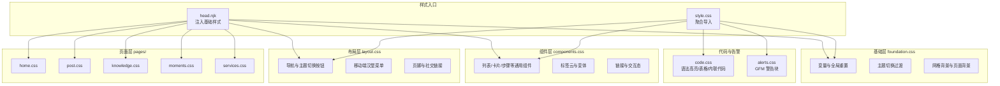
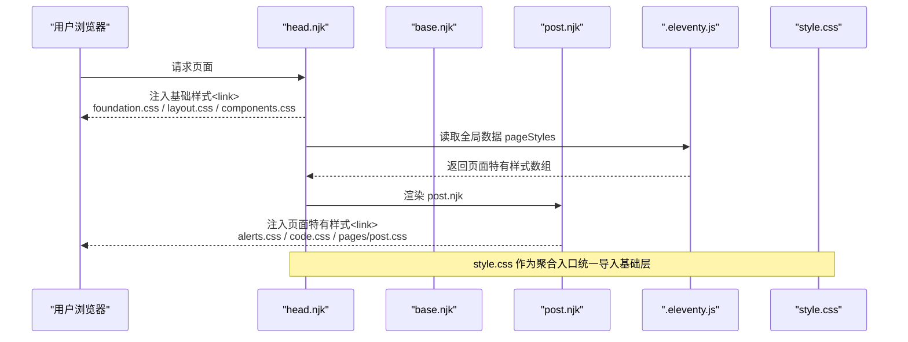
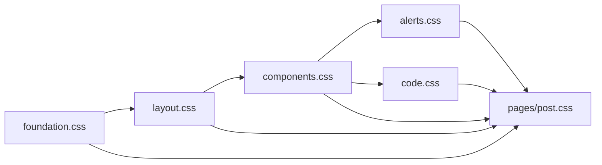

# CSS架构与组织

<cite>
**本文引用的文件**
- [foundation.css](file://src/assets/css/foundation.css)
- [components.css](file://src/assets/css/components.css)
- [layout.css](file://src/assets/css/layout.css)
- [style.css](file://src/assets/css/style.css)
- [code.css](file://src/assets/css/code.css)
- [alerts.css](file://src/assets/css/alerts.css)
- [pages/home.css](file://src/assets/css/pages/home.css)
- [pages/post.css](file://src/assets/css/pages/post.css)
- [pages/knowledge.css](file://src/assets/css/pages/knowledge.css)
- [pages/moments.css](file://src/assets/css/pages/moments.css)
- [pages/services.css](file://src/assets/css/pages/services.css)
- [.eleventy.js](file://.eleventy.js)
- [head.njk](file://src/_includes/partials/head.njk)
- [base.njk](file://src/_includes/layouts/base.njk)
- [post.njk](file://src/_includes/layouts/post.njk)
</cite>

## 目录
1. [引言](#引言)
2. [项目结构](#项目结构)
3. [核心组件](#核心组件)
4. [架构总览](#架构总览)
5. [详细组件分析](#详细组件分析)
6. [依赖关系分析](#依赖关系分析)
7. [性能考量](#性能考量)
8. [故障排查指南](#故障排查指南)
9. [结论](#结论)
10. [附录](#附录)

## 引言
本文件系统性梳理 11ty RainyNight 的 CSS 架构与组织方式，围绕分层设计理念展开：foundation.css（基础样式）、components.css（组件样式）、layout.css（布局样式），以及 pages/（页面特定样式）。文档解释 CSS 变量体系与命名规范、模块化与可维护性策略、CSS 加载顺序与优先级规则，并深入解析代码高亮样式与警告块样式实现。同时提供加载链路图、关键流程图与最佳实践建议，帮助读者快速理解并高效维护该主题的样式体系。

## 项目结构
RainyNight 将样式按“基础—组件—布局—页面”的层次组织，配合 Eleventy 的全局数据与模板注入机制，实现“通用基础 + 页面特有”的组合加载。基础样式统一由 head.njk 注入，页面特有样式通过模板或全局数据注入，保证最小覆盖与高可维护性。

图表来源
- [head.njk:8-10](file://src/_includes/partials/head.njk#L8-L10)
- [style.css:1-6](file://src/assets/css/style.css#L1-L6)
- [foundation.css:1-271](file://src/assets/css/foundation.css#L1-L271)
- [components.css:1-304](file://src/assets/css/components.css#L1-L304)
- [layout.css:1-276](file://src/assets/css/layout.css#L1-L276)
- [code.css:1-285](file://src/assets/css/code.css#L1-L285)
- [alerts.css:1-156](file://src/assets/css/alerts.css#L1-L156)
- [pages/home.css:1-508](file://src/assets/css/pages/home.css#L1-L508)
- [pages/post.css:1-912](file://src/assets/css/pages/post.css#L1-L912)
- [pages/knowledge.css:1-236](file://src/assets/css/pages/knowledge.css#L1-L236)
- [pages/moments.css:1-336](file://src/assets/css/pages/moments.css#L1-L336)
- [pages/services.css:1-544](file://src/assets/css/pages/services.css#L1-L544)

章节来源
- [head.njk:8-26](file://src/_includes/partials/head.njk#L8-L26)
- [style.css:1-6](file://src/assets/css/style.css#L1-L6)

## 核心组件
本节聚焦四层样式职责与关键实现要点：

- foundation.css（基础层）
  - 职责：定义设计令牌（CSS 变量）、全局重置与通用选择器、主题切换过渡、页面背景网格与特殊页面背景。
  - 关键点：采用 :root 与 [data-theme="light"/"dark"] 双主题变量；统一字体族与行高；为所有交互元素设置光标类型；为非首页与文章页设置背景网格；为主题切换提供平滑过渡。
  - 示例路径：[变量与主题切换:1-101](file://src/assets/css/foundation.css#L1-L101)，[全局重置与光标:103-123](file://src/assets/css/foundation.css#L103-L123)，[背景网格与过渡:125-211](file://src/assets/css/foundation.css#L125-L211)。

- components.css（组件层）
  - 职责：提供可复用的 UI 组件基元，如清洁列表、卡片、步骤条、哲学列表、标签云等。
  - 关键点：大量使用 CSS 变量与 HSL 动态色；为暗/亮主题提供差异化 hover 效果；响应式适配；标签云支持 Soft/Outline/Solid 三种变体。
  - 示例路径：[清洁列表与卡片:11-98](file://src/assets/css/components.css#L11-L98)，[标签云变体:179-283](file://src/assets/css/components.css#L179-L283)。

- layout.css（布局层）
  - 职责：站点导航、主题切换按钮、移动端汉堡菜单、页脚与社交链接等布局相关样式。
  - 关键点：固定导航与透明态；汉堡菜单的动画状态；移动端断点下的布局切换；主题图标随主题切换显示。
  - 示例路径：[导航与主题切换:1-108](file://src/assets/css/layout.css#L1-L108)，[汉堡菜单与遮罩:144-227](file://src/assets/css/layout.css#L144-L227)。

- pages/（页面层）
  - 职责：页面级特有样式，如首页英雄区、知识库侧边栏、时光轴、服务页等。
  - 关键点：首页网格背景与搜索区；文章页目录、TOC、图片灯箱；知识库折叠与卡片网格；时光轴时间线与动画；服务页 Bento 布局与动态描边。
  - 示例路径：[首页网格与搜索:3-162](file://src/assets/css/pages/home.css#L3-L162)，[文章页 TOC 与灯箱:72-741](file://src/assets/css/pages/post.css#L72-L741)，[知识库侧边栏与卡片:8-206](file://src/assets/css/pages/knowledge.css#L8-L206)，[时光轴与动画:27-123](file://src/assets/css/pages/moments.css#L27-L123)，[服务页 Bento:31-163](file://src/assets/css/pages/services.css#L31-L163)。

章节来源
- [foundation.css:1-271](file://src/assets/css/foundation.css#L1-L271)
- [components.css:1-304](file://src/assets/css/components.css#L1-L304)
- [layout.css:1-276](file://src/assets/css/layout.css#L1-L276)
- [pages/home.css:1-508](file://src/assets/css/pages/home.css#L1-L508)
- [pages/post.css:1-912](file://src/assets/css/pages/post.css#L1-L912)
- [pages/knowledge.css:1-236](file://src/assets/css/pages/knowledge.css#L1-L236)
- [pages/moments.css:1-336](file://src/assets/css/pages/moments.css#L1-L336)
- [pages/services.css:1-544](file://src/assets/css/pages/services.css#L1-L544)

## 架构总览
下图展示了样式加载与注入的关键链路：head.njk 固定注入基础样式，post.njk 与全局数据控制页面特有样式注入，style.css 作为聚合入口统一管理导入顺序。

图表来源
- [head.njk:8-26](file://src/_includes/partials/head.njk#L8-L26)
- [post.njk:4-7](file://src/_includes/layouts/post.njk#L4-L7)
- [.eleventy.js:148-156](file://.eleventy.js#L148-L156)
- [style.css:1-6](file://src/assets/css/style.css#L1-L6)

章节来源
- [head.njk:8-26](file://src/_includes/partials/head.njk#L8-L26)
- [post.njk:4-7](file://src/_includes/layouts/post.njk#L4-L7)
- [.eleventy.js:148-156](file://.eleventy.js#L148-L156)
- [style.css:1-6](file://src/assets/css/style.css#L1-L6)

## 详细组件分析

### CSS 变量体系与命名规范
- 设计令牌
  - 主题变量：:root 定义高对比暗色主题变量；[data-theme="light"] 定义浅色主题变量；用于背景、文本、强调色、玻璃态、网格线、悬停背景、导航背景等。
  - 语义色板：color-primary/success/warning/danger/info；用于标签与语义化组件。
  - 代码与引用：--code-bg、--blockquote-border；用于代码块与引用边框。
  - 搜索高亮：--mark-bg、--mark-text；用于搜索命中高亮。
  - 示例路径：[高对比暗色主题变量:1-54](file://src/assets/css/foundation.css#L1-L54)，[浅色主题变量:56-101](file://src/assets/css/foundation.css#L56-L101)。

- 组件变量
  - 标签云：--tag-hue、--tag-saturation、--tag-lightness、--tag-bg-opacity；支持 Soft/Outline/Solid 三种变体；暗/亮主题差异化。
  - 卡片与阴影：--tile-bg-1/2/3、--tile-bg-gradient、--tile-shadow；用于卡片与服务页瓦片。
  - 示例路径：[标签云变量与变体:179-283](file://src/assets/css/components.css#L179-L283)。

- 页面变量
  - 首页网格：--glass-border、--hero-line-gradient；用于首页网格背景与标题描边。
  - 文章页：--post-toc-*、--accent-color；用于目录与强调色。
  - 示例路径：[首页网格与标题描边:3-19](file://src/assets/css/pages/home.css#L3-L19)，[文章页 TOC 变量:72-88](file://src/assets/css/pages/post.css#L72-L88)。

- 命名规范
  - 基础层：--bg-color、--text-primary、--accent-color、--glass-border 等语义化命名。
  - 组件层：.clean-*、.process-*、.tag-cloud-*、.philosophy-* 等 BEM 风格。
  - 布局层：.site-nav、.menu-links、.menu-toggle、.footer-* 等模块化命名。
  - 页面层：.hero-*、.post-*、.knowledge-*、.moments-*、.services-* 前缀区分。
  - 示例路径：[基础变量:1-101](file://src/assets/css/foundation.css#L1-L101)，[组件类名:11-98](file://src/assets/css/components.css#L11-L98)，[布局类名:1-142](file://src/assets/css/layout.css#L1-L142)，[页面类名:1-78](file://src/assets/css/pages/home.css#L1-L78)。

章节来源
- [foundation.css:1-101](file://src/assets/css/foundation.css#L1-L101)
- [components.css:179-283](file://src/assets/css/components.css#L179-L283)
- [pages/home.css:1-78](file://src/assets/css/pages/home.css#L1-L78)

### 代码高亮样式实现
- 通用表格与内联代码
  - 表格：边框、圆角、阴影、悬停态；表头背景与边框混合色；偶数行背景混合色。
  - 内联代码：背景、圆角、颜色与字体族；预格式代码块：背景、边框、滚动与阴影。
  - 示例路径：[表格与内联代码:1-54](file://src/assets/css/code.css#L1-L54)。

- 语法高亮主题
  - 浅色主题：基础 token 颜色；内联代码背景与边框。
  - 深色主题：token 调整为低对比与柔和色调；内联代码背景与边框增强对比。
  - 示例路径：[深色主题 token:151-284](file://src/assets/css/code.css#L151-L284)。

- 代码块与表格在文章页中的应用
  - 文章页内容容器中表格与代码块的背景混合与悬停态。
  - 示例路径：[文章页表格与代码块:447-459](file://src/assets/css/pages/post.css#L447-L459)。

章节来源
- [code.css:1-285](file://src/assets/css/code.css#L1-L285)
- [pages/post.css:447-459](file://src/assets/css/pages/post.css#L447-L459)

### 警告块样式实现
- 结构与标题
  - .markdown-alert 通用容器：边框左侧、圆角、背景混合色、行高与内边距；标题 .markdown-alert-title 支持 SVG 图标对齐。
  - 示例路径：[通用容器与标题:3-42](file://src/assets/css/alerts.css#L3-L42)。

- 类别样式
  - note/tip/warning/important/caution 五种类别，分别定义边框色、背景色与标题色。
  - 示例路径：[类别样式:48-96](file://src/assets/css/alerts.css#L48-L96)。

- 深色主题覆盖
  - 每个类别在深色主题下调整边框、背景与标题色；整体容器与链接颜色也相应调整。
  - 示例路径：[深色主题覆盖:98-155](file://src/assets/css/alerts.css#L98-L155)。

- 在文章页的应用
  - 文章页通过 pageStyles 注入 alerts.css，Markdown-it-GitHub-Alerts 插件生成对应 HTML 结构。
  - 示例路径：[模板注入:4-7](file://src/_includes/layouts/post.njk#L4-L7)，[全局数据注入:148-156](file://.eleventy.js#L148-L156)。

章节来源
- [alerts.css:1-156](file://src/assets/css/alerts.css#L1-L156)
- [post.njk:4-7](file://src/_includes/layouts/post.njk#L4-L7)
- [.eleventy.js:148-156](file://.eleventy.js#L148-L156)

### 页面特定样式与优先级
- 首页（home.css）
  - 首屏网格背景、板块标题样式迁移、搜索区与结果卡片、特性卡片与“科学化箭头”定位系统、Who For 卡片、收尾区块与链接动效。
  - 示例路径：[网格与搜索:3-162](file://src/assets/css/pages/home.css#L3-L162)，[特性卡片与箭头:233-327](file://src/assets/css/pages/home.css#L233-L327)。

- 文章页（post.css）
  - 标题、元信息、标签云、目录（桌面/移动）、文章内容排版、引用块、任务列表、Mermaid 图表、图片灯箱与脚注预览。
  - 示例路径：[目录与灯箱:72-741](file://src/assets/css/pages/post.css#L72-L741)，[内容排版与引用:280-396](file://src/assets/css/pages/post.css#L280-L396)。

- 知识库（knowledge.css）
  - 侧边栏折叠、文件夹列表、卡片网格与响应式列数、活动态样式与悬停态。
  - 示例路径：[侧边栏与卡片:8-206](file://src/assets/css/pages/knowledge.css#L8-L206)。

- 时光轴（moments.css）
  - 时间线、日期标签、卡片列表与逐帧入场动画、图片网格与视频封面播放按钮。
  - 示例路径：[时间线与卡片:27-128](file://src/assets/css/pages/moments.css#L27-L128)。

- 服务页（services.css）
  - 英雄区描边与标题背景混合、Bento 瓦片布局、服务项列表与链接动效、CTA 区域。
  - 示例路径：[Bento 布局:31-163](file://src/assets/css/pages/services.css#L31-L163)。

章节来源
- [pages/home.css:1-508](file://src/assets/css/pages/home.css#L1-L508)
- [pages/post.css:1-912](file://src/assets/css/pages/post.css#L1-L912)
- [pages/knowledge.css:1-236](file://src/assets/css/pages/knowledge.css#L1-L236)
- [pages/moments.css:1-336](file://src/assets/css/pages/moments.css#L1-L336)
- [pages/services.css:1-544](file://src/assets/css/pages/services.css#L1-L544)

## 依赖关系分析
- 导入顺序（style.css）
  - foundation.css → layout.css → components.css → alerts.css → code.css
  - 作用：确保基础变量与全局样式先定义，再叠加布局与组件，最后注入页面特有样式。
  - 示例路径：[聚合导入:1-6](file://src/assets/css/style.css#L1-L6)。

- 注入顺序（head.njk）
  - 固定注入基础样式（foundation.css、layout.css、components.css）。
  - 条件注入页面特有样式（alerts.css、code.css、pages/*.css）。
  - 示例路径：[基础注入:8-10](file://src/_includes/partials/head.njk#L8-L10)，[页面样式注入:22-26](file://src/_includes/partials/head.njk#L22-L26)。

- 全局数据注入（.eleventy.js）
  - 对文章页设置 pageStyles，确保 alerts.css、code.css、pages/post.css 按需注入。
  - 示例路径：[全局数据 pageStyles:148-156](file://.eleventy.js#L148-L156)。

图表来源
- [style.css:1-6](file://src/assets/css/style.css#L1-L6)
- [head.njk:8-26](file://src/_includes/partials/head.njk#L8-L26)
- [.eleventy.js:148-156](file://.eleventy.js#L148-L156)

章节来源
- [style.css:1-6](file://src/assets/css/style.css#L1-L6)
- [head.njk:8-26](file://src/_includes/partials/head.njk#L8-L26)
- [.eleventy.js:148-156](file://.eleventy.js#L148-L156)

## 性能考量
- 变量驱动与主题切换
  - 使用 CSS 变量与 [data-theme] 属性，避免重复定义与多套样式文件，降低体积与切换成本。
  - 示例路径：[主题切换:56-101](file://src/assets/css/foundation.css#L56-L101)。

- 响应式与媒体查询
  - 在组件层与页面层合理使用媒体查询，减少不必要的样式分支，提升渲染效率。
  - 示例路径：[组件响应式:174-177](file://src/assets/css/components.css#L174-L177)，[页面响应式:329-352](file://src/assets/css/pages/home.css#L329-L352)。

- 动画与过渡
  - 仅在必要元素使用 transform/opacity 等高性能属性，避免大范围重绘。
  - 示例路径：[卡片悬停与过渡:74-87](file://src/assets/css/components.css#L74-L87)，[文章页目录悬停:103-113](file://src/assets/css/pages/post.css#L103-L113)。

- 聚合导入与缓存
  - style.css 聚合导入，减少请求次数；head.njk 与 .eleventy.js 中版本参数用于缓存失效控制。
  - 示例路径：[聚合导入:1-6](file://src/assets/css/style.css#L1-L6)，[版本参数:8-10](file://src/_includes/partials/head.njk#L8-L10)，[全局数据版本:151-154](file://.eleventy.js#L151-L154)。

## 故障排查指南
- 样式未生效
  - 检查 head.njk 是否正确注入基础样式与页面样式；确认 .eleventy.js 的 pageStyles 是否返回目标页面样式数组。
  - 示例路径：[基础注入:8-26](file://src/_includes/partials/head.njk#L8-L26)，[页面样式注入:22-26](file://src/_includes/partials/head.njk#L22-L26)，[全局数据:148-156](file://.eleventy.js#L148-L156)。

- 主题切换异常
  - 确认 [data-theme] 属性是否在 <html> 上设置；检查 :root 与 [data-theme] 变量是否一致。
  - 示例路径：[主题初始化脚本:11-21](file://src/_includes/partials/head.njk#L11-L21)，[变量定义:1-101](file://src/assets/css/foundation.css#L1-L101)。

- 代码高亮颜色不正确
  - 深色主题下 token 颜色已调整；若仍异常，检查是否被页面样式覆盖或存在冲突选择器。
  - 示例路径：[深色主题 token:151-284](file://src/assets/css/code.css#L151-L284)。

- 警告块样式错位
  - 确认 Markdown-it-GitHub-Alerts 输出的 HTML 结构与 alerts.css 选择器匹配；检查类别类名是否正确。
  - 示例路径：[类别样式:48-96](file://src/assets/css/alerts.css#L48-L96)。

章节来源
- [head.njk:8-26](file://src/_includes/partials/head.njk#L8-L26)
- [.eleventy.js:148-156](file://.eleventy.js#L148-L156)
- [foundation.css:1-101](file://src/assets/css/foundation.css#L1-L101)
- [code.css:151-284](file://src/assets/css/code.css#L151-L284)
- [alerts.css:48-96](file://src/assets/css/alerts.css#L48-L96)

## 结论
RainyNight 的 CSS 架构以“基础—组件—布局—页面”分层组织，结合 CSS 变量与 [data-theme] 主题系统，实现了高可维护性与强扩展性的样式体系。通过 head.njk 与 .eleventy.js 的协同，确保基础样式与页面特有样式按需加载与正确优先级。代码高亮与警告块通过独立模块与语义化类名实现，既满足功能需求又保持风格一致性。遵循本文的命名规范与加载顺序建议，可在不破坏现有结构的前提下安全扩展新页面或组件。

## 附录
- 最佳实践建议
  - 优先使用 CSS 变量表达设计令牌，避免硬编码颜色与尺寸。
  - 组件命名遵循 BEM 风格，页面样式前缀化，减少选择器冲突。
  - 在 pages/ 下新增页面样式时，尽量复用 components.css 与 layout.css 的通用能力，避免重复定义。
  - 使用 style.css 聚合导入，统一管理加载顺序与缓存版本参数。
  - 在深/浅主题下分别验证关键组件（卡片、导航、代码块、警告块）的对比度与可读性。