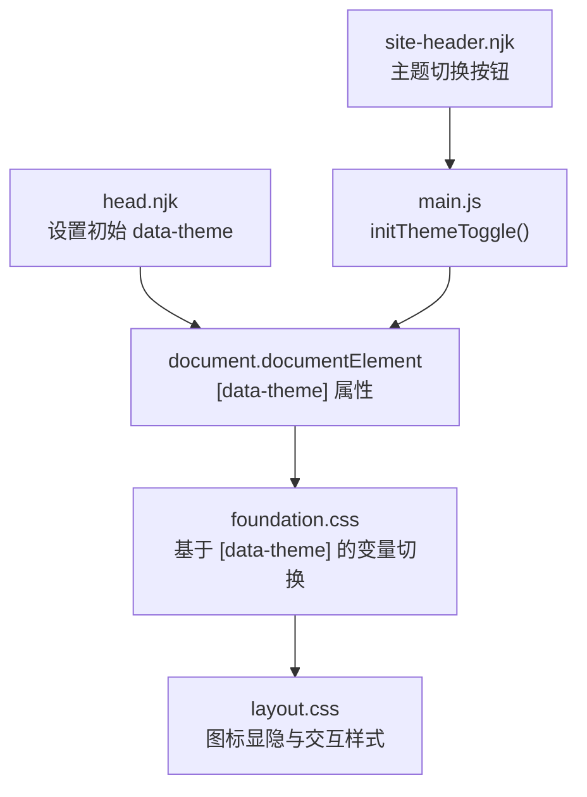
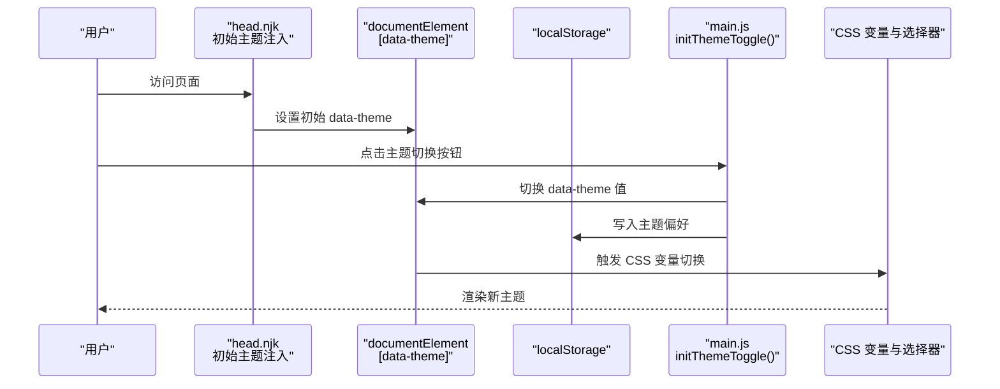
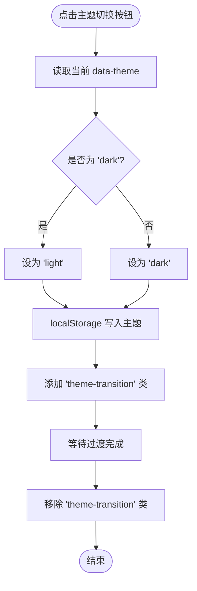
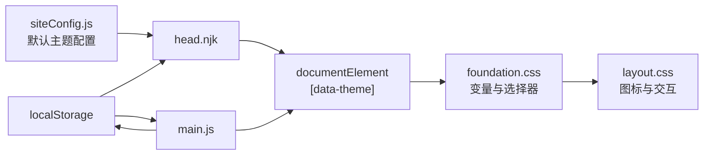

# 主题切换机制

<cite>
**本文引用的文件**
- [src/_includes/partials/head.njk](file://src/_includes/partials/head.njk)
- [src/_includes/partials/site-header.njk](file://src/_includes/partials/site-header.njk)
- [src/assets/js/main.js](file://src/assets/js/main.js)
- [src/assets/css/foundation.css](file://src/assets/css/foundation.css)
- [src/assets/css/layout.css](file://src/assets/css/layout.css)
- [src/assets/css/style.css](file://src/assets/css/style.css)
- [src/content/settings/siteConfig.js](file://src/content/settings/siteConfig.js)
- [src/_data/siteConfig.js](file://src/_data/siteConfig.js)
- [tests/theme-logic.test.js](file://tests/theme-logic.test.js)
</cite>

## 目录
1. [引言](#引言)
2. [项目结构](#项目结构)
3. [核心组件](#核心组件)
4. [架构概览](#架构概览)
5. [详细组件分析](#详细组件分析)
6. [依赖关系分析](#依赖关系分析)
7. [性能考量](#性能考量)
8. [故障排查指南](#故障排查指南)
9. [结论](#结论)
10. [附录](#附录)

## 引言
本文件系统性梳理 11ty RainyNight 的主题切换机制，覆盖明暗主题的自动检测与用户手动切换逻辑、主题状态的持久化策略（localStorage）、JavaScript 核心函数与 DOM 操作流程、CSS 变量与媒体查询的协同工作方式，并提供用户体验与无障碍访问建议及调试方法。

## 项目结构
RainyNight 的主题系统由三部分组成：
- HTML 层：在页面头部注入初始主题状态，确保首屏即正确主题，避免闪烁。
- CSS 层：以 CSS 变量为核心，通过 [data-theme] 属性选择器应用明暗两套配色与过渡动画。
- JS 层：提供主题切换按钮事件处理，读取/写入 localStorage 并更新根元素属性。

图表来源
- [src/_includes/partials/head.njk:11-21](file://src/_includes/partials/head.njk#L11-L21)
- [src/_includes/partials/site-header.njk:36-39](file://src/_includes/partials/site-header.njk#L36-L39)
- [src/assets/js/main.js:1081-1104](file://src/assets/js/main.js#L1081-L1104)
- [src/assets/css/foundation.css:56-101](file://src/assets/css/foundation.css#L56-L101)
- [src/assets/css/layout.css:69-108](file://src/assets/css/layout.css#L69-L108)

章节来源
- [src/_includes/partials/head.njk:11-21](file://src/_includes/partials/head.njk#L11-L21)
- [src/_includes/partials/site-header.njk:36-39](file://src/_includes/partials/site-header.njk#L36-L39)
- [src/assets/js/main.js:1081-1104](file://src/assets/js/main.js#L1081-L1104)
- [src/assets/css/foundation.css:56-101](file://src/assets/css/foundation.css#L56-L101)
- [src/assets/css/layout.css:69-108](file://src/assets/css/layout.css#L69-L108)

## 核心组件
- 初始主题注入（HTML）：在页面加载早期，通过内联脚本读取站点配置中的默认主题值与 localStorage 中的用户偏好，设置 document.documentElement 的 data-theme 属性，保证首屏无闪烁。
- 主题切换按钮（HTML）：在站点导航中提供可访问的按钮，包含太阳/月亮图标，用于手动切换明暗主题。
- 主题切换逻辑（JS）：监听按钮点击，切换 data-theme 值并写入 localStorage；同时添加过渡类以平滑颜色变化。
- 明暗主题变量（CSS）：以 CSS 变量定义两套配色方案，通过 [data-theme="light"/"dark"] 选择器应用；同时提供全局过渡类以统一动画时序。
- 图标显隐（CSS）：根据当前主题动态显示太阳或月亮图标，提升视觉反馈。

章节来源
- [src/_includes/partials/head.njk:11-21](file://src/_includes/partials/head.njk#L11-L21)
- [src/_includes/partials/site-header.njk:36-39](file://src/_includes/partials/site-header.njk#L36-L39)
- [src/assets/js/main.js:1081-1104](file://src/assets/js/main.js#L1081-L1104)
- [src/assets/css/foundation.css:56-101](file://src/assets/css/foundation.css#L56-L101)
- [src/assets/css/layout.css:69-108](file://src/assets/css/layout.css#L69-L108)

## 架构概览
主题切换的整体流程如下：

图表来源
- [src/_includes/partials/head.njk:11-21](file://src/_includes/partials/head.njk#L11-L21)
- [src/assets/js/main.js:1081-1104](file://src/assets/js/main.js#L1081-L1104)
- [src/assets/css/foundation.css:56-101](file://src/assets/css/foundation.css#L56-L101)

## 详细组件分析

### 组件A：初始主题注入（head.njk）
- 作用：在页面最早阶段确定初始主题，避免“白屏/黑屏”闪烁。
- 关键点：
  - 读取站点配置中的默认主题（light/dark），若配置无效则回退为 light。
  - 读取 localStorage 中已保存的主题偏好，若存在则优先使用。
  - 将最终主题写入 document.documentElement 的 data-theme 属性。
- 影响范围：影响整个页面生命周期内的主题渲染。

章节来源
- [src/_includes/partials/head.njk:11-21](file://src/_includes/partials/head.njk#L11-L21)
- [src/content/settings/siteConfig.js:36-38](file://src/content/settings/siteConfig.js#L36-L38)
- [src/_data/siteConfig.js:1-2](file://src/_data/siteConfig.js#L1-L2)

### 组件B：主题切换按钮（site-header.njk）
- 作用：提供可访问的主题切换入口，包含太阳/月亮图标。
- 可访问性：按钮带有 aria-label，便于屏幕阅读器识别。
- 图标切换：通过 CSS 在不同主题下显隐太阳/月亮图标，直观提示当前主题。

章节来源
- [src/_includes/partials/site-header.njk:36-39](file://src/_includes/partials/site-header.njk#L36-L39)
- [src/assets/css/layout.css:69-108](file://src/assets/css/layout.css#L69-L108)

### 组件C：主题切换核心逻辑（main.js）
- 函数：initThemeToggle()
- 行为：
  - 监听 .theme-toggle 点击事件。
  - 读取当前 data-theme，取反后写回根元素。
  - 同步写入 localStorage，确保跨页面一致。
  - 临时添加 .theme-transition 类以启用 CSS 过渡动画，动画结束后移除。
- 动画时序：JS 添加过渡类，CSS 定义 300ms 过渡，JS 在约 350ms 后移除类，避免抖动。

图表来源
- [src/assets/js/main.js:1081-1104](file://src/assets/js/main.js#L1081-L1104)

章节来源
- [src/assets/js/main.js:1081-1104](file://src/assets/js/main.js#L1081-L1104)

### 组件D：明暗主题变量与过渡（foundation.css）
- 变量定义：:root 定义通用变量；[data-theme="light"] 定义浅色变量；[data-theme="dark"] 定义深色变量。
- 过渡控制：.theme-transition 对根元素及其子树统一应用背景、文字、边框等属性的 300ms 过渡。
- 页面网格：针对不同页面类型提供背景网格，受主题变量控制。

章节来源
- [src/assets/css/foundation.css:1-54](file://src/assets/css/foundation.css#L1-L54)
- [src/assets/css/foundation.css:56-101](file://src/assets/css/foundation.css#L56-L101)
- [src/assets/css/foundation.css:198-211](file://src/assets/css/foundation.css#L198-L211)

### 组件E：图标显隐与交互（layout.css）
- 主题图标：.theme-toggle 下的太阳/月亮图标在不同主题下显隐。
- 交互样式：悬停颜色与背景高亮，过渡时间为 0.3s，与 CSS 过渡保持一致。

章节来源
- [src/assets/css/layout.css:69-108](file://src/assets/css/layout.css#L69-L108)

### 组件F：测试用例（tests/theme-logic.test.js）
- 默认逻辑：当 localStorage 为空时，依据站点配置与默认回退规则确定初始主题。
- 持久化逻辑：当 localStorage 存在用户偏好时，优先使用。
- 切换逻辑：点击切换按钮后，data-theme 与 localStorage 同步切换，验证双向一致性。

章节来源
- [tests/theme-logic.test.js:28-46](file://tests/theme-logic.test.js#L28-L46)
- [tests/theme-logic.test.js:49-64](file://tests/theme-logic.test.js#L49-L64)
- [tests/theme-logic.test.js:67-95](file://tests/theme-logic.test.js#L67-L95)

## 依赖关系分析
- head.njk 依赖站点配置与 localStorage，决定初始主题。
- main.js 依赖 DOM 中的 .theme-toggle 按钮，依赖 localStorage 与 document.documentElement 的 data-theme 属性。
- CSS 依赖 [data-theme] 属性选择器与 CSS 变量，形成主题切换的视觉表现。
- layout.css 依赖 foundation.css 的变量，进一步细化按钮与图标的主题态样式。

图表来源
- [src/content/settings/siteConfig.js:36-38](file://src/content/settings/siteConfig.js#L36-L38)
- [src/_includes/partials/head.njk:11-21](file://src/_includes/partials/head.njk#L11-L21)
- [src/assets/js/main.js:1081-1104](file://src/assets/js/main.js#L1081-L1104)
- [src/assets/css/foundation.css:56-101](file://src/assets/css/foundation.css#L56-L101)
- [src/assets/css/layout.css:69-108](file://src/assets/css/layout.css#L69-L108)

章节来源
- [src/content/settings/siteConfig.js:36-38](file://src/content/settings/siteConfig.js#L36-L38)
- [src/_includes/partials/head.njk:11-21](file://src/_includes/partials/head.njk#L11-L21)
- [src/assets/js/main.js:1081-1104](file://src/assets/js/main.js#L1081-L1104)
- [src/assets/css/foundation.css:56-101](file://src/assets/css/foundation.css#L56-L101)
- [src/assets/css/layout.css:69-108](file://src/assets/css/layout.css#L69-L108)

## 性能考量
- 首屏渲染：通过 head.njk 在 DOMContentLoaded 之前设置 data-theme，避免 FOUC（Flash of Unstyled Content）。
- 动画时序：CSS 过渡 300ms，JS 在 350ms 后移除过渡类，留有余量防止抖动。
- 事件监听：JS 仅在存在 .theme-toggle 时初始化，避免不必要的绑定。
- 变量复用：CSS 使用变量与选择器，减少重复样式计算，提升渲染效率。

## 故障排查指南
- 症状：切换后主题未持久化
  - 排查：检查 localStorage 是否可用，确认 main.js 写入逻辑是否执行。
  - 参考路径：[src/assets/js/main.js:1081-1104](file://src/assets/js/main.js#L1081-L1104)
- 症状：首屏主题异常或闪烁
  - 排查：确认 head.njk 的初始注入逻辑是否在 DOMContentLoaded 前执行，检查站点配置默认主题与 localStorage 的优先级。
  - 参考路径：[src/_includes/partials/head.njk:11-21](file://src/_includes/partials/head.njk#L11-L21)
- 症状：切换动画不生效
  - 排查：确认 CSS 中 .theme-transition 的过渡定义是否存在，JS 是否在切换时添加/移除该类。
  - 参考路径：[src/assets/css/foundation.css:198-211](file://src/assets/css/foundation.css#L198-L211)
- 症状：图标未随主题切换
  - 排查：确认 layout.css 中太阳/月亮图标的显隐规则是否被覆盖。
  - 参考路径：[src/assets/css/layout.css:69-108](file://src/assets/css/layout.css#L69-L108)
- 症状：测试失败
  - 排查：对照测试用例的断言与模拟环境，逐项验证默认逻辑、持久化逻辑与切换逻辑。
  - 参考路径：[tests/theme-logic.test.js:28-46](file://tests/theme-logic.test.js#L28-L46), [tests/theme-logic.test.js:49-64](file://tests/theme-logic.test.js#L49-L64), [tests/theme-logic.test.js:67-95](file://tests/theme-logic.test.js#L67-L95)

## 结论
RainyNight 的主题系统通过“HTML 注入 + CSS 变量 + JS 切换”的分层设计，实现了稳定、可维护且高性能的主题切换。其核心优势在于：
- 首屏无闪烁：head.njk 在 DOMContentLoaded 前设置初始主题。
- 用户偏好持久化：localStorage 与站点配置共同决定初始主题，且支持跨页面保持。
- 视觉一致性：CSS 变量与选择器确保明暗两套配色与过渡效果统一。
- 可访问性友好：按钮具备 aria-label，图标随主题显隐，便于屏幕阅读器与视觉辅助工具识别。

## 附录
- 完整样式入口：[src/assets/css/style.css:1-6](file://src/assets/css/style.css#L1-L6)
- 站点配置入口：[src/_data/siteConfig.js:1-2](file://src/_data/siteConfig.js#L1-L2)