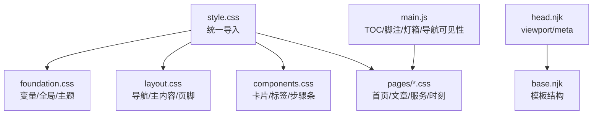
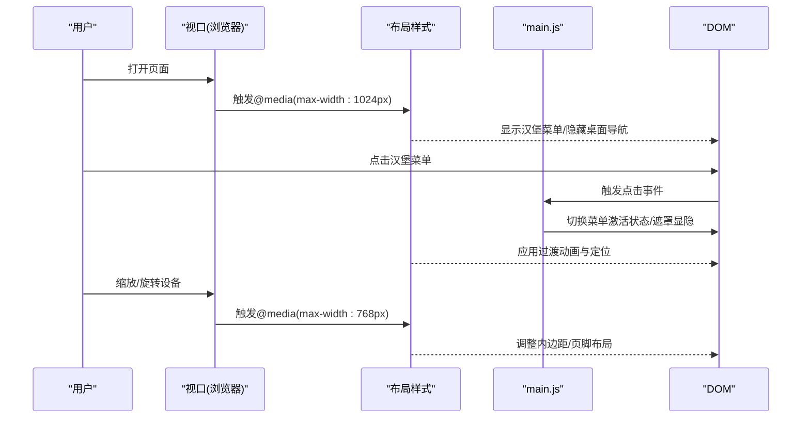
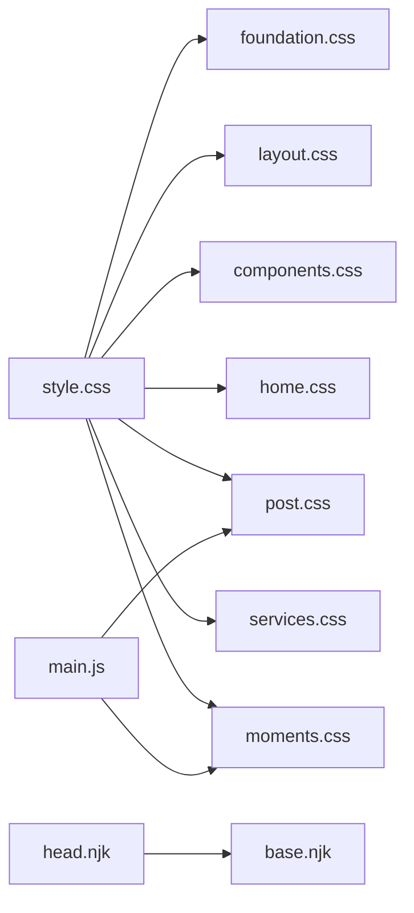

# 响应式设计

<cite>
**本文引用的文件**
- [foundation.css](file://src/assets/css/foundation.css)
- [layout.css](file://src/assets/css/layout.css)
- [components.css](file://src/assets/css/components.css)
- [style.css](file://src/assets/css/style.css)
- [home.css](file://src/assets/css/pages/home.css)
- [post.css](file://src/assets/css/pages/post.css)
- [services.css](file://src/assets/css/pages/services.css)
- [moments.css](file://src/assets/css/pages/moments.css)
- [head.njk](file://src/_includes/partials/head.njk)
- [base.njk](file://src/_includes/layouts/base.njk)
- [main.js](file://src/assets/js/main.js)
- [package.json](file://package.json)
</cite>

## 目录
1. [引言](#引言)
2. [项目结构](#项目结构)
3. [核心组件](#核心组件)
4. [架构总览](#架构总览)
5. [详细组件分析](#详细组件分析)
6. [依赖关系分析](#依赖关系分析)
7. [性能考量](#性能考量)
8. [故障排查指南](#故障排查指南)
9. [结论](#结论)
10. [附录](#附录)

## 引言
本文件面向11ty RainyNight主题的响应式设计，系统梳理断点与媒体查询策略、弹性布局与网格系统、字体与间距的响应式调整原则、移动端优先理念与实现技巧，并结合实际CSS与JS代码路径给出可操作的设计模式与最佳实践。同时覆盖触摸交互与手势支持、响应式测试方法与工具推荐，帮助读者快速落地高质量的跨设备体验。

## 项目结构
RainyNight采用分层CSS组织方式，按“基础变量与全局样式 → 布局 → 组件 → 页面级样式”的顺序引入，形成清晰的职责边界与可维护性：
- 基础层：foundation.css 定义变量、全局排版与主题切换
- 布局层：layout.css 控制导航、主内容区与页脚等容器布局
- 组件层：components.css 提供卡片、标签云、步骤条等通用组件
- 页面层：home.css、post.css、services.css、moments.css 等针对页面特性进行细化
- 主入口：style.css 统一导入各层样式

图表来源
- [style.css:1-6](file://src/assets/css/style.css#L1-L6)
- [foundation.css:1-271](file://src/assets/css/foundation.css#L1-L271)
- [layout.css:1-276](file://src/assets/css/layout.css#L1-L276)
- [components.css:1-304](file://src/assets/css/components.css#L1-L304)
- [home.css:1-508](file://src/assets/css/pages/home.css#L1-L508)
- [post.css:1-912](file://src/assets/css/pages/post.css#L1-L912)
- [services.css:1-544](file://src/assets/css/pages/services.css#L1-L544)
- [moments.css:1-336](file://src/assets/css/pages/moments.css#L1-L336)
- [head.njk:1-27](file://src/_includes/partials/head.njk#L1-L27)
- [base.njk:1-20](file://src/_includes/layouts/base.njk#L1-L20)
- [main.js:1-800](file://src/assets/js/main.js#L1-L800)

章节来源
- [style.css:1-6](file://src/assets/css/style.css#L1-L6)
- [head.njk:1-27](file://src/_includes/partials/head.njk#L1-L27)
- [base.njk:1-20](file://src/_includes/layouts/base.njk#L1-L20)

## 核心组件
- 断点与媒体查询策略
  - 移动端优先：以小屏为基线，逐步增强
  - 关键断点：1024px（导航折叠）、768px（移动端菜单、页脚堆叠）
  - 页面特有断点：如服务页900px（桌面端两列内容区）、时刻页600px（窄屏图片网格）

- 弹性布局与网格系统
  - Flex：导航链接、页脚社交区、移动端汉堡菜单
  - Grid：卡片网格（auto-fill/auto-fit）、页面骨架（服务页12列网格）
  - 自适应单位：clamp、min/max、calc，用于标题与内容区自适应

- 字体与间距
  - 字号：基于相对单位与clamp实现流式缩放；标题随视口宽度变化
  - 间距：统一使用rem/em，配合媒体查询在关键节点调整

- 主题与对比度
  - 通过CSS变量在深浅主题间切换，保证对比度与可读性
  - 高对比网格背景仅在非首页启用，避免首页信息过载

章节来源
- [layout.css:229-275](file://src/assets/css/layout.css#L229-L275)
- [services.css:471-543](file://src/assets/css/pages/services.css#L471-L543)
- [moments.css:298-335](file://src/assets/css/pages/moments.css#L298-L335)
- [foundation.css:1-271](file://src/assets/css/foundation.css#L1-L271)
- [components.css:59-177](file://src/assets/css/components.css#L59-L177)

## 架构总览
以下序列图展示移动端优先的导航折叠与菜单交互流程，体现断点与JS协同：

图表来源
- [layout.css:229-275](file://src/assets/css/layout.css#L229-L275)
- [head.njk:1-27](file://src/_includes/partials/head.njk#L1-L27)
- [main.js:794-800](file://src/assets/js/main.js#L794-L800)

## 详细组件分析

### 导航与移动端菜单
- 设计要点
  - 固定顶部导航，透明与滚动态切换
  - 桌面端水平排列，移动端折叠为抽屉式菜单
  - 菜单抽屉使用绝对定位与过渡，遮罩层控制交互

- 关键断点
  - 1024px：显示汉堡菜单，隐藏桌面导航项
  - 768px：调整内边距、页脚垂直堆叠

- 交互细节
  - 菜单开关通过类名切换实现，配合遮罩层控制指针事件
  - 主题切换按钮在移动端菜单中重新定位

章节来源
- [layout.css:1-276](file://src/assets/css/layout.css#L1-L276)
- [head.njk:1-27](file://src/_includes/partials/head.njk#L1-L27)

### 卡片网格与标签云
- 卡片网格
  - 使用CSS Grid与auto-fill/auto-fit实现自适应列数
  - 间距与圆角、阴影统一，悬停态增强可感知性

- 标签云
  - 大量size类与variant类，通过CSS变量与HSL色彩体系实现主题一致的视觉层次
  - 悬停放大与阴影增强交互反馈

- 响应式调整
  - 在768px以下，卡片网格改为单列，哲学列表双列改为单列

章节来源
- [components.css:59-177](file://src/assets/css/components.css#L59-L177)

### 首页特性区与搜索
- 特性网格
  - 使用grid-template-columns: repeat(auto-fit, minmax(220px, 1fr))实现自适应
  - 悬停态采用边框虚线与微位移，避免布局抖动

- 搜索区
  - 使用CSS Grid与minmax实现输入与按钮的自适应布局
  - 结果项采用卡片化设计，悬停态强调边框与阴影

- 移动端优化
  - 768px以下：搜索控件改为单列，按钮保持方形以维持视觉稳定

章节来源
- [home.css:233-352](file://src/assets/css/pages/home.css#L233-L352)

### 文章页目录与行动区
- 目录（TOC）
  - 固定右侧，使用calc/clamp/自定义属性动态计算位置
  - 悬停展开，非悬停仅保留当前标题文本，节省空间
  - 移动端提供summary折叠版本

- 行动区（回到顶部/返回）
  - 固定底部，根据页脚与动作区自身高度动态偏移
  - 滚动超过阈值显示，点击平滑回到顶部

- 图片与脚注
  - 支持点击放大、滚轮缩放、拖拽移动
  - 脚注预览支持多方向定位与键盘ESC关闭

章节来源
- [post.css:72-231](file://src/assets/css/pages/post.css#L72-L231)
- [post.css:232-500](file://src/assets/css/pages/post.css#L232-L500)
- [post.css:500-912](file://src/assets/css/pages/post.css#L500-L912)
- [main.js:13-79](file://src/assets/js/main.js#L13-L79)

### 服务页骨架与动画
- 12列网格骨架，支持桌面端两列内容布局
- 标题与副标题使用clamp实现流式缩放
- 大量CSS动画与过渡，增强可读性与交互反馈

- 关键断点
  - 900px以上：左侧元信息+右侧内容两列
  - 768px以下：整体单列，内边距与间距调整

章节来源
- [services.css:31-497](file://src/assets/css/pages/services.css#L31-L497)
- [services.css:499-543](file://src/assets/css/pages/services.css#L499-L543)

### 时刻页时间轴
- 时间轴与日期标签
  - 左侧竖线与圆点装饰，日期标签突出
- 卡片布局
  - 横向布局，头像+内容+图片/视频
- 移动端优化
  - 600px以下：图片网格改为单列，内边距与字号微调

章节来源
- [moments.css:1-336](file://src/assets/css/pages/moments.css#L1-L336)

### 触摸交互与手势支持
- 图片灯箱
  - 支持滚轮缩放、键盘快捷键（+/-/0/ESC）、拖拽移动
  - 按钮与遮罩层分离，避免误触
- 脚注预览
  - 悬停/焦点触发，支持鼠标与指针事件，自动避障定位
- 导航与菜单
  - 指针事件与过渡动画，确保在触摸设备上的流畅体验

章节来源
- [post.css:602-741](file://src/assets/css/pages/post.css#L602-L741)
- [post.css:280-500](file://src/assets/css/pages/post.css#L280-L500)
- [main.js:496-792](file://src/assets/js/main.js#L496-L792)
- [main.js:280-455](file://src/assets/js/main.js#L280-L455)

## 依赖关系分析
- CSS层叠
  - style.css统一导入foundation/layout/components与页面样式
  - 页面样式按需覆盖组件样式，遵循就近原则
- JS与样式的耦合
  - main.js通过类名切换与自定义属性驱动样式变化
  - 事件监听器与滚动/窗口尺寸变更联动，确保布局一致性

图表来源
- [style.css:1-6](file://src/assets/css/style.css#L1-L6)
- [foundation.css:1-271](file://src/assets/css/foundation.css#L1-L271)
- [layout.css:1-276](file://src/assets/css/layout.css#L1-L276)
- [components.css:1-304](file://src/assets/css/components.css#L1-L304)
- [home.css:1-508](file://src/assets/css/pages/home.css#L1-L508)
- [post.css:1-912](file://src/assets/css/pages/post.css#L1-L912)
- [services.css:1-544](file://src/assets/css/pages/services.css#L1-L544)
- [moments.css:1-336](file://src/assets/css/pages/moments.css#L1-L336)
- [head.njk:1-27](file://src/_includes/partials/head.njk#L1-L27)
- [base.njk:1-20](file://src/_includes/layouts/base.njk#L1-L20)
- [main.js:1-800](file://src/assets/js/main.js#L1-L800)

章节来源
- [style.css:1-6](file://src/assets/css/style.css#L1-L6)
- [head.njk:1-27](file://src/_includes/partials/head.njk#L1-L27)
- [base.njk:1-20](file://src/_includes/layouts/base.njk#L1-L20)
- [main.js:1-800](file://src/assets/js/main.js#L1-L800)

## 性能考量
- CSS变量与主题切换
  - 通过CSS变量集中管理颜色与阴影，减少重复样式与重绘
- 布局稳定性
  - 使用minmax与auto-fit/auto-fill，避免频繁重排
  - 固定TOC与行动区位置，减少滚动时的布局抖动
- JS事件优化
  - 滚动与resize事件使用passive监听，降低主线程压力
  - 条件初始化：仅在存在目标元素时才绑定事件

章节来源
- [foundation.css:1-271](file://src/assets/css/foundation.css#L1-L271)
- [layout.css:1-276](file://src/assets/css/layout.css#L1-L276)
- [post.css:72-231](file://src/assets/css/pages/post.css#L72-L231)
- [main.js:13-79](file://src/assets/js/main.js#L13-L79)

## 故障排查指南
- 视口未生效
  - 检查head.njk中的viewport meta是否正确注入
- 菜单无法打开或遮罩无响应
  - 确认布局样式中@media断点与类名切换逻辑
- TOC位置异常或被页脚遮挡
  - 检查main.js中计算最大高度与位置的逻辑，以及自定义属性的设置
- 图片灯箱无法拖拽或缩放
  - 确认pointer事件与wheel事件绑定，以及最小/最大缩放限制
- 脚注预览定位错误
  - 检查定位函数与视口边界处理，确保tooltip不会溢出

章节来源
- [head.njk:1-27](file://src/_includes/partials/head.njk#L1-L27)
- [layout.css:229-275](file://src/assets/css/layout.css#L229-L275)
- [main.js:81-278](file://src/assets/js/main.js#L81-L278)
- [main.js:496-792](file://src/assets/js/main.js#L496-L792)

## 结论
RainyNight的响应式设计以移动端优先为核心，通过合理的断点策略、弹性布局与网格系统、流式字体与间距体系，以及完善的触摸交互与JS联动，实现了在多设备上的一致体验。建议在后续迭代中持续关注性能指标与可访问性，进一步完善手势与键盘导航的覆盖。

## 附录
- 响应式测试方法与工具推荐
  - 浏览器开发者工具：设备模拟器、网络节流、性能面板
  - Puppeteer/Cypress：自动化端到端测试
  - Lighthouse/axe-core：可访问性与性能评估
  - 真机测试：iOS Safari与Android Chrome的实际表现验证

章节来源
- [package.json:6-16](file://package.json#L6-L16)