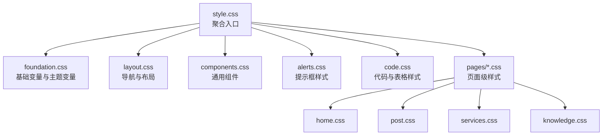
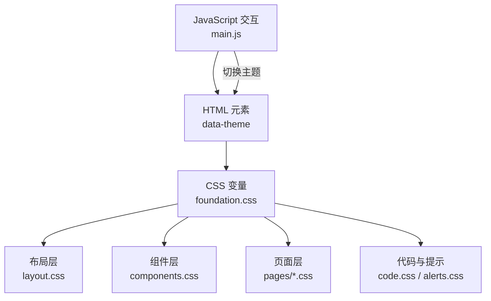
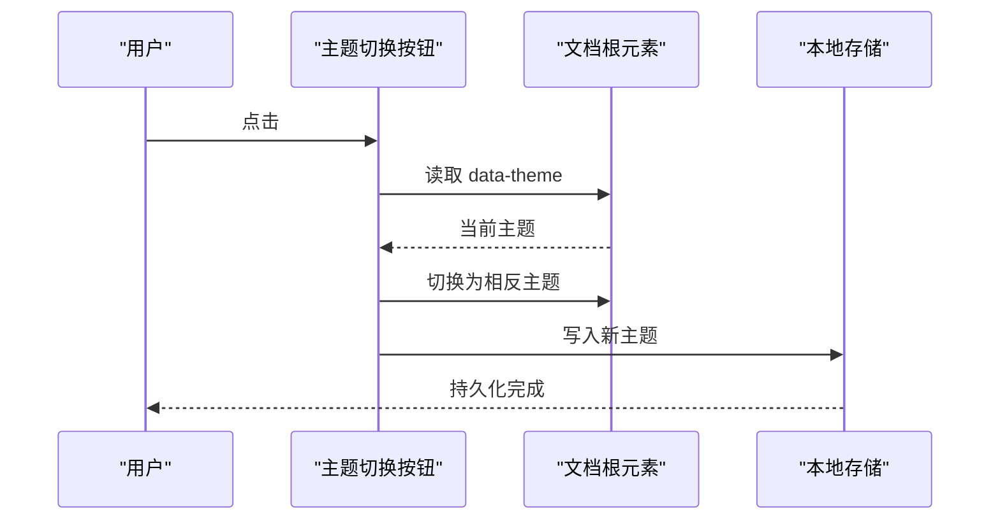
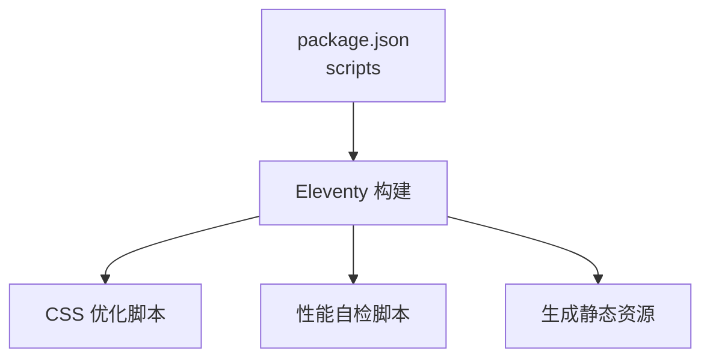

# 样式和主题系统

<cite>
**本文引用的文件**
- [style.css](file://src/assets/css/style.css)
- [foundation.css](file://src/assets/css/foundation.css)
- [layout.css](file://src/assets/css/layout.css)
- [components.css](file://src/assets/css/components.css)
- [alerts.css](file://src/assets/css/alerts.css)
- [code.css](file://src/assets/css/code.css)
- [home.css](file://src/assets/css/pages/home.css)
- [post.css](file://src/assets/css/pages/post.css)
- [services.css](file://src/assets/css/pages/services.css)
- [knowledge.css](file://src/assets/css/pages/knowledge.css)
- [main.js](file://src/assets/js/main.js)
- [siteConfig.js](file://src/content/settings/siteConfig.js)
- [theme-logic.test.js](file://tests/theme-logic.test.js)
- [package.json](file://package.json)
</cite>

## 目录
1. [引言](#引言)
2. [项目结构](#项目结构)
3. [核心组件](#核心组件)
4. [架构总览](#架构总览)
5. [详细组件分析](#详细组件分析)
6. [依赖关系分析](#依赖关系分析)
7. [性能考量](#性能考量)
8. [故障排查指南](#故障排查指南)
9. [结论](#结论)
10. [附录](#附录)

## 引言
本文件系统性梳理 11ty RainyNight 的样式与主题体系，覆盖 CSS 架构分层（基础、布局、组件、页面）、主题切换机制（自动检测、偏好持久化、样式切换）、响应式策略与断点、自定义样式开发流程与最佳实践、CSS 变量与主题定制技巧、JavaScript 交互实现、样式性能优化与加载策略，以及主题定制示例与常见问题解决方案。

## 项目结构
RainyNight 将样式按层次组织，采用模块化导入的方式构建最终样式包。基础层提供全局变量与主题变量；布局层负责导航、菜单、网格等结构；组件层提供卡片、标签云、列表等通用 UI；页面层针对首页、文章页、服务页等进行差异化设计；代码与提示框样式分别处理语法高亮与 Markdown 提示块。

图表来源
- [style.css:1-6](file://src/assets/css/style.css#L1-L6)
- [foundation.css:1-271](file://src/assets/css/foundation.css#L1-L271)
- [layout.css:1-276](file://src/assets/css/layout.css#L1-L276)
- [components.css:1-304](file://src/assets/css/components.css#L1-L304)
- [alerts.css:1-156](file://src/assets/css/alerts.css#L1-L156)
- [code.css:1-285](file://src/assets/css/code.css#L1-L285)
- [home.css:1-508](file://src/assets/css/pages/home.css#L1-L508)
- [post.css:1-912](file://src/assets/css/pages/post.css#L1-L912)
- [services.css:1-544](file://src/assets/css/pages/services.css#L1-L544)
- [knowledge.css:1-236](file://src/assets/css/pages/knowledge.css#L1-L236)

章节来源
- [style.css:1-6](file://src/assets/css/style.css#L1-L6)

## 核心组件
- 基础层（foundation.css）
  - 定义 CSS 变量：背景、文本、强调色、玻璃态、网格线、悬停态、导航背景、代码块与引用边框、语义色板、搜索高亮等。
  - 主题变量：通过 [data-theme="light"] 与 :root 定义明/暗两套变量，实现主题切换。
  - 全局样式：重置、字体、滚动条、网格背景、过渡动画等。
- 布局层（layout.css）
  - 导航栏固定定位、透明态、模糊背景、主题切换按钮图标随主题切换显示。
  - 移动端汉堡菜单、遮罩层、菜单项动画。
  - 主体内容区、页脚、社交链接等。
- 组件层（components.css）
  - 清单、卡片、步骤、哲学展示、标签云（Soft/Outline/Solid 变体）、链接等。
  - 标签云基于 HSL 色相与亮度变量动态生成颜色，适配明/暗主题。
- 页面层（pages/*.css）
  - 首页：英雄区网格背景、搜索框、特性卡片、适合人群、结尾区块。
  - 文章页：目录、目录滚动、回到顶部、脚注预览、图片灯箱、Mermaid 图表。
  - 服务页：Bento 卡片布局、标题背景、列表项动画、CTA 区域。
  - 知识库：侧边栏目录、卡片网格、响应式列数。
- 代码与提示（code.css、alerts.css）
  - 表格、代码块、行内代码、键盘键位、高亮标记。
  - GitHub 风格提示框（Note/Tip/Warning/Important/Caution），暗色主题覆盖。

章节来源
- [foundation.css:1-271](file://src/assets/css/foundation.css#L1-L271)
- [layout.css:1-276](file://src/assets/css/layout.css#L1-L276)
- [components.css:1-304](file://src/assets/css/components.css#L1-L304)
- [home.css:1-508](file://src/assets/css/pages/home.css#L1-L508)
- [post.css:1-912](file://src/assets/css/pages/post.css#L1-L912)
- [services.css:1-544](file://src/assets/css/pages/services.css#L1-L544)
- [knowledge.css:1-236](file://src/assets/css/pages/knowledge.css#L1-L236)
- [code.css:1-285](file://src/assets/css/code.css#L1-L285)
- [alerts.css:1-156](file://src/assets/css/alerts.css#L1-L156)

## 架构总览
样式系统采用“变量驱动 + 属性选择器”的主题切换架构：通过在 <html> 上设置 data-theme="light"/"dark"，配合 CSS 变量与属性选择器，实现明/暗主题的无缝切换。页面样式按需引入，避免重复与冲突。

图表来源
- [foundation.css:56-101](file://src/assets/css/foundation.css#L56-L101)
- [layout.css:69-108](file://src/assets/css/layout.css#L69-L108)
- [components.css:179-283](file://src/assets/css/components.css#L179-L283)
- [post.css:1-912](file://src/assets/css/pages/post.css#L1-L912)
- [code.css:1-285](file://src/assets/css/code.css#L1-L285)
- [alerts.css:1-156](file://src/assets/css/alerts.css#L1-L156)
- [main.js:1-800](file://src/assets/js/main.js#L1-L800)

## 详细组件分析

### 主题切换机制
- 默认与持久化策略
  - 首次加载：若 localStorage 中无主题记录，则根据系统偏好（测试模拟为深色）设置默认值。
  - 持久化：切换主题后将当前主题写入 localStorage，刷新后仍保持。
- 切换逻辑
  - 点击主题按钮：读取当前 data-theme，取反后写回 <html>，同时同步 localStorage。
- 自动检测
  - 测试中通过 window.matchMedia 模拟系统深色偏好；实际项目可扩展为浏览器匹配媒体查询以自动识别系统主题。

图表来源
- [theme-logic.test.js:34-83](file://tests/theme-logic.test.js#L34-L83)

章节来源
- [theme-logic.test.js:1-97](file://tests/theme-logic.test.js#L1-L97)

### 响应式设计与断点
- 移动优先策略：基础样式适用于移动端，随后在大屏断点上增强布局与细节。
- 断点分布
  - 1024px：移动端汉堡菜单出现，右侧滑入式菜单；导航栏内边距调整。
  - 768px：主体内边距、页脚布局、首页搜索按钮栅格、服务页标题与内容网格、知识库侧边栏折叠。
  - 1400px/1024px/640px：知识库卡片网格列数递减，保证信息密度与可读性。
- 关键实现位置
  - 导航与菜单：[layout.css:229-276](file://src/assets/css/layout.css#L229-L276)
  - 首页响应式：[home.css:329-352](file://src/assets/css/pages/home.css#L329-L352)
  - 服务页响应式：[services.css:471-543](file://src/assets/css/pages/services.css#L471-L543)
  - 知识库响应式：[knowledge.css:132-148](file://src/assets/css/pages/knowledge.css#L132-L148)

章节来源
- [layout.css:229-276](file://src/assets/css/layout.css#L229-L276)
- [home.css:329-352](file://src/assets/css/pages/home.css#L329-L352)
- [services.css:471-543](file://src/assets/css/pages/services.css#L471-L543)
- [knowledge.css:132-148](file://src/assets/css/pages/knowledge.css#L132-L148)

### CSS 变量与主题定制
- 变量命名规范
  - 语义化命名：如 --bg-color、--text-primary、--accent-color、--glass-bg、--hover-bg、--nav-bg、--code-bg、--blockquote-border、--mark-bg、--mark-text。
  - 主题作用域：:root 定义默认变量，[data-theme="light"] 定义浅色变量覆盖。
- 动态色彩系统
  - 标签云：基于 --tag-hue、--tag-saturation、--tag-lightness、--tag-bg-opacity 计算 Soft/Outline/Solid 变体颜色，适配明/暗主题。
  - 语义色板：--color-primary/--color-success/--color-warning/--color-danger/--color-info 在明/暗主题下保持一致语义。
- 定制建议
  - 仅修改变量值即可完成品牌色与对比度调整。
  - 使用 color-mix 与透明度组合，实现层次丰富的卡片与背景。
  - 为特殊页面（如 post-bg-highlight）提供局部覆盖变量，避免全局污染。

章节来源
- [foundation.css:1-271](file://src/assets/css/foundation.css#L1-L271)
- [components.css:179-283](file://src/assets/css/components.css#L179-L283)

### JavaScript 交互功能
- 文章页功能
  - 目录生成与滚动激活：解析标题、生成桌面/移动目录、计算最大高度与中心位置、滚动时更新激活项。
  - 回到顶部：监听滚动阈值显示/隐藏，点击平滑滚动至顶部。
  - 脚注预览：鼠标悬停/焦点显示预览气泡，支持键盘 ESC 隐藏与窗口变化重定位。
  - 图片灯箱：点击可缩放、拖拽、滚轮缩放、键盘 +/-/0 控制、ESC 关闭。
- 通用行为
  - 交互元素绑定/解绑，避免内存泄漏；滚动/尺寸事件使用 passive 优化。
- 关键实现位置
  - 目录与滚动：[main.js:81-278](file://src/assets/js/main.js#L81-L278)
  - 回到顶部与底部偏移：[main.js:13-79](file://src/assets/js/main.js#L13-L79)
  - 脚注预览：[main.js:280-455](file://src/assets/js/main.js#L280-L455)
  - 图片灯箱：[main.js:496-792](file://src/assets/js/main.js#L496-L792)

章节来源
- [main.js:1-800](file://src/assets/js/main.js#L1-L800)

### 页面级样式与组件复用
- 首页（home.css）
  - 英雄区网格背景、搜索框、特性卡片、适合人群、结尾区块。
  - 标签云与卡片 hover 效果，暗色模式下的对比度增强。
- 文章页（post.css）
  - 目录悬浮、滚动激活、移动端折叠；回到顶部；脚注预览；图片灯箱；Mermaid 图表适配。
- 服务页（services.css）
  - Bento 卡片网格、标题背景文字、列表项动画、CTA 区域。
- 知识库（knowledge.css）
  - 侧边栏目录、卡片网格列数随屏幕宽度自适应。

章节来源
- [home.css:1-508](file://src/assets/css/pages/home.css#L1-L508)
- [post.css:1-912](file://src/assets/css/pages/post.css#L1-L912)
- [services.css:1-544](file://src/assets/css/pages/services.css#L1-L544)
- [knowledge.css:1-236](file://src/assets/css/pages/knowledge.css#L1-L236)

## 依赖关系分析
- 构建与优化
  - 构建脚本在 Eleventy 生成静态站点后，执行 CSS 优化与性能自检。
  - 优化脚本与性能检查脚本位于 scripts 目录，构建流程中自动调用。
- 外部依赖
  - Eleventy、Markdown-it、Mermaid 插件等，用于内容渲染与图表支持。

图表来源
- [package.json:6-16](file://package.json#L6-L16)

章节来源
- [package.json:1-35](file://package.json#L1-L35)

## 性能考量
- 变量驱动的主题切换
  - 通过 CSS 变量与属性选择器实现，避免重绘与布局抖动，切换流畅。
- 事件优化
  - 目录滚动与窗口尺寸变更使用 passive 事件监听，减少主线程阻塞。
  - 交互初始化返回清理函数，确保卸载时移除监听，避免内存泄漏。
- 加载策略
  - 样式按需引入，避免冗余；构建阶段统一打包与压缩，减少请求次数与体积。
- 可访问性
  - 高对比度变量、键盘操作支持（灯箱 ESC、缩放快捷键）、焦点可见性。

[本节为通用指导，无需具体文件分析]

## 故障排查指南
- 主题未生效
  - 检查 <html> 是否正确设置 data-theme；确认 localStorage 中存在主题记录；核对 [data-theme="light"] 变量覆盖是否被其他规则覆盖。
- 目录不显示或不激活
  - 确认文章内容包含足够标题数量；检查目录容器是否存在；查看滚动事件是否正常触发。
- 脚注预览不显示
  - 确认脚注目标存在且 ID 正确；检查预览容器是否创建成功；验证定位函数是否在窗口变化时重新计算。
- 图片灯箱无法缩放/拖拽
  - 检查图片是否具备缩放类名；确认事件监听是否绑定；查看 transform 与 clamp 计算是否生效。
- 构建后样式异常
  - 执行 CSS 优化与性能自检脚本；确认构建顺序与输出路径；检查变量拼写与作用域。

章节来源
- [main.js:81-792](file://src/assets/js/main.js#L81-L792)
- [theme-logic.test.js:1-97](file://tests/theme-logic.test.js#L1-L97)

## 结论
RainyNight 的样式与主题系统以 CSS 变量为核心，结合属性选择器与模块化样式组织，实现了高可维护性的明/暗主题切换与响应式布局。配合 JavaScript 的目录、脚注与灯箱交互，提供了良好的阅读与使用体验。通过变量定制与构建优化，可在保证性能的同时灵活适配品牌与业务需求。

[本节为总结，无需具体文件分析]

## 附录

### 自定义样式开发流程与最佳实践
- 明确分层：基础变量 → 布局 → 组件 → 页面 → 特殊场景。
- 变量优先：尽量通过变量控制颜色、间距、圆角等，避免硬编码。
- 语义化命名：组件与页面命名清晰，便于复用与维护。
- 响应式优先：移动优先，逐步增强；断点与栅格遵循一致性。
- 可访问性：关注对比度、键盘可达性、焦点可见性。
- 构建与测试：构建后运行性能自检，确保无回归。

[本节为通用指导，无需具体文件分析]

### 主题定制示例
- 修改强调色：调整 --accent-color 与 --color-primary 等变量，观察组件联动变化。
- 调整网格背景：修改 --page-grid-line 与 --post-reading-grid-line，控制网格密度与透明度。
- 标签云变体：通过 --tag-hue、--tag-saturation、--tag-lightness、--tag-bg-opacity 控制 Soft/Outline/Solid 变体视觉效果。
- 文章页高亮：为特定页面添加背景变量，如 --bg-color 覆盖，避免影响全局。

章节来源
- [foundation.css:1-271](file://src/assets/css/foundation.css#L1-L271)
- [components.css:179-283](file://src/assets/css/components.css#L179-L283)
- [post.css:222-231](file://src/assets/css/pages/post.css#L222-L231)