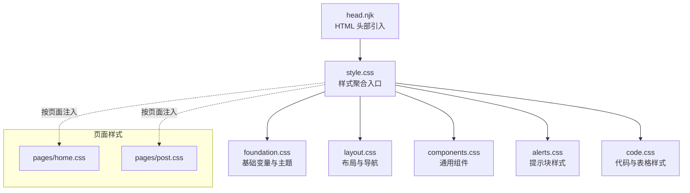
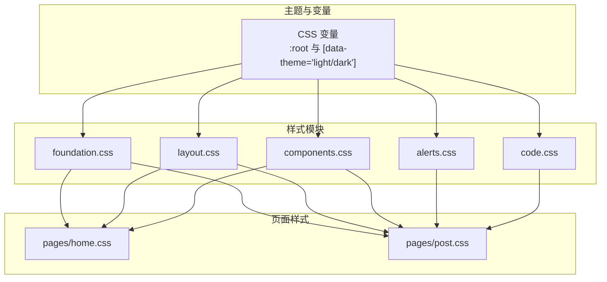
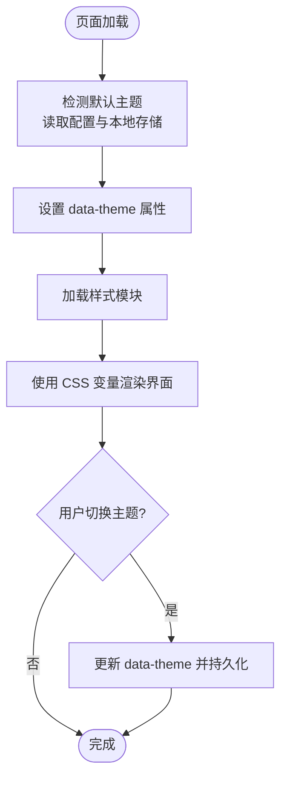
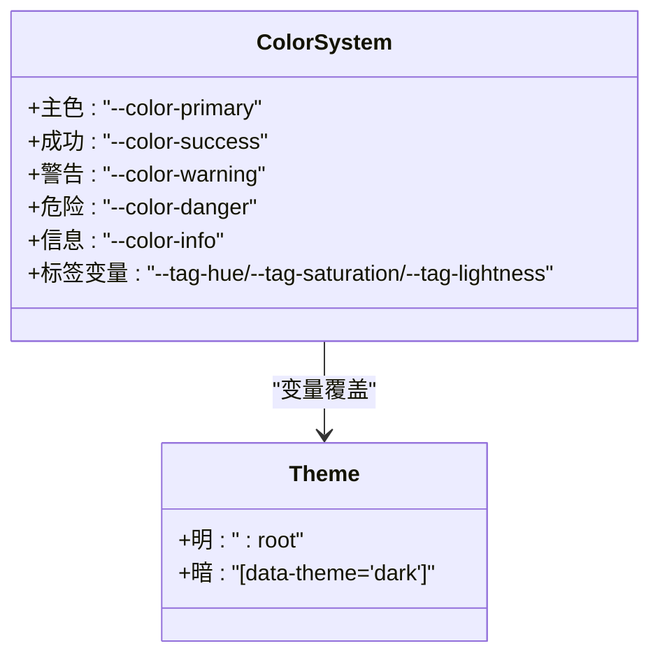
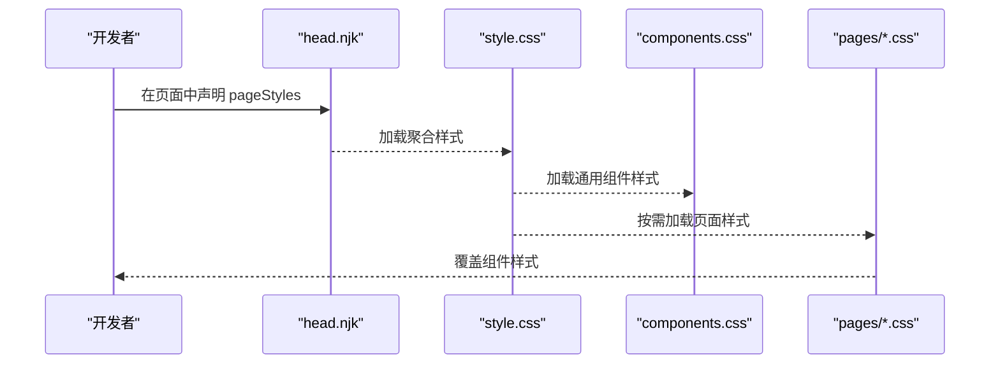
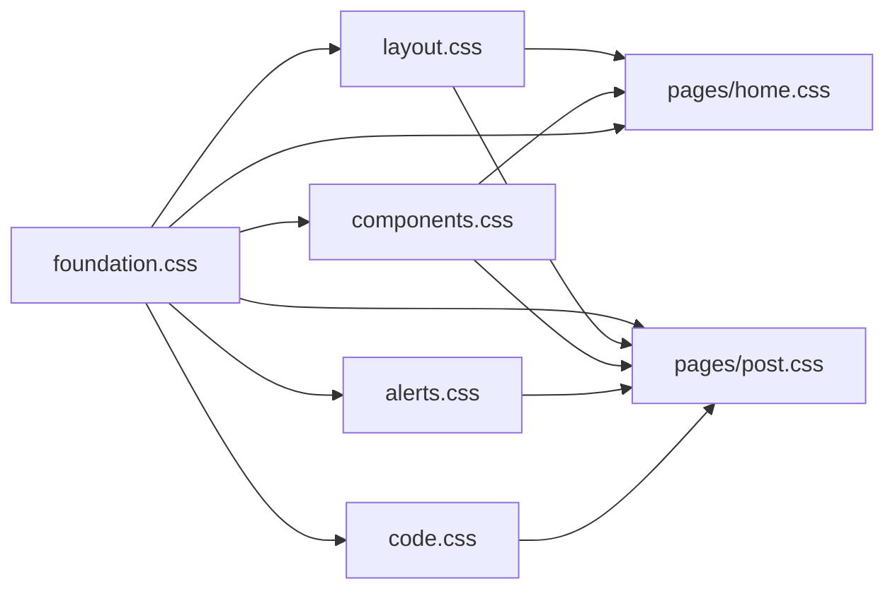

# 自定义样式开发

<cite>
**本文引用的文件**
- [style.css](file://src/assets/css/style.css)
- [foundation.css](file://src/assets/css/foundation.css)
- [components.css](file://src/assets/css/components.css)
- [layout.css](file://src/assets/css/layout.css)
- [alerts.css](file://src/assets/css/alerts.css)
- [code.css](file://src/assets/css/code.css)
- [home.css](file://src/assets/css/pages/home.css)
- [post.css](file://src/assets/css/pages/post.css)
- [head.njk](file://src/_includes/partials/head.njk)
- [siteConfig.js](file://src/content/settings/siteConfig.js)
- [optimize-css-safe.js](file://scripts/optimize-css-safe.js)
- [package.json](file://package.json)
- [theme-logic.test.js](file://tests/theme-logic.test.js)
</cite>

## 目录
1. [引言](#引言)
2. [项目结构](#项目结构)
3. [核心组件](#核心组件)
4. [架构总览](#架构总览)
5. [详细组件分析](#详细组件分析)
6. [依赖关系分析](#依赖关系分析)
7. [性能考量](#性能考量)
8. [故障排查指南](#故障排查指南)
9. [结论](#结论)
10. [附录](#附录)

## 引言
本指南面向为 11ty RainyNight 项目进行样式定制与扩展的开发者，目标是在不破坏现有结构的前提下，安全地扩展样式系统、自定义 CSS 变量、主题与组件样式，并提供颜色、字体、间距等系统化的定制方法。文档同时涵盖新增 CSS 文件的接入方式、样式层次维护、调试技巧与性能优化建议。

## 项目结构
RainyNight 的样式采用分层模块化组织，主入口通过样式聚合文件加载各子模块，页面级样式按需引入，便于按页面隔离与覆盖。

**图表来源**
- [style.css:1-6](file://src/assets/css/style.css#L1-L6)
- [foundation.css:1-271](file://src/assets/css/foundation.css#L1-L271)
- [layout.css:1-276](file://src/assets/css/layout.css#L1-L276)
- [components.css:1-304](file://src/assets/css/components.css#L1-L304)
- [alerts.css:1-156](file://src/assets/css/alerts.css#L1-L156)
- [code.css:1-285](file://src/assets/css/code.css#L1-L285)
- [home.css:1-508](file://src/assets/css/pages/home.css#L1-L508)
- [post.css:1-912](file://src/assets/css/pages/post.css#L1-L912)
- [head.njk:1-27](file://src/_includes/partials/head.njk#L1-L27)

**章节来源**
- [style.css:1-6](file://src/assets/css/style.css#L1-L6)
- [head.njk:1-27](file://src/_includes/partials/head.njk#L1-L27)

## 核心组件
- 样式聚合入口：通过聚合文件统一引入基础、布局、组件、提示与代码等模块，保证加载顺序与作用域边界。
- 基础与主题：以 CSS 变量为核心的主题系统，支持明暗两套主题切换，覆盖背景、文本、强调色、卡片与网格等。
- 布局与导航：站点导航、移动端菜单、主题切换按钮等布局组件样式。
- 通用组件：列表、卡片、步骤、标签云等可复用 UI 组件。
- 页面样式：首页与文章页的页面级样式，提供更强的视觉与交互表现。
- 提示块与代码：遵循 GitHub 风格的提示块与语法高亮，适配明暗主题。

**章节来源**
- [foundation.css:1-271](file://src/assets/css/foundation.css#L1-L271)
- [layout.css:1-276](file://src/assets/css/layout.css#L1-L276)
- [components.css:1-304](file://src/assets/css/components.css#L1-L304)
- [home.css:1-508](file://src/assets/css/pages/home.css#L1-L508)
- [post.css:1-912](file://src/assets/css/pages/post.css#L1-L912)
- [alerts.css:1-156](file://src/assets/css/alerts.css#L1-L156)
- [code.css:1-285](file://src/assets/css/code.css#L1-L285)

## 架构总览
样式系统以“变量驱动 + 主题切换 + 模块化样式 + 页面级覆盖”的方式构建，确保一致性与可扩展性。

**图表来源**
- [foundation.css:1-271](file://src/assets/css/foundation.css#L1-L271)
- [layout.css:1-276](file://src/assets/css/layout.css#L1-L276)
- [components.css:1-304](file://src/assets/css/components.css#L1-L304)
- [alerts.css:1-156](file://src/assets/css/alerts.css#L1-L156)
- [code.css:1-285](file://src/assets/css/code.css#L1-L285)
- [home.css:1-508](file://src/assets/css/pages/home.css#L1-L508)
- [post.css:1-912](file://src/assets/css/pages/post.css#L1-L912)

## 详细组件分析

### CSS 变量与主题系统
- 变量集中于根节点与明暗主题选择器，覆盖背景、文本、强调色、边框、卡片、网格与高亮等。
- 主题切换通过 HTML 属性选择器应用，配合过渡动画实现平滑切换。
- 页面级变量覆盖：如文章页高亮背景、FAQ 背景等，通过局部变量或伪元素叠加实现。

**图表来源**
- [head.njk:11-21](file://src/_includes/partials/head.njk#L11-L21)
- [foundation.css:1-271](file://src/assets/css/foundation.css#L1-L271)
- [theme-logic.test.js:28-83](file://tests/theme-logic.test.js#L28-L83)

**章节来源**
- [foundation.css:1-271](file://src/assets/css/foundation.css#L1-L271)
- [head.njk:11-21](file://src/_includes/partials/head.njk#L11-L21)
- [theme-logic.test.js:1-83](file://tests/theme-logic.test.js#L1-L83)

### 颜色系统定制
- 语义色板：主色、成功、警告、危险、信息等，通过变量统一管理，便于全局替换。
- 标签系统：基于色相与饱和度、亮度变量动态生成软/实/描边等变体，适配明暗主题。
- 卡片与网格：通过背景与阴影变量实现层级与对比，暗色模式下增强对比度。

**图表来源**
- [foundation.css:44-101](file://src/assets/css/foundation.css#L44-L101)
- [components.css:179-283](file://src/assets/css/components.css#L179-L283)

**章节来源**
- [foundation.css:44-101](file://src/assets/css/foundation.css#L44-L101)
- [components.css:179-283](file://src/assets/css/components.css#L179-L283)

### 字体系统与排版
- 使用可变字体与等宽字体，保证正文与代码的可读性。
- 标题层级、段落间距、列表缩进等通过基础变量与组件样式统一控制。

**章节来源**
- [foundation.css:125-134](file://src/assets/css/foundation.css#L125-L134)
- [code.css:42-54](file://src/assets/css/code.css#L42-L54)

### 间距系统与网格
- 间距与网格通过变量与媒体查询控制，确保在桌面与移动设备上的一致体验。
- 页面网格背景与卡片阴影等通过变量与伪元素实现，避免硬编码。

**章节来源**
- [foundation.css:136-196](file://src/assets/css/foundation.css#L136-L196)
- [layout.css:1-276](file://src/assets/css/layout.css#L1-L276)

### 组件样式覆盖与扩展策略
- 通用组件：在组件样式基础上进行局部覆盖，避免破坏全局一致性。
- 页面级样式：通过页面样式文件进行强约束覆盖，确保视觉与交互效果。
- 变量优先：优先通过变量调整组件外观，其次考虑选择器特异性与层叠规则。

**图表来源**
- [head.njk:22-26](file://src/_includes/partials/head.njk#L22-L26)
- [style.css:1-6](file://src/assets/css/style.css#L1-L6)
- [components.css:1-304](file://src/assets/css/components.css#L1-L304)
- [home.css:1-508](file://src/assets/css/pages/home.css#L1-L508)
- [post.css:1-912](file://src/assets/css/pages/post.css#L1-L912)

**章节来源**
- [head.njk:22-26](file://src/_includes/partials/head.njk#L22-L26)
- [style.css:1-6](file://src/assets/css/style.css#L1-L6)

### 添加新 CSS 文件与维护层次
- 新增文件：在 src/assets/css 下创建新文件，按功能命名（如 utilities.css）。
- 引入顺序：在样式聚合文件中追加 @import，确保变量与基础样式先于组件与页面样式加载。
- 页面级引入：通过页面上下文注入 pageStyles，实现按需加载与隔离覆盖。

**章节来源**
- [style.css:1-6](file://src/assets/css/style.css#L1-L6)
- [head.njk:22-26](file://src/_includes/partials/head.njk#L22-L26)

### 样式覆盖示例与最佳实践
- 示例路径参考：
  - 首页搜索框聚焦态强调色覆盖：[home.css:122-126](file://src/assets/css/pages/home.css#L122-L126)
  - 文章页标签动态色值构造：[post.css:31-55](file://src/assets/css/pages/post.css#L31-L55)
  - 通用卡片悬停效果增强：[components.css:74-87](file://src/assets/css/components.css#L74-L87)
- 最佳实践：
  - 优先使用变量，避免硬编码颜色与尺寸。
  - 使用 :root 与 [data-theme="..."] 组合，确保主题一致性。
  - 页面级样式尽量局部化，避免全局污染。
  - 通过媒体查询与响应式单位保障移动端体验。

**章节来源**
- [home.css:122-126](file://src/assets/css/pages/home.css#L122-L126)
- [post.css:31-55](file://src/assets/css/pages/post.css#L31-L55)
- [components.css:74-87](file://src/assets/css/components.css#L74-L87)

## 依赖关系分析
样式模块之间存在明确的依赖与被依赖关系，聚合入口负责编排加载顺序，页面样式在最后阶段进行覆盖。

**图表来源**
- [style.css:1-6](file://src/assets/css/style.css#L1-L6)
- [foundation.css:1-271](file://src/assets/css/foundation.css#L1-L271)
- [layout.css:1-276](file://src/assets/css/layout.css#L1-L276)
- [components.css:1-304](file://src/assets/css/components.css#L1-L304)
- [alerts.css:1-156](file://src/assets/css/alerts.css#L1-L156)
- [code.css:1-285](file://src/assets/css/code.css#L1-L285)
- [home.css:1-508](file://src/assets/css/pages/home.css#L1-L508)
- [post.css:1-912](file://src/assets/css/pages/post.css#L1-L912)

**章节来源**
- [style.css:1-6](file://src/assets/css/style.css#L1-L6)

## 性能考量
- 构建脚本自动压缩已生成的 CSS，减少体积与传输时间。
- 建议：
  - 合理拆分样式模块，避免单文件过大。
  - 使用变量与媒体查询替代重复样式。
  - 在生产环境启用构建脚本进行压缩与检查。

**章节来源**
- [optimize-css-safe.js:1-112](file://scripts/optimize-css-safe.js#L1-L112)
- [package.json:6-16](file://package.json#L6-L16)

## 故障排查指南
- 主题切换无效
  - 检查 HTML 是否正确设置 data-theme 属性。
  - 确认本地存储是否保存了正确的主题值。
  - 参考测试用例中的逻辑模拟与断言。
- 样式未生效
  - 确认页面是否正确注入 pageStyles。
  - 检查样式加载顺序与选择器特异性。
  - 使用浏览器开发者工具检查变量最终解析值。
- 构建后样式异常
  - 运行构建脚本进行压缩与检查。
  - 确认聚合入口是否包含新增样式文件。

**章节来源**
- [head.njk:11-21](file://src/_includes/partials/head.njk#L11-L21)
- [theme-logic.test.js:28-83](file://tests/theme-logic.test.js#L28-L83)
- [optimize-css-safe.js:82-112](file://scripts/optimize-css-safe.js#L82-L112)

## 结论
RainyNight 的样式系统以变量与主题为核心，结合模块化与页面级覆盖，提供了良好的扩展性与一致性。遵循本文的定制方法与最佳实践，可在不破坏原有结构的前提下，安全地进行主题与组件的深度定制，并获得稳定的性能与可维护性。

## 附录
- 主题配置：通过站点配置中的主题默认值控制初始主题。
- 构建命令：使用构建脚本进行清理、同步元数据、生成与优化。

**章节来源**
- [siteConfig.js:36-38](file://src/content/settings/siteConfig.js#L36-L38)
- [package.json:6-16](file://package.json#L6-L16)