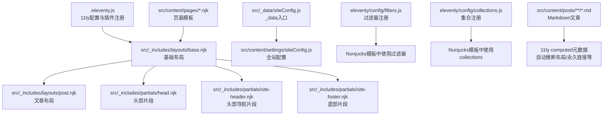
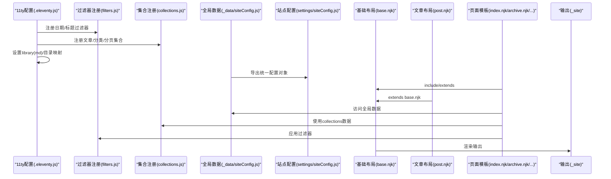
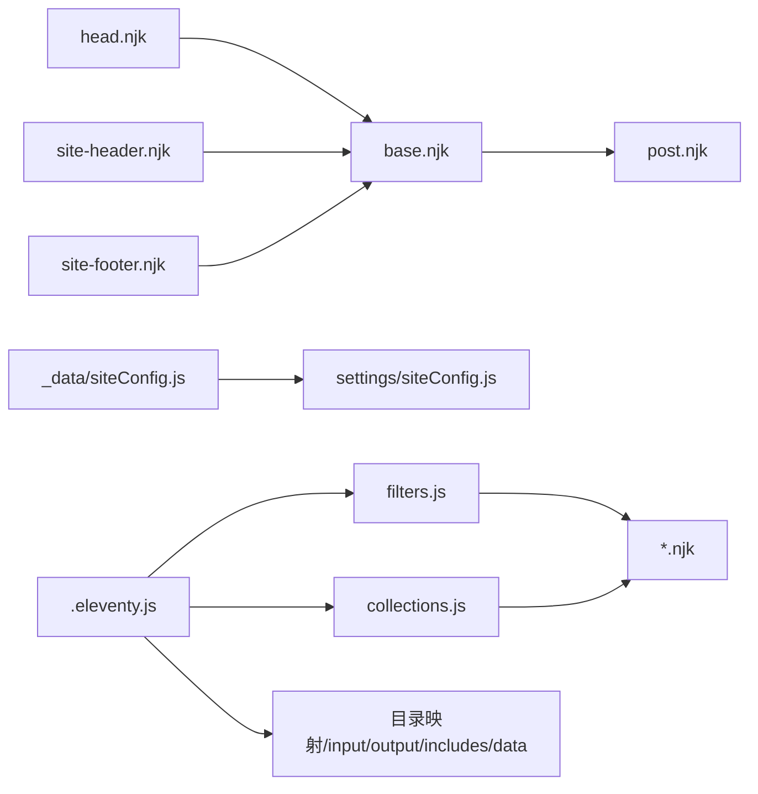

# Nunjucks模板引擎

<cite>
**本文引用的文件**
- [.eleventy.js](file://.eleventy.js)
- [src/_includes/layouts/base.njk](file://src/_includes/layouts/base.njk)
- [src/_includes/layouts/post.njk](file://src/_includes/layouts/post.njk)
- [src/_includes/partials/head.njk](file://src/_includes/partials/head.njk)
- [src/_includes/partials/site-header.njk](file://src/_includes/partials/site-header.njk)
- [src/_includes/partials/site-footer.njk](file://src/_includes/partials/site-footer.njk)
- [src/_data/siteConfig.js](file://src/_data/siteConfig.js)
- [src/content/settings/siteConfig.js](file://src/content/settings/siteConfig.js)
- [eleventy/config/filters.js](file://eleventy/config/filters.js)
- [eleventy/config/collections.js](file://eleventy/config/collections.js)
- [src/content/pages/index.njk](file://src/content/pages/index.njk)
- [src/content/pages/archive.njk](file://src/content/pages/archive.njk)
- [src/content/pages/categories.njk](file://src/content/pages/categories.njk)
- [src/content/pages/services.njk](file://src/content/pages/services.njk)
- [src/content/pages/moments.njk](file://src/content/pages/moments.njk)
</cite>

## 目录
1. [引言](#引言)
2. [项目结构](#项目结构)
3. [核心组件](#核心组件)
4. [架构总览](#架构总览)
5. [详细组件分析](#详细组件分析)
6. [依赖关系分析](#依赖关系分析)
7. [性能考虑](#性能考虑)
8. [故障排查指南](#故障排查指南)
9. [结论](#结论)
10. [附录](#附录)

## 引言
本文件系统性梳理本项目中Nunjucks模板引擎的使用方式，结合11ty构建管线，覆盖基础语法（变量插值、条件与循环）、模板继承（extends/block等）在本项目中的落地形态、变量传递与过滤器、集合数据的使用、调试技巧与常见错误处理，以及性能优化策略。文中所有示例均以仓库中的真实模板与配置为依据，避免脱离实际的空谈。

## 项目结构
本项目采用11ty标准目录结构，Nunjucks模板位于src/_includes与src/content/pages等位置；全局数据通过src/_data与src/content/settings导出；过滤器与集合在eleventy/config中注册；11ty主配置在根目录的配置文件中完成。

图表来源
- [.eleventy.js:36-181](file://.eleventy.js#L36-L181)
- [src/_includes/layouts/base.njk:1-20](file://src/_includes/layouts/base.njk#L1-L20)
- [src/_includes/layouts/post.njk:1-49](file://src/_includes/layouts/post.njk#L1-L49)
- [src/_includes/partials/head.njk:1-27](file://src/_includes/partials/head.njk#L1-L27)
- [src/_includes/partials/site-header.njk:1-44](file://src/_includes/partials/site-header.njk#L1-L44)
- [src/_includes/partials/site-footer.njk:1-13](file://src/_includes/partials/site-footer.njk#L1-L13)
- [src/_data/siteConfig.js:1-2](file://src/_data/siteConfig.js#L1-L2)
- [src/content/settings/siteConfig.js:1-168](file://src/content/settings/siteConfig.js#L1-L168)
- [eleventy/config/filters.js:1-43](file://eleventy/config/filters.js#L1-L43)
- [eleventy/config/collections.js:1-377](file://eleventy/config/collections.js#L1-L377)

章节来源
- [.eleventy.js:36-181](file://.eleventy.js#L36-L181)
- [src/_includes/layouts/base.njk:1-20](file://src/_includes/layouts/base.njk#L1-L20)
- [src/_includes/layouts/post.njk:1-49](file://src/_includes/layouts/post.njk#L1-L49)
- [src/_includes/partials/head.njk:1-27](file://src/_includes/partials/head.njk#L1-L27)
- [src/_includes/partials/site-header.njk:1-44](file://src/_includes/partials/site-header.njk#L1-L44)
- [src/_includes/partials/site-footer.njk:1-13](file://src/_includes/partials/site-footer.njk#L1-L13)
- [src/_data/siteConfig.js:1-2](file://src/_data/siteConfig.js#L1-L2)
- [src/content/settings/siteConfig.js:1-168](file://src/content/settings/siteConfig.js#L1-L168)
- [eleventy/config/filters.js:1-43](file://eleventy/config/filters.js#L1-L43)
- [eleventy/config/collections.js:1-377](file://eleventy/config/collections.js#L1-L377)

## 核心组件
- 基础布局与继承
  - 基础布局负责HTML骨架、包含头部片段、主体内容占位、底部片段与脚本注入。
  - 文章布局通过Front Matter声明layout字段继承基础布局，并在内部填充文章内容与样式列表。
- 片段化复用
  - 头部片段集中注入SEO元信息、样式表与主题初始化逻辑。
  - 导航与底部片段通过配置驱动，实现菜单项、社交链接与版权信息的动态渲染。
- 全局数据与配置
  - 通过_data入口与settings配置文件集中管理品牌、导航、页脚、主题、分页与页面文案等。
- 过滤器与集合
  - 在11ty配置中注册日期与标题类过滤器，供模板中使用。
  - 注册多类集合（文章、分类树、分类分页、文件夹分组），在模板中以collections访问。
- 自动推断与computed元数据
  - 对文章类型内容，11ty通过computed规则自动推断标题、子分类、布局、永久链接、标签、样式等，减少Front Matter重复。

章节来源
- [src/_includes/layouts/base.njk:1-20](file://src/_includes/layouts/base.njk#L1-L20)
- [src/_includes/layouts/post.njk:1-49](file://src/_includes/layouts/post.njk#L1-L49)
- [src/_includes/partials/head.njk:1-27](file://src/_includes/partials/head.njk#L1-L27)
- [src/_includes/partials/site-header.njk:1-44](file://src/_includes/partials/site-header.njk#L1-L44)
- [src/_includes/partials/site-footer.njk:1-13](file://src/_includes/partials/site-footer.njk#L1-L13)
- [src/_data/siteConfig.js:1-2](file://src/_data/siteConfig.js#L1-L2)
- [src/content/settings/siteConfig.js:1-168](file://src/content/settings/siteConfig.js#L1-L168)
- [eleventy/config/filters.js:1-43](file://eleventy/config/filters.js#L1-L43)
- [eleventy/config/collections.js:1-377](file://eleventy/config/collections.js#L1-L377)
- [.eleventy.js:75-157](file://.eleventy.js#L75-L157)

## 架构总览
下图展示了11ty构建过程中Nunjucks模板与数据、过滤器、集合之间的交互关系。

图表来源
- [.eleventy.js:36-181](file://.eleventy.js#L36-L181)
- [eleventy/config/filters.js:1-43](file://eleventy/config/filters.js#L1-L43)
- [eleventy/config/collections.js:1-377](file://eleventy/config/collections.js#L1-L377)
- [src/_data/siteConfig.js:1-2](file://src/_data/siteConfig.js#L1-L2)
- [src/content/settings/siteConfig.js:1-168](file://src/content/settings/siteConfig.js#L1-L168)
- [src/_includes/layouts/base.njk:1-20](file://src/_includes/layouts/base.njk#L1-L20)
- [src/_includes/layouts/post.njk:1-49](file://src/_includes/layouts/post.njk#L1-L49)
- [src/content/pages/index.njk:1-94](file://src/content/pages/index.njk#L1-L94)
- [src/content/pages/archive.njk:1-57](file://src/content/pages/archive.njk#L1-L57)

## 详细组件分析

### 基础语法与变量插值
- 变量插值
  - 使用双花括号进行插值，如站点语言、标题、描述、样式列表、页面类名等。
  - 示例路径：[站点语言与标题插值:2-4](file://src/_includes/layouts/base.njk#L2-L4)，[页面样式注入:22-26](file://src/_includes/partials/head.njk#L22-L26)，[页面类名条件插值:6-10](file://src/_includes/layouts/base.njk#L6-L10)。
- 安全输出
  - 使用安全过滤器输出原始HTML内容，如文章正文。
  - 示例路径：[安全输出content:10-10](file://src/_includes/layouts/base.njk#L10-L10)，[文章内容安全输出:37-37](file://src/_includes/layouts/post.njk#L37-L37)。

章节来源
- [src/_includes/layouts/base.njk:1-20](file://src/_includes/layouts/base.njk#L1-L20)
- [src/_includes/partials/head.njk:1-27](file://src/_includes/partials/head.njk#L1-L27)
- [src/_includes/layouts/post.njk:1-49](file://src/_includes/layouts/post.njk#L1-L49)

### 条件语句与循环
- 条件判断
  - 使用条件块根据变量存在性或布尔值控制渲染，如页面类名、更新时间显示、导航激活态等。
  - 示例路径：[页面类名条件:6-6](file://src/_includes/layouts/base.njk#L6-L6)，[更新时间条件显示:18-23](file://src/_includes/layouts/post.njk#L18-L23)，[导航激活态:17-17](file://src/_includes/partials/site-header.njk#L17-L17)。
- 循环遍历
  - 使用for循环渲染列表，如首页特性网格、文章归档按年分组、分类卡片、服务条目、动态时间轴等。
  - 示例路径：[首页特性网格循环:68-76](file://src/content/pages/index.njk#L68-L76)，[归档按年分组循环:16-31](file://src/content/pages/archive.njk#L16-L31)，[分类卡片循环:36-47](file://src/content/pages/categories.njk#L36-L47)，[服务条目循环:21-43](file://src/content/pages/services.njk#L21-L43)，[动态时间轴循环:17-78](file://src/content/pages/moments.njk#L17-L78)。

章节来源
- [src/_includes/layouts/base.njk:1-20](file://src/_includes/layouts/base.njk#L1-L20)
- [src/_includes/layouts/post.njk:1-49](file://src/_includes/layouts/post.njk#L1-L49)
- [src/_includes/partials/site-header.njk:1-44](file://src/_includes/partials/site-header.njk#L1-L44)
- [src/content/pages/index.njk:1-94](file://src/content/pages/index.njk#L1-L94)
- [src/content/pages/archive.njk:1-57](file://src/content/pages/archive.njk#L1-L57)
- [src/content/pages/categories.njk:1-67](file://src/content/pages/categories.njk#L1-L67)
- [src/content/pages/services.njk:1-56](file://src/content/pages/services.njk#L1-L56)
- [src/content/pages/moments.njk:1-80](file://src/content/pages/moments.njk#L1-L80)

### 模板继承与块占位
- 继承机制
  - 子模板通过Front Matter声明layout字段继承基础布局；文章布局进一步继承基础布局，形成层次化的页面结构。
  - 示例路径：[文章布局声明继承:2-2](file://src/_includes/layouts/post.njk#L2-L2)，[基础布局include片段:4-13](file://src/_includes/layouts/base.njk#L4-L13)。
- 块占位与内容注入
  - 基础布局在主体区域预留内容占位，子模板将具体页面内容插入该占位，实现“骨架-内容”分离。
  - 示例路径：[内容占位safe输出:10-10](file://src/_includes/layouts/base.njk#L10-L10)，[文章内容占位:36-38](file://src/_includes/layouts/post.njk#L36-L38)。

章节来源
- [src/_includes/layouts/post.njk:1-49](file://src/_includes/layouts/post.njk#L1-L49)
- [src/_includes/layouts/base.njk:1-20](file://src/_includes/layouts/base.njk#L1-L20)

### 变量传递与全局数据
- 数据来源
  - 全局数据通过_data入口导出，settings配置集中管理品牌、导航、页脚、主题、分页与页面文案等。
  - 示例路径：[_data入口:1-2](file://src/_data/siteConfig.js#L1-L2)，[站点配置对象:1-168](file://src/content/settings/siteConfig.js#L1-L168)。
- 页面模板中的使用
  - 页面模板通过变量访问全局数据，如页面标题、描述、样式列表、导航项、页脚社交链接等。
  - 示例路径：[页面样式列表:5-7](file://src/content/pages/index.njk#L5-L7)，[导航菜单循环:15-27](file://src/_includes/partials/site-header.njk#L15-L27)，[页脚社交链接:4-6](file://src/_includes/partials/site-footer.njk#L4-L6)。

章节来源
- [src/_data/siteConfig.js:1-2](file://src/_data/siteConfig.js#L1-L2)
- [src/content/settings/siteConfig.js:1-168](file://src/content/settings/siteConfig.js#L1-L168)
- [src/content/pages/index.njk:1-94](file://src/content/pages/index.njk#L1-L94)
- [src/_includes/partials/site-header.njk:1-44](file://src/_includes/partials/site-header.njk#L1-L44)
- [src/_includes/partials/site-footer.njk:1-13](file://src/_includes/partials/site-footer.njk#L1-L13)

### 过滤器使用与最佳实践
- 过滤器注册
  - 在11ty配置中注册日期类与标题类过滤器，供模板中使用。
  - 示例路径：[日期过滤器注册:6-29](file://eleventy/config/filters.js#L6-L29)，[标题过滤器注册:32-39](file://eleventy/config/filters.js#L32-L39)。
- 模板中应用
  - 使用过滤器对日期进行可读化、对标题进行拼接与去重处理、对字符串进行替换与安全输出等。
  - 示例路径：[日期过滤器应用:16-16](file://src/_includes/layouts/post.njk#L16-L16)，[标题过滤器应用:3-3](file://src/_includes/partials/head.njk#L3-L3)，[字符串替换与安全输出:83-83](file://src/content/pages/index.njk#L83-L83)。

章节来源
- [eleventy/config/filters.js:1-43](file://eleventy/config/filters.js#L1-L43)
- [src/_includes/layouts/post.njk:1-49](file://src/_includes/layouts/post.njk#L1-L49)
- [src/_includes/partials/head.njk:1-27](file://src/_includes/partials/head.njk#L1-L27)
- [src/content/pages/index.njk:1-94](file://src/content/pages/index.njk#L1-L94)

### 集合数据与分页
- 集合注册
  - 注册文章、分类树、分类分页、文件夹分组等集合，供模板中以collections访问。
  - 示例路径：[集合注册:219-371](file://eleventy/config/collections.js#L219-L371)。
- 模板中使用
  - 使用collections渲染分类导航、分页链接、分组卡片等。
  - 示例路径：[分类分组循环:17-50](file://src/content/pages/categories.njk#L17-L50)，[分页导航:34-55](file://src/content/pages/archive.njk#L34-L55)。

章节来源
- [eleventy/config/collections.js:1-377](file://eleventy/config/collections.js#L1-L377)
- [src/content/pages/categories.njk:1-67](file://src/content/pages/categories.njk#L1-L67)
- [src/content/pages/archive.njk:1-57](file://src/content/pages/archive.njk#L1-L57)

### 自动推断与computed元数据
- 推断规则
  - 对文章类型内容，11ty通过computed规则自动推断标题、子分类、布局、永久链接、发布/更新时间、标签、页面样式等。
  - 示例路径：[computed元数据:75-157](file://.eleventy.js#L75-L157)。
- 模板中的体现
  - 文章模板无需重复声明布局与样式，即可获得正确的页面结构与资源加载。
  - 示例路径：[文章布局继承:2-2](file://src/_includes/layouts/post.njk#L2-L2)，[文章样式列表:4-7](file://src/_includes/layouts/post.njk#L4-L7)。

章节来源
- [.eleventy.js:75-157](file://.eleventy.js#L75-L157)
- [src/_includes/layouts/post.njk:1-49](file://src/_includes/layouts/post.njk#L1-L49)

### 实际页面模板示例
- 首页模板
  - 展示Hero区、搜索区、受众群体、功能入口与结尾CTA，使用全局配置与循环渲染。
  - 示例路径：[首页模板:1-94](file://src/content/pages/index.njk#L1-L94)。
- 归档模板
  - 按年分组渲染文章列表，配合分页导航。
  - 示例路径：[归档模板:1-57](file://src/content/pages/archive.njk#L1-L57)。
- 分类模板
  - 文件夹分组与分类卡片，支持子分类与描述展示。
  - 示例路径：[分类模板:1-67](file://src/content/pages/categories.njk#L1-L67)。
- 服务说明模板
  - 列表式的服务说明与CTA。
  - 示例路径：[服务说明模板:1-56](file://src/content/pages/services.njk#L1-L56)。
- 动态模板
  - 时间轴式动态展示，支持图片、视频与外链。
  - 示例路径：[动态模板:1-80](file://src/content/pages/moments.njk#L1-L80)。

章节来源
- [src/content/pages/index.njk:1-94](file://src/content/pages/index.njk#L1-L94)
- [src/content/pages/archive.njk:1-57](file://src/content/pages/archive.njk#L1-L57)
- [src/content/pages/categories.njk:1-67](file://src/content/pages/categories.njk#L1-L67)
- [src/content/pages/services.njk:1-56](file://src/content/pages/services.njk#L1-L56)
- [src/content/pages/moments.njk:1-80](file://src/content/pages/moments.njk#L1-L80)

## 依赖关系分析
- 模板与数据
  - 页面模板依赖全局数据与站点配置；片段模板依赖基础布局与全局数据。
- 模板与过滤器
  - 模板通过过滤器实现日期格式化、标题拼接、字符串处理等。
- 模板与集合
  - 模板通过collections访问文章、分类、分页等数据。
- 配置与运行时
  - 11ty配置注册过滤器、集合、Markdown库与目录映射，决定模板渲染行为。

图表来源
- [.eleventy.js:36-181](file://.eleventy.js#L36-L181)
- [src/_includes/layouts/base.njk:1-20](file://src/_includes/layouts/base.njk#L1-L20)
- [src/_includes/layouts/post.njk:1-49](file://src/_includes/layouts/post.njk#L1-L49)
- [src/_includes/partials/head.njk:1-27](file://src/_includes/partials/head.njk#L1-L27)
- [src/_includes/partials/site-header.njk:1-44](file://src/_includes/partials/site-header.njk#L1-L44)
- [src/_includes/partials/site-footer.njk:1-13](file://src/_includes/partials/site-footer.njk#L1-L13)
- [src/_data/siteConfig.js:1-2](file://src/_data/siteConfig.js#L1-L2)
- [src/content/settings/siteConfig.js:1-168](file://src/content/settings/siteConfig.js#L1-L168)
- [eleventy/config/filters.js:1-43](file://eleventy/config/filters.js#L1-L43)
- [eleventy/config/collections.js:1-377](file://eleventy/config/collections.js#L1-L377)

章节来源
- [.eleventy.js:36-181](file://.eleventy.js#L36-L181)
- [src/_includes/layouts/base.njk:1-20](file://src/_includes/layouts/base.njk#L1-L20)
- [src/_includes/layouts/post.njk:1-49](file://src/_includes/layouts/post.njk#L1-L49)
- [src/_includes/partials/head.njk:1-27](file://src/_includes/partials/head.njk#L1-L27)
- [src/_includes/partials/site-header.njk:1-44](file://src/_includes/partials/site-header.njk#L1-L44)
- [src/_includes/partials/site-footer.njk:1-13](file://src/_includes/partials/site-footer.njk#L1-L13)
- [src/_data/siteConfig.js:1-2](file://src/_data/siteConfig.js#L1-L2)
- [src/content/settings/siteConfig.js:1-168](file://src/content/settings/siteConfig.js#L1-L168)
- [eleventy/config/filters.js:1-43](file://eleventy/config/filters.js#L1-L43)
- [eleventy/config/collections.js:1-377](file://eleventy/config/collections.js#L1-L377)

## 性能考虑
- 模板缓存与增量构建
  - 11ty基于文件变更进行增量构建，建议保持模板与数据结构稳定，避免不必要的大范围重渲染。
- 过滤器与集合复杂度
  - 将复杂计算放入集合或过滤器中，模板中尽量只做渲染逻辑，减少模板层的计算开销。
- 资源加载与分页
  - 合理使用分页集合与按需样式列表，避免一次性加载过多CSS/JS。
- Markdown与插件
  - Markdown渲染与插件（如Mermaid、语法高亮）会增加构建时间，建议按需启用与版本固定。

## 故障排查指南
- 变量未定义或为空
  - 检查全局数据是否正确导出与访问，确认Front Matter与computed元数据未覆盖预期值。
  - 参考路径：[全局数据导出:1-2](file://src/_data/siteConfig.js#L1-L2)，[站点配置对象:1-168](file://src/content/settings/siteConfig.js#L1-L168)，[computed元数据:75-157](file://.eleventy.js#L75-L157)。
- 过滤器报错
  - 确认过滤器已注册且参数类型正确；对日期类过滤器传入合法日期对象。
  - 参考路径：[过滤器注册:6-29](file://eleventy/config/filters.js#L6-L29)。
- 循环渲染异常
  - 检查集合是否存在与数据结构是否符合预期；对可能为空的数据添加存在性判断。
  - 参考路径：[集合注册:219-371](file://eleventy/config/collections.js#L219-L371)。
- 继承与include问题
  - 确保子模板Front Matter中的layout路径正确；include的片段路径相对于includes目录。
  - 参考路径：[文章布局继承:2-2](file://src/_includes/layouts/post.njk#L2-L2)，[基础布局include片段:4-13](file://src/_includes/layouts/base.njk#L4-L13)。
- 分页与链接错误
  - 检查分页集合与模板中的分页变量；确认分页页码与URL生成逻辑一致。
  - 参考路径：[分页导航:34-55](file://src/content/pages/archive.njk#L34-L55)。

章节来源
- [src/_data/siteConfig.js:1-2](file://src/_data/siteConfig.js#L1-L2)
- [src/content/settings/siteConfig.js:1-168](file://src/content/settings/siteConfig.js#L1-L168)
- [.eleventy.js:75-157](file://.eleventy.js#L75-L157)
- [eleventy/config/filters.js:1-43](file://eleventy/config/filters.js#L1-L43)
- [eleventy/config/collections.js:1-377](file://eleventy/config/collections.js#L1-L377)
- [src/_includes/layouts/post.njk:1-49](file://src/_includes/layouts/post.njk#L1-L49)
- [src/_includes/layouts/base.njk:1-20](file://src/_includes/layouts/base.njk#L1-L20)
- [src/content/pages/archive.njk:1-57](file://src/content/pages/archive.njk#L1-L57)

## 结论
本项目在11ty生态中充分利用了Nunjucks模板的继承、片段化复用、过滤器与集合能力，结合全局数据与computed元数据，实现了高度模块化与可维护的页面渲染体系。遵循本文的语法规范、最佳实践与调试方法，可在保证性能的同时提升开发效率与可扩展性。

## 附录
- 术语
  - 布局：定义页面骨架与通用结构的模板。
  - 片段：可被多个模板include的可复用部分。
  - 过滤器：对变量进行转换的函数。
  - 集合：11ty提供的数据容器，模板中以collections访问。
  - computed：11ty在构建时自动推断与设置的元数据。