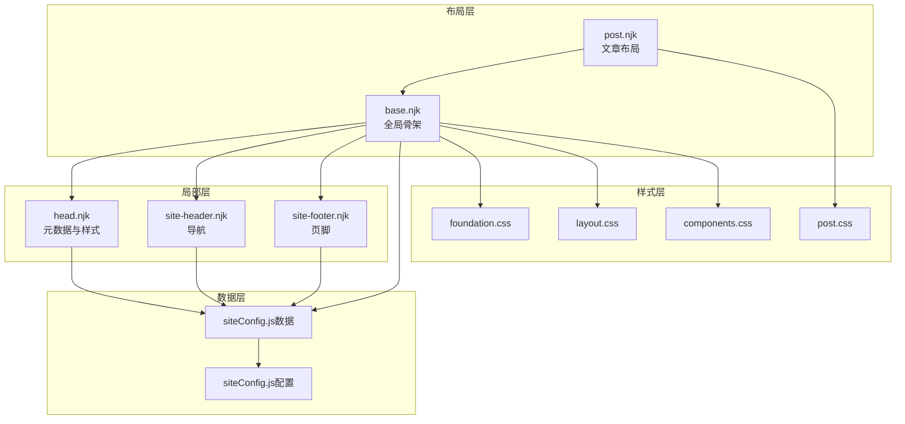
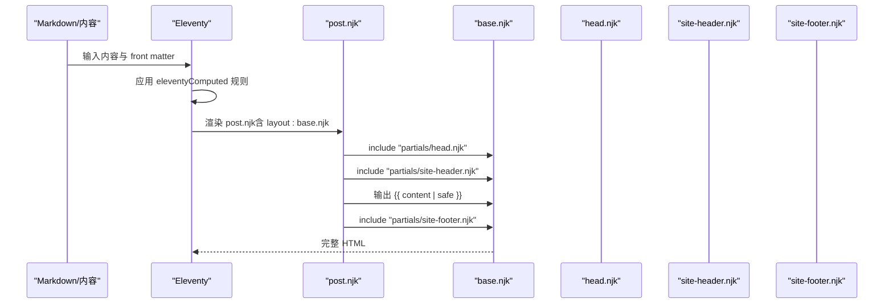
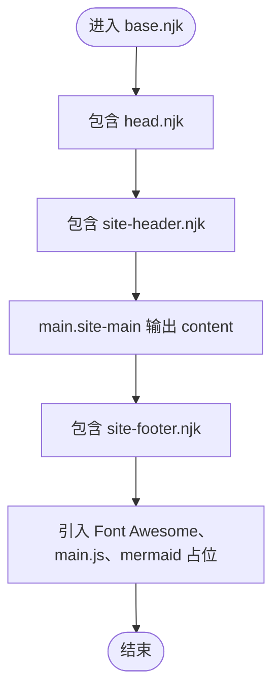
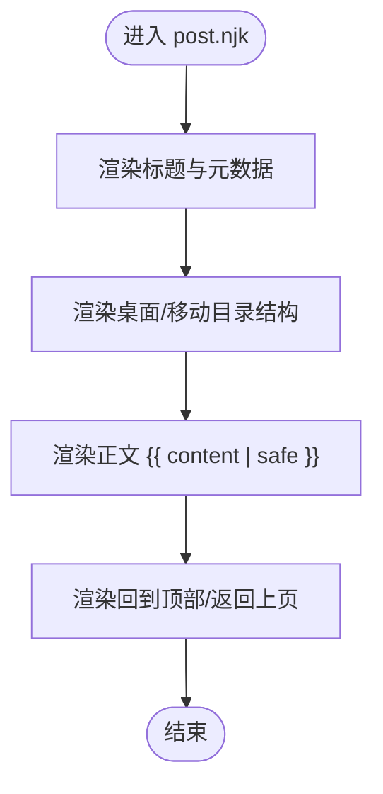
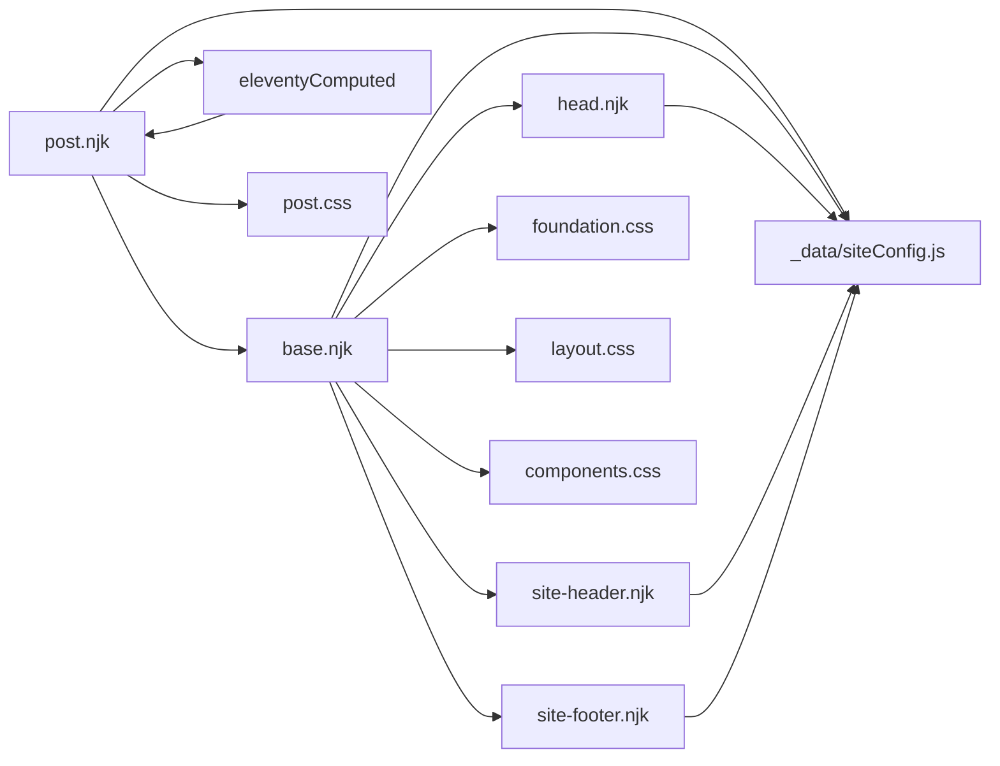

# 布局系统架构

<cite>
**本文引用的文件**
- [base.njk](file://src/_includes/layouts/base.njk)
- [post.njk](file://src/_includes/layouts/post.njk)
- [head.njk](file://src/_includes/partials/head.njk)
- [site-header.njk](file://src/_includes/partials/site-header.njk)
- [site-footer.njk](file://src/_includes/partials/site-footer.njk)
- [siteConfig.js（数据）](file://src/_data/siteConfig.js)
- [siteConfig.js（配置）](file://src/content/settings/siteConfig.js)
- [layout.css](file://src/assets/css/layout.css)
- [foundation.css](file://src/assets/css/foundation.css)
- [components.css](file://src/assets/css/components.css)
- [post.css](file://src/assets/css/pages/post.css)
- [.eleventy.js](file://.eleventy.js)
- [index.njk](file://src/content/pages/index.njk)
- [moments.json](file://src/_data/moments.json)
</cite>

## 目录
1. [引言](#引言)
2. [项目结构](#项目结构)
3. [核心组件](#核心组件)
4. [架构总览](#架构总览)
5. [详细组件分析](#详细组件分析)
6. [依赖分析](#依赖分析)
7. [性能考虑](#性能考虑)
8. [故障排查指南](#故障排查指南)
9. [结论](#结论)
10. [附录](#附录)

## 引言
本文件系统性解析本项目的布局系统，围绕基础布局 base.njk 的设计理念与全局结构、元数据处理与通用组件集成展开；同时深入剖析文章布局 post.njk 的具体实现，包括内容渲染、元数据展示与文章相关功能。文档进一步阐明布局间的继承关系与复用机制，解释布局参数传递、条件渲染与动态内容插入的实现方式，并提供布局定制与扩展的开发指南，覆盖响应式布局与移动端适配的具体方案。

## 项目结构
布局系统位于 src/_includes 下，采用“布局 + 局部”分层组织：
- 布局层：base.njk（全局骨架）、post.njk（文章专用）
- 局部层：head.njk（头部元数据与样式注入）、site-header.njk（导航）、site-footer.njk（页脚）
- 数据层：_data/siteConfig.js 汇聚 content/settings/siteConfig.js 的全站配置
- 样式层：foundation.css（主题变量与全局基线）、layout.css（导航与全局栅格）、components.css（通用组件）、pages/post.css（文章页特有样式）

图表来源
- [base.njk:1-20](file://src/_includes/layouts/base.njk#L1-L20)
- [post.njk:1-49](file://src/_includes/layouts/post.njk#L1-L49)
- [head.njk:1-27](file://src/_includes/partials/head.njk#L1-L27)
- [site-header.njk:1-44](file://src/_includes/partials/site-header.njk#L1-L44)
- [site-footer.njk:1-13](file://src/_includes/partials/site-footer.njk#L1-L13)
- [siteConfig.js（数据）:1-2](file://src/_data/siteConfig.js#L1-L2)
- [siteConfig.js（配置）:1-168](file://src/content/settings/siteConfig.js#L1-L168)
- [foundation.css:1-271](file://src/assets/css/foundation.css#L1-L271)
- [layout.css:1-276](file://src/assets/css/layout.css#L1-L276)
- [components.css:1-304](file://src/assets/css/components.css#L1-L304)
- [post.css:1-912](file://src/assets/css/pages/post.css#L1-L912)

章节来源
- [base.njk:1-20](file://src/_includes/layouts/base.njk#L1-L20)
- [post.njk:1-49](file://src/_includes/layouts/post.njk#L1-L49)
- [head.njk:1-27](file://src/_includes/partials/head.njk#L1-L27)
- [site-header.njk:1-44](file://src/_includes/partials/site-header.njk#L1-L44)
- [site-footer.njk:1-13](file://src/_includes/partials/site-footer.njk#L1-L13)
- [siteConfig.js（数据）:1-2](file://src/_data/siteConfig.js#L1-L2)
- [siteConfig.js（配置）:1-168](file://src/content/settings/siteConfig.js#L1-L168)
- [foundation.css:1-271](file://src/assets/css/foundation.css#L1-L271)
- [layout.css:1-276](file://src/assets/css/layout.css#L1-L276)
- [components.css:1-304](file://src/assets/css/components.css#L1-L304)
- [post.css:1-912](file://src/assets/css/pages/post.css#L1-L912)

## 核心组件
- 基础布局 base.njk
  - 设计理念：最小可用骨架，承载全局结构与通用组件，通过 Nunjucks include 注入头部、页眉与页脚，主体区域输出 content 片段。
  - 关键点：lang 来自 siteConfig.meta.lang；body 可附加 bodyClass；引入 Font Awesome 与本地 JS；支持 mermaid 渲染占位。
- 文章布局 post.njk
  - 设计理念：在基础布局之上，限定文章容器、标题、元数据（日期/更新时间）、目录（桌面/移动）、正文与操作按钮。
  - 关键点：声明 layout: base.njk；设置 bodyClass: no-grid-page post-page；注入 pageStyles；条件渲染“最后更新时间”；提供桌面/移动目录结构。
- 头部 head.njk
  - 设计理念：集中注入 viewport、title（含标题过滤器）、description、字体资源、基础与组件样式、主题初始化脚本、页面级样式表。
  - 关键点：根据 pageStyles 循环注入 link；主题初始化脚本依据 siteConfig.theme.default 与 localStorage 决定初始主题。
- 导航 site-header.njk
  - 设计理念：响应式导航，移动端汉堡菜单，支持图标化导航项，主题切换按钮，基于 siteConfig.navigation.main 渲染。
- 页脚 site-footer.njk
  - 设计理念：品牌标识、社交链接、版权信息，基于 siteConfig.footer 构建。
- 全站配置 siteConfig
  - 设计理念：集中管理品牌、导航、页脚、元数据、主题、分页等，供布局与页面模板共享。
- 样式体系
  - foundation.css：主题变量与全局基线，含明暗两套主题；网格背景按页面类型差异化呈现。
  - layout.css：导航固定、透明态、汉堡菜单、移动端抽屉与遮罩；响应式断点与布局间距。
  - components.css：通用卡片、标签云、步骤条等组件样式；移动端折叠。
  - post.css：文章容器宽度、标题层级、目录吸附定位、滚动条、图片缩放与灯箱、脚注预览等。

章节来源
- [base.njk:1-20](file://src/_includes/layouts/base.njk#L1-L20)
- [post.njk:1-49](file://src/_includes/layouts/post.njk#L1-L49)
- [head.njk:1-27](file://src/_includes/partials/head.njk#L1-L27)
- [site-header.njk:1-44](file://src/_includes/partials/site-header.njk#L1-L44)
- [site-footer.njk:1-13](file://src/_includes/partials/site-footer.njk#L1-L13)
- [siteConfig.js（数据）:1-2](file://src/_data/siteConfig.js#L1-L2)
- [siteConfig.js（配置）:1-168](file://src/content/settings/siteConfig.js#L1-L168)
- [foundation.css:1-271](file://src/assets/css/foundation.css#L1-L271)
- [layout.css:1-276](file://src/assets/css/layout.css#L1-L276)
- [components.css:1-304](file://src/assets/css/components.css#L1-L304)
- [post.css:1-912](file://src/assets/css/pages/post.css#L1-L912)

## 架构总览
布局系统遵循“继承 + 组合”的模式：
- post.njk 通过 front matter 声明 layout: base.njk，形成继承链：post.njk -> base.njk -> head.njk/site-header.njk/site-footer.njk
- 元数据通过 _data/siteConfig.js 与 Eleventy 计算数据（eleventyComputed）注入，实现跨页面一致性
- 样式按需加载：head.njk 注入基础样式与组件样式；post.njk 通过 pageStyles 注入文章页样式

图表来源
- [.eleventy.js:75-157](file://.eleventy.js#L75-L157)
- [post.njk:1-49](file://src/_includes/layouts/post.njk#L1-L49)
- [base.njk:1-20](file://src/_includes/layouts/base.njk#L1-L20)
- [head.njk:1-27](file://src/_includes/partials/head.njk#L1-L27)
- [site-header.njk:1-44](file://src/_includes/partials/site-header.njk#L1-L44)
- [site-footer.njk:1-13](file://src/_includes/partials/site-footer.njk#L1-L13)

## 详细组件分析

### 基础布局 base.njk
- 结构职责
  - 头部：include head.njk
  - 主体：main.site-main 包裹 {{ content | safe }}
  - 页脚：include site-footer.njk
  - 脚本：Font Awesome CDN、本地 main.js、mermaid 占位
- 参数与上下文
  - 使用 siteConfig.meta.lang 设置 html lang
  - 支持 bodyClass（可由上游布局或页面设置）
  - content 为上游模板输出的 HTML 片段
- 与 partials 的组合
  - head.njk：注入 title、description、字体、基础样式、主题初始化、页面样式
  - site-header.njk：导航与主题切换
  - site-footer.njk：品牌与社交

图表来源
- [base.njk:1-20](file://src/_includes/layouts/base.njk#L1-L20)
- [head.njk:1-27](file://src/_includes/partials/head.njk#L1-L27)
- [site-header.njk:1-44](file://src/_includes/partials/site-header.njk#L1-L44)
- [site-footer.njk:1-13](file://src/_includes/partials/site-footer.njk#L1-L13)

章节来源
- [base.njk:1-20](file://src/_includes/layouts/base.njk#L1-L20)

### 文章布局 post.njk
- 继承与参数
  - layout: base.njk
  - bodyClass: no-grid-page post-page（影响背景网格与样式）
  - pageStyles：注入 alerts.css、code.css、post.css
- 内容渲染
  - 文章容器：.post-container
  - 标题：{{ title }}
  - 元数据：发布时间（page.date）与可选“最后更新时间”（updated）
  - 正文：{{ content | safe }}
  - 目录：桌面 .post-toc 与移动 details .post-toc-mobile
  - 操作：回到顶部、返回上页
- 条件渲染
  - updated 存在时才渲染“最后更新时间”
- 动态内容
  - mermaid 占位由 base.njk 引入，post.njk 中通过 {{ content | safe }} 含有 mermaid 图表时生效

图表来源
- [post.njk:1-49](file://src/_includes/layouts/post.njk#L1-L49)

章节来源
- [post.njk:1-49](file://src/_includes/layouts/post.njk#L1-L49)

### 头部 head.njk
- 元数据与资源
  - viewport、title（结合 formatTitle 过滤器与 siteConfig.meta.title）、description
  - 字体资源（fonts.loli.net）
  - 基础样式：foundation.css、layout.css、components.css
  - 主题初始化脚本：根据 siteConfig.theme.default 与 localStorage 决定初始主题
  - 页面样式：若存在 pageStyles，则循环注入 link
- 与站点配置的关系
  - 所有文案与默认值来自 siteConfig（brand、meta、theme）

章节来源
- [head.njk:1-27](file://src/_includes/partials/head.njk#L1-L27)

### 导航 site-header.njk
- 结构与交互
  - 固定导航、汉堡菜单、移动端抽屉与遮罩
  - 主菜单项来自 siteConfig.navigation.main，支持图标化
  - 主题切换按钮，基于 data-theme 控制图标显示
- 响应式行为
  - 在 layout.css 中定义了移动端断点与菜单抽屉逻辑

章节来源
- [site-header.njk:1-44](file://src/_includes/partials/site-header.njk#L1-L44)
- [layout.css:229-268](file://src/assets/css/layout.css#L229-L268)

### 页脚 site-footer.njk
- 结构
  - 品牌标识：siteConfig.brand.logoText
  - 社交链接：siteConfig.footer.socialLinks
  - 版权信息：siteConfig.footer.tagline 与年份
- 与配置耦合
  - 所有内容均来自 siteConfig.footer

章节来源
- [site-footer.njk:1-13](file://src/_includes/partials/site-footer.njk#L1-L13)

### 全站配置 siteConfig
- 数据聚合
  - _data/siteConfig.js 导出 content/settings/siteConfig.js 的配置对象
- 配置项
  - brand、navigation、footer、meta、theme、pagination、pages（首页、分类、服务等页面文案）
- 作用域
  - 布局与页面模板均可直接访问 siteConfig.* 获取统一文案与元数据

章节来源
- [siteConfig.js（数据）:1-2](file://src/_data/siteConfig.js#L1-L2)
- [siteConfig.js（配置）:1-168](file://src/content/settings/siteConfig.js#L1-L168)

### 样式体系与响应式
- foundation.css
  - 定义明暗两套主题变量，含网格背景、悬停态、语义色等
  - body 上的类选择器（如 .post-page、.no-grid-page）驱动背景网格差异
- layout.css
  - 导航固定与透明态、汉堡菜单、移动端抽屉与遮罩
  - 响应式断点：1024px 与 768px，分别控制导航与页脚布局
- components.css
  - 通用组件样式与移动端折叠
- post.css
  - 文章容器宽度、标题层级、目录吸附定位、滚动条、图片缩放与灯箱、脚注预览等

章节来源
- [foundation.css:1-271](file://src/assets/css/foundation.css#L1-L271)
- [layout.css:1-276](file://src/assets/css/layout.css#L1-L276)
- [components.css:1-304](file://src/assets/css/components.css#L1-L304)
- [post.css:1-912](file://src/assets/css/pages/post.css#L1-L912)

## 依赖分析
- 继承关系
  - post.njk -> base.njk（front matter 声明）
  - base.njk -> head.njk/site-header.njk/site-footer.njk（include）
- 数据依赖
  - _data/siteConfig.js -> content/settings/siteConfig.js
  - Eleventy 计算数据（eleventyComputed）为 post 提供 title、subcategory、layout、permalink、publishDate、updated、tags、bodyClass、pageStyles 等
- 样式依赖
  - head.njk 注入基础与组件样式；post.njk 注入文章页样式
  - 响应式样式集中在 layout.css 与 post.css

图表来源
- [post.njk:1-49](file://src/_includes/layouts/post.njk#L1-L49)
- [base.njk:1-20](file://src/_includes/layouts/base.njk#L1-L20)
- [head.njk:1-27](file://src/_includes/partials/head.njk#L1-L27)
- [site-header.njk:1-44](file://src/_includes/partials/site-header.njk#L1-L44)
- [site-footer.njk:1-13](file://src/_includes/partials/site-footer.njk#L1-L13)
- [siteConfig.js（数据）:1-2](file://src/_data/siteConfig.js#L1-L2)
- [.eleventy.js:75-157](file://.eleventy.js#L75-L157)

章节来源
- [.eleventy.js:75-157](file://.eleventy.js#L75-L157)

## 性能考虑
- 样式按需加载：head.njk 注入基础与组件样式；post.njk 通过 pageStyles 注入文章页样式，避免不必要的样式阻塞
- 主题初始化：head.njk 中的主题脚本在 DOMContentLoaded 前后设置 data-theme，减少闪烁
- 背景网格：foundation.css 通过 body 类控制网格背景，避免在非目标页面渲染网格
- 响应式：layout.css 与 post.css 的媒体查询仅在必要时生效，减少复杂计算

## 故障排查指南
- 文章未应用 post 布局
  - 检查 front matter 是否声明 layout: layouts/post.njk 或是否被 eleventyComputed 覆盖
  - 参考：[post.njk:2](file://src/_includes/layouts/post.njk#L2-L2)、[.eleventy.js:98-101](file://.eleventy.js#L98-L101)
- 标题或元描述异常
  - 检查 siteConfig.meta.title 与 siteConfig.meta.description
  - 参考：[head.njk:3-4](file://src/_includes/partials/head.njk#L3-L4)、[siteConfig.js（配置）:27-34](file://src/content/settings/siteConfig.js#L27-L34)
- 主题切换无效
  - 检查 localStorage 中的 theme 值与 siteConfig.theme.default
  - 参考：[head.njk:11-21](file://src/_includes/partials/head.njk#L11-L21)、[siteConfig.js（配置）:36-38](file://src/content/settings/siteConfig.js#L36-L38)
- 文章目录不显示
  - 检查是否存在标题层级与 mermaid 占位；确认 post.css 中目录样式未被覆盖
  - 参考：[post.njk:27-34](file://src/_includes/layouts/post.njk#L27-L34)、[post.css:72-230](file://src/assets/css/pages/post.css#L72-L230)
- 移动端导航无法打开
  - 检查 layout.css 中菜单开关类与遮罩逻辑
  - 参考：[layout.css:229-268](file://src/assets/css/layout.css#L229-L268)

章节来源
- [post.njk:1-49](file://src/_includes/layouts/post.njk#L1-L49)
- [head.njk:1-27](file://src/_includes/partials/head.njk#L1-L27)
- [siteConfig.js（配置）:1-168](file://src/content/settings/siteConfig.js#L1-L168)
- [layout.css:229-268](file://src/assets/css/layout.css#L229-L268)
- [post.css:1-912](file://src/assets/css/pages/post.css#L1-L912)

## 结论
本布局系统以 base.njk 为核心骨架，通过 post.njk 实现文章页的强约束渲染；head.njk、site-header.njk、site-footer.njk 提供一致的头部、导航与页脚体验；siteConfig 将全站文案与元数据集中管理；Eleventy 的 eleventyComputed 为文章页提供稳定的默认值与规则。样式体系以 foundation.css 为主题基线，layout.css 与 post.css 实现响应式与文章页特有交互。整体架构清晰、职责分明、易于扩展与维护。

## 附录

### 布局参数传递与条件渲染清单
- front matter 参数
  - layout：指定父布局（如 layouts/base.njk）
  - bodyClass：附加到 body 的类名（如 no-grid-page post-page）
  - pageStyles：数组形式的页面级样式表路径
- 上下文变量
  - title、page.date、updated、content、siteConfig.*
- 条件渲染
  - updated 存在时显示“最后更新时间”
  - pageStyles 存在时注入 link 标签
  - 导航项 active 状态基于 page.url 与导航项 url 对比

章节来源
- [post.njk:1-49](file://src/_includes/layouts/post.njk#L1-L49)
- [head.njk:22-26](file://src/_includes/partials/head.njk#L22-L26)
- [site-header.njk:17-26](file://src/_includes/partials/site-header.njk#L17-L26)

### 响应式布局与移动端适配方案
- 断点与布局
  - 1024px：隐藏桌面导航，启用汉堡菜单与右侧抽屉
  - 768px：调整 main 内边距与 footer 布局
- 交互细节
  - 导航透明态与过渡动画
  - 移动端遮罩层与菜单开关状态
- 文章页目录
  - 桌面目录固定吸附，移动端使用 details/summary
  - 悬停时显示目录项，非悬停仅显示当前激活项文本

章节来源
- [layout.css:229-276](file://src/assets/css/layout.css#L229-L276)
- [post.css:72-230](file://src/assets/css/pages/post.css#L72-L230)

### 开发指南：布局定制与扩展
- 新增页面布局
  - 在 src/_includes/layouts 下新增 .njk 文件，使用  继承
  - 在 front matter 中设置 bodyClass 与 pageStyles（如适用）
- 修改全局样式
  - 在 head.njk 中追加 link 或在 post.njk 中通过 pageStyles 注入
  - 在 foundation.css 中调整主题变量，确保明暗两套兼容
- 扩展导航
  - 在 content/settings/siteConfig.js 的 navigation.main 中添加新项
  - 在 site-header.njk 中根据 url 增加图标映射
- 文章页增强
  - 在 post.njk 中新增区块（如“相关推荐”），并通过样式文件控制响应式表现
- 数据层扩展
  - 在 content/settings/siteConfig.js 中新增页面文案配置，在 _data/siteConfig.js 中导出
  - 在 .eleventy.js 的 eleventyComputed 中为新页面类型补充默认值与规则

章节来源
- [siteConfig.js（配置）:1-168](file://src/content/settings/siteConfig.js#L1-L168)
- [siteConfig.js（数据）:1-2](file://src/_data/siteConfig.js#L1-L2)
- [.eleventy.js:75-157](file://.eleventy.js#L75-L157)
- [post.njk:1-49](file://src/_includes/layouts/post.njk#L1-L49)
- [head.njk:1-27](file://src/_includes/partials/head.njk#L1-L27)
- [site-header.njk:1-44](file://src/_includes/partials/site-header.njk#L1-L44)