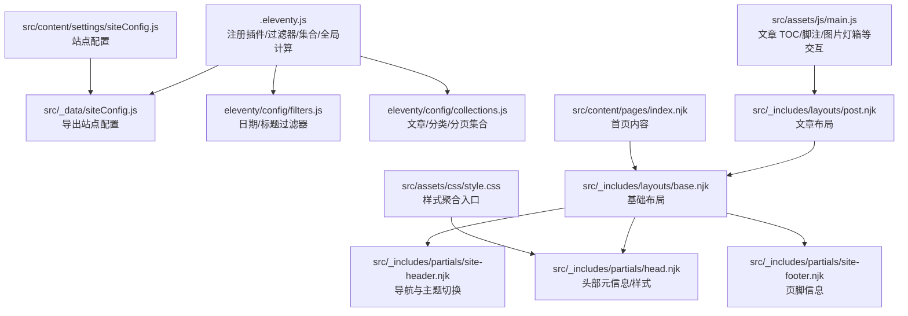
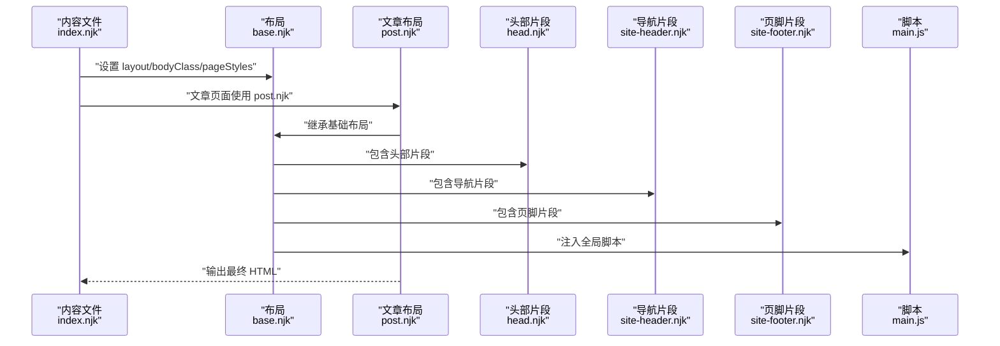
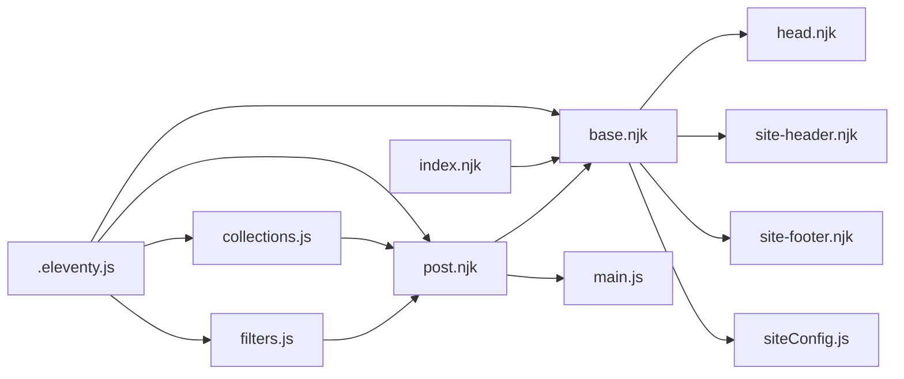

# 模板和布局系统

<cite>
**本文引用的文件**
- [.eleventy.js](file://.eleventy.js)
- [src/_includes/layouts/base.njk](file://src/_includes/layouts/base.njk)
- [src/_includes/layouts/post.njk](file://src/_includes/layouts/post.njk)
- [src/_includes/partials/head.njk](file://src/_includes/partials/head.njk)
- [src/_includes/partials/site-header.njk](file://src/_includes/partials/site-header.njk)
- [src/_includes/partials/site-footer.njk](file://src/_includes/partials/site-footer.njk)
- [src/content/pages/index.njk](file://src/content/pages/index.njk)
- [src/content/settings/siteConfig.js](file://src/content/settings/siteConfig.js)
- [src/_data/siteConfig.js](file://src/_data/siteConfig.js)
- [eleventy/config/filters.js](file://eleventy/config/filters.js)
- [eleventy/config/collections.js](file://eleventy/config/collections.js)
- [src/assets/css/style.css](file://src/assets/css/style.css)
- [src/assets/js/main.js](file://src/assets/js/main.js)
</cite>

## 目录
1. [引言](#引言)
2. [项目结构](#项目结构)
3. [核心组件](#核心组件)
4. [架构总览](#架构总览)
5. [详细组件分析](#详细组件分析)
6. [依赖关系分析](#依赖关系分析)
7. [性能考量](#性能考量)
8. [故障排查指南](#故障排查指南)
9. [结论](#结论)
10. [附录](#附录)

## 引言
本文件系统性梳理 11ty RainyNight 模板与布局体系，聚焦 Nunjucks 模板引擎的使用与语法特性，详解基础布局 base.njk 与文章布局 post.njk 的设计理念，说明部分模板（partials）的组织与复用机制，阐述模板继承、变量传递与条件渲染的实现方式，并给出模板开发最佳实践、性能优化建议、自定义组件开发指南、调试与错误处理方法，以及响应式与移动端适配的实现思路。

## 项目结构
RainyNight 采用 11ty 标准目录结构，结合 Nunjucks 模板与 Eleventy 配置，形成“数据驱动 + 模板继承 + 静态生成”的前端构建体系。关键目录与职责如下：
- src/_includes：存放 Nunjucks 模板与布局，含 layouts 与 partials 子目录
- src/_data：全局数据模块，如 siteConfig.js 导出站点配置
- src/content：内容层，包含页面与文章，使用 Front Matter 驱动模板变量
- src/assets：静态资源，CSS/JS 分离，便于按需加载
- eleventy/config：Eleventy 插件与过滤器、集合注册等配置
- .eleventy.js：Eleventy 主配置，注册插件、过滤器、集合、Markdown 库与全局计算属性

图表来源
- [.eleventy.js:36-181](file://.eleventy.js#L36-L181)
- [src/_includes/layouts/base.njk:1-20](file://src/_includes/layouts/base.njk#L1-L20)
- [src/_includes/partials/head.njk:1-27](file://src/_includes/partials/head.njk#L1-L27)
- [src/_includes/partials/site-header.njk:1-44](file://src/_includes/partials/site-header.njk#L1-L44)
- [src/_includes/partials/site-footer.njk:1-13](file://src/_includes/partials/site-footer.njk#L1-L13)
- [src/_includes/layouts/post.njk:1-49](file://src/_includes/layouts/post.njk#L1-L49)
- [src/content/pages/index.njk:1-94](file://src/content/pages/index.njk#L1-L94)
- [src/content/settings/siteConfig.js:1-168](file://src/content/settings/siteConfig.js#L1-L168)
- [src/_data/siteConfig.js:1-2](file://src/_data/siteConfig.js#L1-L2)
- [src/assets/css/style.css:1-6](file://src/assets/css/style.css#L1-L6)
- [src/assets/js/main.js:1-800](file://src/assets/js/main.js#L1-L800)

章节来源
- [.eleventy.js:36-181](file://.eleventy.js#L36-L181)
- [src/_includes/layouts/base.njk:1-20](file://src/_includes/layouts/base.njk#L1-L20)
- [src/_includes/partials/head.njk:1-27](file://src/_includes/partials/head.njk#L1-L27)
- [src/_includes/partials/site-header.njk:1-44](file://src/_includes/partials/site-header.njk#L1-L44)
- [src/_includes/partials/site-footer.njk:1-13](file://src/_includes/partials/site-footer.njk#L1-L13)
- [src/_includes/layouts/post.njk:1-49](file://src/_includes/layouts/post.njk#L1-L49)
- [src/content/pages/index.njk:1-94](file://src/content/pages/index.njk#L1-L94)
- [src/content/settings/siteConfig.js:1-168](file://src/content/settings/siteConfig.js#L1-L168)
- [src/_data/siteConfig.js:1-2](file://src/_data/siteConfig.js#L1-L2)
- [src/assets/css/style.css:1-6](file://src/assets/css/style.css#L1-L6)
- [src/assets/js/main.js:1-800](file://src/assets/js/main.js#L1-L800)

## 核心组件
- 基础布局 base.njk：定义 HTML 结构、引入 head 与 footer、注入 content 区域与全局脚本；通过 bodyClass 与 pageStyles 实现页面级样式与类名控制
- 文章布局 post.njk：继承基础布局，封装文章容器、标题/日期/更新时间、目录（桌面/移动）、内容区与操作按钮；内置 Mermaid 脚本占位符
- 头部 partial head.njk：输出 meta、预连接字体、主题初始化脚本、按页面注入额外样式表
- 导航 partial site-header.njk：读取站点配置渲染主导航、活动态高亮、主题切换按钮、移动端菜单
- 页脚 partial site-footer.njk：品牌名、社交链接、版权信息
- 页面内容：如首页 index.njk 使用 Front Matter 设置 layout/bodyClass/pageStyles，并通过 siteConfig.pages.home 渲染区块
- 过滤器：日期格式化、HTML 日期字符串、年份、归档月份、标题格式化、从路径提取目录名
- 集合：文章、分类树、分类详情分页、文件夹分组等
- 全局计算属性：自动推断文章标题/子分类/布局/永久链接/发布/更新时间/标签/样式等

章节来源
- [src/_includes/layouts/base.njk:1-20](file://src/_includes/layouts/base.njk#L1-L20)
- [src/_includes/layouts/post.njk:1-49](file://src/_includes/layouts/post.njk#L1-L49)
- [src/_includes/partials/head.njk:1-27](file://src/_includes/partials/head.njk#L1-L27)
- [src/_includes/partials/site-header.njk:1-44](file://src/_includes/partials/site-header.njk#L1-L44)
- [src/_includes/partials/site-footer.njk:1-13](file://src/_includes/partials/site-footer.njk#L1-L13)
- [src/content/pages/index.njk:1-94](file://src/content/pages/index.njk#L1-L94)
- [eleventy/config/filters.js:1-43](file://eleventy/config/filters.js#L1-L43)
- [eleventy/config/collections.js:1-377](file://eleventy/config/collections.js#L1-L377)
- [.eleventy.js:75-157](file://.eleventy.js#L75-L157)

## 架构总览
模板系统围绕“数据 + 模板 + 配置”三层展开：
- 数据层：_data 与 content/settings 提供全局配置与页面局部数据
- 模板层：layouts 与 partials 实现可复用的结构与片段
- 配置层：.eleventy.js 注册插件、过滤器、集合与全局计算属性，统一 Markdown 渲染与资源复制策略

图表来源
- [src/content/pages/index.njk:1-94](file://src/content/pages/index.njk#L1-L94)
- [src/_includes/layouts/base.njk:1-20](file://src/_includes/layouts/base.njk#L1-L20)
- [src/_includes/layouts/post.njk:1-49](file://src/_includes/layouts/post.njk#L1-L49)
- [src/_includes/partials/head.njk:1-27](file://src/_includes/partials/head.njk#L1-L27)
- [src/_includes/partials/site-header.njk:1-44](file://src/_includes/partials/site-header.njk#L1-L44)
- [src/_includes/partials/site-footer.njk:1-13](file://src/_includes/partials/site-footer.njk#L1-L13)
- [src/assets/js/main.js:1-800](file://src/assets/js/main.js#L1-L800)

## 详细组件分析

### 基础布局 base.njk
- 设计要点
  - 以最小 HTML 结构承载页面骨架，通过 include 引入 head、header、footer 片段
  - content 区域使用安全输出，确保 Markdown 渲染后的 HTML 正确显示
  - 支持 bodyClass 与 pageStyles 的动态注入，实现页面级样式与类名控制
  - 在 body 底部注入 Font Awesome 与本地脚本，以及 Mermaid 占位符
- 关键点
  - 语言属性来自全局配置
  - 通过 include 将 head 与 footer 的职责解耦
  - 安全输出 content，避免 XSS 风险

章节来源
- [src/_includes/layouts/base.njk:1-20](file://src/_includes/layouts/base.njk#L1-L20)

### 文章布局 post.njk
- 设计要点
  - 继承基础布局，设置默认 bodyClass 与 pageStyles，确保文章页样式一致
  - 输出文章标题、日期与可选的更新时间，使用日期过滤器进行格式化
  - 提供桌面与移动双套目录结构，配合 JS 实现滚动联动与激活态
  - 内容区域安全输出，支持 Mermaid 图表占位符
  - 提供返回顶部与返回上页的操作按钮
- 关键点
  - 条件渲染更新时间，避免空值显示
  - 目录列表通过 JS 动态生成，减少模板复杂度

章节来源
- [src/_includes/layouts/post.njk:1-49](file://src/_includes/layouts/post.njk#L1-L49)

### 头部片段 head.njk
- 设计要点
  - 输出字符集、视口、标题与描述，标题通过过滤器进行格式化
  - 预连接字体资源，提升首屏渲染性能
  - 注入主题初始化脚本，基于配置与本地存储决定初始主题
  - 支持按页面注入额外样式表，实现页面级样式隔离
- 关键点
  - 主题初始化逻辑在客户端执行，保证 SSR 与 CSR 一致性
  - pageStyles 通过循环注入，便于按需扩展

章节来源
- [src/_includes/partials/head.njk:1-27](file://src/_includes/partials/head.njk#L1-L27)

### 导航片段 site-header.njk
- 设计要点
  - 从站点配置读取主导航，支持活动态高亮
  - 为特定路由图标化，增强可读性
  - 提供主题切换按钮，与 head 中的主题初始化脚本协同工作
  - 移动端汉堡菜单与遮罩层，保证移动端可访问性
- 关键点
  - 未配置时提供回退链接，保证可用性
  - SVG 图标内联，减少额外请求

章节来源
- [src/_includes/partials/site-header.njk:1-44](file://src/_includes/partials/site-header.njk#L1-L44)

### 页脚片段 site-footer.njk
- 设计要点
  - 品牌名、社交链接、版权信息均来自站点配置
  - 年份通过过滤器动态生成，避免手工维护
- 关键点
  - 社交链接循环输出，便于扩展

章节来源
- [src/_includes/partials/site-footer.njk:1-13](file://src/_includes/partials/site-footer.njk#L1-L13)

### 页面内容示例：首页 index.njk
- 设计要点
  - 使用 Front Matter 设置 layout/bodyClass/pageStyles
  - 通过 siteConfig.pages.home 获取首页区块数据，实现内容与模板分离
  - 使用安全输出与替换过滤器处理多行文本
  - 区块化结构，便于维护与扩展
- 关键点
  - 与基础布局解耦，仅负责内容区

章节来源
- [src/content/pages/index.njk:1-94](file://src/content/pages/index.njk#L1-L94)

### 过滤器与集合
- 过滤器
  - 日期类：readableDate、htmlDateString、year、archiveMonth、archiveMonthLabel
  - 标题类：formatTitle，实现标题与站点标题的拼接与去重
  - 工具类：folderNameFromPost，从文章路径提取目录名
- 集合
  - 文章集合：按日期倒序
  - 分类集合：构建分类树与子分类元数据
  - 分类详情分页：按配置分页大小生成分页数据
  - 文件夹分组：按顶层分类与子分类组合统计与排序
- 关键点
  - 过滤器与集合均在 Eleventy 配置中注册，全局可用
  - 集合构建考虑多级分类、子分类元数据与排序规则

章节来源
- [eleventy/config/filters.js:1-43](file://eleventy/config/filters.js#L1-L43)
- [eleventy/config/collections.js:1-377](file://eleventy/config/collections.js#L1-L377)

### 全局计算属性（eleventyComputed）
- 设计要点
  - 自动推断文章标题、子分类、布局、永久链接、发布/更新时间、标签、bodyClass、pageStyles
  - 对文章输入进行专门判断，确保非文章页面不受影响
  - 更新时间基于文件修改时间与发布日期对比，超过阈值才显示
- 关键点
  - 通过 computed 属性减少 Front Matter 冗余，提升维护效率

章节来源
- [.eleventy.js:75-157](file://.eleventy.js#L75-L157)

### 样式与脚本组织
- 样式
  - style.css 作为聚合入口，统一导入基础、布局、组件、告警、代码等样式
  - head.njk 按页面注入额外样式表，实现按需加载
- 脚本
  - main.js 负责文章 TOC、脚注预览/跳转、图片灯箱等交互
  - base.njk 注入 Font Awesome 与本地脚本，支持 Mermaid 占位符

章节来源
- [src/assets/css/style.css:1-6](file://src/assets/css/style.css#L1-L6)
- [src/assets/js/main.js:1-800](file://src/assets/js/main.js#L1-L800)
- [src/_includes/layouts/base.njk:15-17](file://src/_includes/layouts/base.njk#L15-L17)
- [src/_includes/partials/head.njk:22-26](file://src/_includes/partials/head.njk#L22-L26)

## 依赖关系分析
- 模板依赖
  - post.njk 依赖 base.njk
  - base.njk 依赖 head、site-header、site-footer
- 数据依赖
  - 所有页面依赖 siteConfig.js 提供的品牌、导航、页脚、元信息与分页配置
- 配置依赖
  - .eleventy.js 注册过滤器、集合、Markdown 库、全局计算属性与资源复制
- 运行时依赖
  - main.js 依赖 post.njk 的 DOM 结构与样式类名

图表来源
- [src/_includes/layouts/post.njk:1-49](file://src/_includes/layouts/post.njk#L1-L49)
- [src/_includes/layouts/base.njk:1-20](file://src/_includes/layouts/base.njk#L1-L20)
- [src/_includes/partials/head.njk:1-27](file://src/_includes/partials/head.njk#L1-L27)
- [src/_includes/partials/site-header.njk:1-44](file://src/_includes/partials/site-header.njk#L1-L44)
- [src/_includes/partials/site-footer.njk:1-13](file://src/_includes/partials/site-footer.njk#L1-L13)
- [src/content/pages/index.njk:1-94](file://src/content/pages/index.njk#L1-L94)
- [eleventy/config/filters.js:1-43](file://eleventy/config/filters.js#L1-L43)
- [eleventy/config/collections.js:1-377](file://eleventy/config/collections.js#L1-L377)
- [.eleventy.js:36-181](file://.eleventy.js#L36-L181)

## 性能考量
- 模板层面
  - 使用 include 复用 head/header/footer，减少重复渲染
  - 通过 pageStyles 按页面注入样式，避免全局样式冗余
  - 使用安全输出与过滤器，避免不必要的模板计算
- 资源层面
  - head.njk 预连接字体资源，缩短首屏等待
  - main.js 采用事件委托与被动监听，降低滚动/尺寸变化开销
- 数据层面
  - 全局计算属性减少 Front Matter 冗余，提高构建稳定性
  - 集合构建考虑排序与分页，避免运行时大量计算
- 构建层面
  - Eleventy 配置中注册语法高亮与 Mermaid 插件，统一处理代码与图表渲染

章节来源
- [src/_includes/partials/head.njk:5-7](file://src/_includes/partials/head.njk#L5-L7)
- [src/assets/js/main.js:63-79](file://src/assets/js/main.js#L63-L79)
- [.eleventy.js:47-48](file://.eleventy.js#L47-L48)
- [.eleventy.js:160-170](file://.eleventy.js#L160-L170)

## 故障排查指南
- 布局未生效
  - 检查页面 Front Matter 是否正确设置 layout
  - 确认 post.njk 与 base.njk 的继承关系
- 样式缺失
  - 确认 head.njk 中 pageStyles 注入逻辑
  - 检查 style.css 是否正确聚合
- 主题切换异常
  - 检查 head.njk 中主题初始化脚本与 siteConfig.js 的默认主题配置
  - 确认 localStorage 中是否存在主题缓存
- 文章更新时间显示异常
  - 检查全局计算属性中 updated 的推断逻辑与文件修改时间
- 目录/脚注/图片灯箱无效
  - 确认 main.js 是否被正确注入（base.njk）
  - 检查 post.njk 的 DOM 结构是否与 JS 选择器匹配

章节来源
- [src/_includes/layouts/post.njk:1-49](file://src/_includes/layouts/post.njk#L1-L49)
- [src/_includes/layouts/base.njk:15-17](file://src/_includes/layouts/base.njk#L15-L17)
- [src/_includes/partials/head.njk:11-21](file://src/_includes/partials/head.njk#L11-L21)
- [.eleventy.js:117-135](file://.eleventy.js#L117-L135)
- [src/assets/js/main.js:81-278](file://src/assets/js/main.js#L81-L278)

## 结论
RainyNight 的模板与布局系统以 Nunjucks 为基础，结合 Eleventy 的数据与配置能力，实现了高内聚、低耦合的页面结构。通过基础布局与文章布局的继承关系、头部/导航/页脚片段的复用、全局过滤器与集合的统一处理，以及按页面注入样式与运行时脚本，形成了稳定且易扩展的静态站点模板体系。遵循本文的最佳实践与性能建议，可进一步提升开发效率与用户体验。

## 附录

### Nunjucks 模板引擎使用要点
- 变量输出
  - 使用安全输出避免 XSS，如 content 的安全输出
- 条件渲染
  - 基于变量存在性与布尔值进行分支控制，如更新时间条件渲染
- 循环与过滤器
  - 列表循环与内置/自定义过滤器结合，如日期格式化、标题拼接
- 模板继承
  - 通过 extends 与 blocks 实现布局复用，子模板覆盖指定区块

章节来源
- [src/_includes/layouts/post.njk:18-23](file://src/_includes/layouts/post.njk#L18-L23)
- [src/_includes/partials/head.njk:3](file://src/_includes/partials/head.njk#L3)
- [eleventy/config/filters.js:33-39](file://eleventy/config/filters.js#L33-L39)

### 模板开发最佳实践
- 数据与模板分离：通过 _data 与 content/settings 统一管理配置
- 复用优先：优先使用 include 片段，减少重复代码
- 按需加载：通过 pageStyles 与 head.njk 注入页面所需样式
- 可访问性：为交互元素提供 aria 属性与键盘支持
- 可维护性：使用过滤器与集合统一处理日期、标题、分类等逻辑

章节来源
- [src/_data/siteConfig.js:1-2](file://src/_data/siteConfig.js#L1-L2)
- [src/content/settings/siteConfig.js:1-168](file://src/content/settings/siteConfig.js#L1-L168)
- [src/_includes/partials/site-header.njk:36-40](file://src/_includes/partials/site-header.njk#L36-L40)

### 自定义组件开发指南
- 组件结构
  - 将可复用 UI 抽象为 partial，如导航项、卡片、按钮等
  - 通过参数传入数据，保持组件通用性
- 与 JS 协同
  - 为组件预留类名与数据属性，便于 JS 选择与绑定事件
  - 避免在模板中直接写复杂逻辑，将交互下沉至脚本
- 示例路径
  - 参考 site-header.njk 的导航项渲染与主题切换按钮
  - 参考 post.njk 的目录结构与操作按钮

章节来源
- [src/_includes/partials/site-header.njk:14-40](file://src/_includes/partials/site-header.njk#L14-L40)
- [src/_includes/layouts/post.njk:10-48](file://src/_includes/layouts/post.njk#L10-L48)

### 响应式与移动端适配
- 视口与字体
  - head.njk 中设置视口与预连接字体，提升移动端首屏体验
- 导航与菜单
  - site-header.njk 提供汉堡菜单与遮罩层，移动端可折叠导航
- 目录与滚动
  - post.njk 提供桌面与移动两套目录，配合 JS 实现滚动联动
- 图片与弹窗
  - main.js 的图片灯箱支持缩放与拖拽，移动端友好

章节来源
- [src/_includes/partials/head.njk:2-7](file://src/_includes/partials/head.njk#L2-L7)
- [src/_includes/partials/site-header.njk:8-12](file://src/_includes/partials/site-header.njk#L8-L12)
- [src/_includes/layouts/post.njk:27-34](file://src/_includes/layouts/post.njk#L27-L34)
- [src/assets/js/main.js:496-792](file://src/assets/js/main.js#L496-L792)