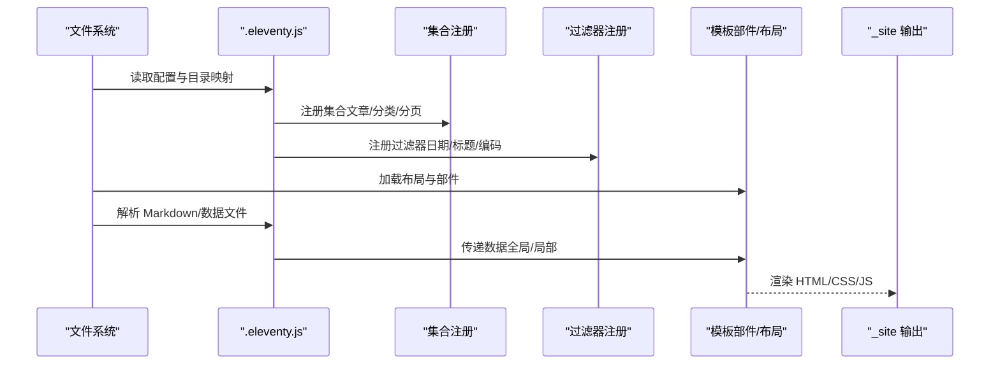
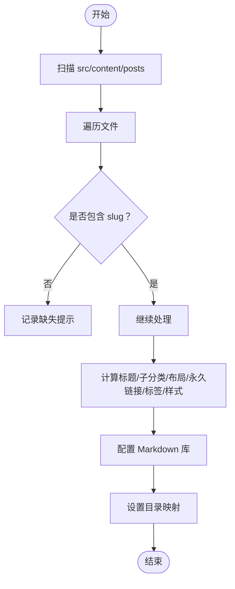
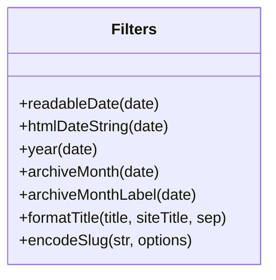
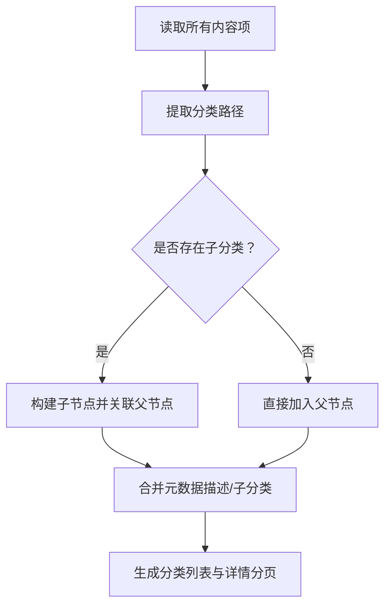
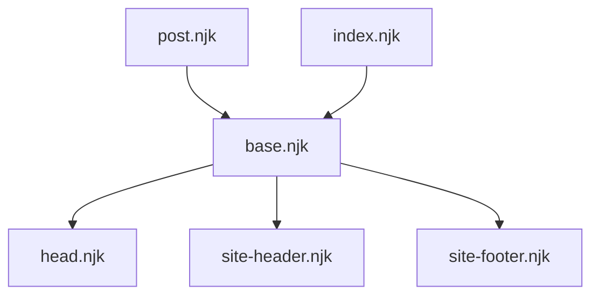
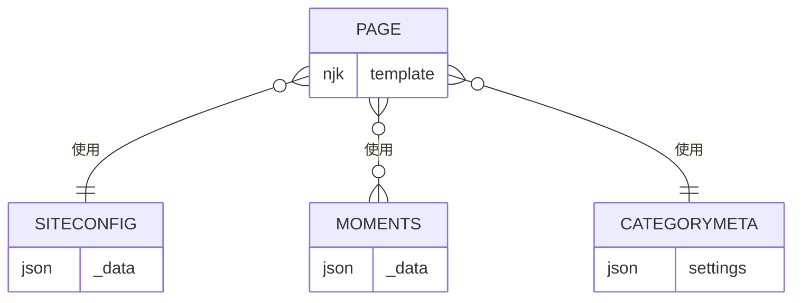
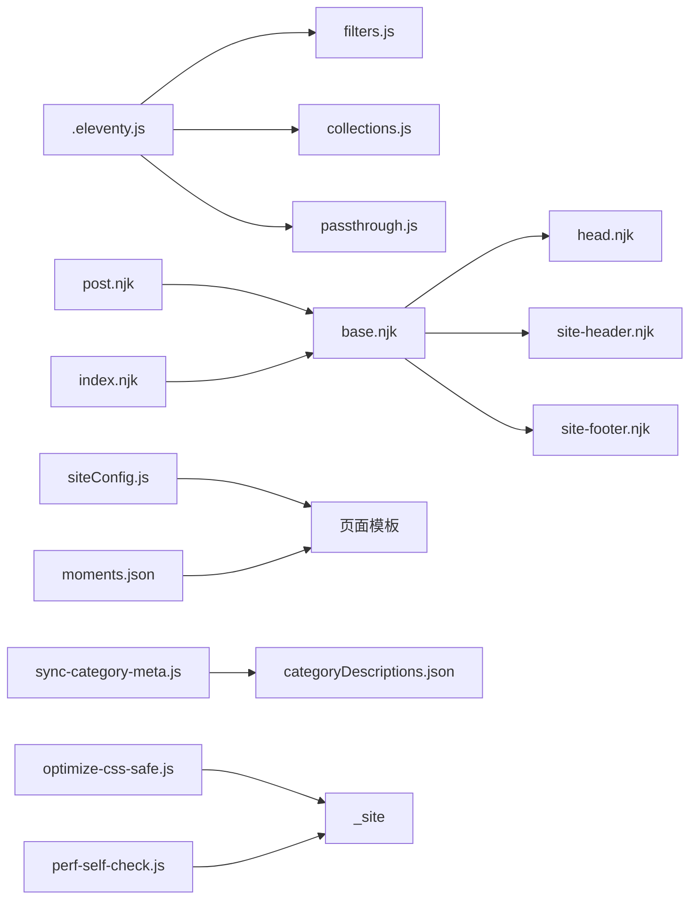

# 模板开发指南

<cite>
**本文引用的文件**
- [.eleventy.js](file://.eleventy.js)
- [package.json](file://package.json)
- [src/_data/siteConfig.js](file://src/_data/siteConfig.js)
- [src/_data/moments.json](file://src/_data/moments.json)
- [src/_includes/layouts/base.njk](file://src/_includes/layouts/base.njk)
- [src/_includes/layouts/post.njk](file://src/_includes/layouts/post.njk)
- [src/_includes/partials/head.njk](file://src/_includes/partials/head.njk)
- [src/_includes/partials/site-header.njk](file://src/_includes/partials/site-header.njk)
- [src/_includes/partials/site-footer.njk](file://src/_includes/partials/site-footer.njk)
- [eleventy/config/filters.js](file://eleventy/config/filters.js)
- [eleventy/config/collections.js](file://eleventy/config/collections.js)
- [src/content/settings/siteConfig.js](file://src/content/settings/siteConfig.js)
- [scripts/optimize-css-safe.js](file://scripts/optimize-css-safe.js)
- [scripts/perf-self-check.js](file://scripts/perf-self-check.js)
- [scripts/sync-category-meta.js](file://scripts/sync-category-meta.js)
- [tests/theme-logic.test.js](file://tests/theme-logic.test.js)
- [src/assets/js/main.js](file://src/assets/js/main.js)
- [src/content/pages/index.njk](file://src/content/pages/index.njk)
</cite>

## 目录
1. [引言](#引言)
2. [项目结构](#项目结构)
3. [核心组件](#核心组件)
4. [架构总览](#架构总览)
5. [详细组件分析](#详细组件分析)
6. [依赖关系分析](#依赖关系分析)
7. [性能考量](#性能考量)
8. [故障排除指南](#故障排除指南)
9. [结论](#结论)
10. [附录](#附录)

## 引言
本指南面向使用 Eleventy 的模板开发者，系统性地阐述模板开发工作流程、文件组织、命名规范、开发环境设置、调试技巧、性能优化、安全最佳实践、与数据层的交互与数据绑定、版本管理与向后兼容，以及常见问题排查。文档以仓库现有实现为依据，结合可操作的步骤与可视化图示，帮助你在保证质量的同时高效迭代。

## 项目结构
该项目采用典型的 Eleventy 结构：内容区（Markdown/数据）、模板区（Nunjucks）、数据区（全局数据与本地数据）、构建脚本与工具链。核心目录与职责如下：
- src：站点源码
  - _data：全局数据与本地数据（如站点配置、动态数据）
  - _includes：模板片段（布局与部件）
  - content：内容文件（Markdown、页面、设置等）
  - assets：静态资源（CSS/JS）
  - static：无需处理的静态文件（如 robots.txt）
- eleventy：Eleventy 配置（过滤器、集合、透传复制等）
- scripts：构建与性能检查脚本
- tests：前端逻辑测试（主题切换等）

```mermaid
graph TB
A[".eleventy.js<br/>Eleventy 配置入口"] --> B["eleventy/config/filters.js<br/>注册过滤器"]
A --> C["eleventy/config/collections.js<br/>注册集合与元数据"]
A --> D["eleventy/config/passthrough.js<br/>透传复制路径"]
E["src/_data/siteConfig.js<br/>全局配置别名"] --> F["src/content/settings/siteConfig.js<br/>站点配置数据"]
G["src/_data/moments.json<br/>动态数据"] --> H["内容渲染示例"]
I["src/_includes/layouts/base.njk<br/>基础布局"] --> J["src/_includes/partials/*.njk<br/>头部/页眉/页脚"]
K["src/_includes/layouts/post.njk<br/>文章布局"] --> L["Markdown 渲染输出"]
M["src/assets/js/main.js<br/>运行时逻辑"] --> N["_site 输出"]
O["scripts/optimize-css-safe.js<br/>CSS 压缩"] --> N
P["scripts/perf-self-check.js<br/>构建性能检查"] --> N
Q["scripts/sync-category-meta.js<br/>分类元数据同步"] --> R["src/content/settings/categoryDescriptions.json<br/>分类描述"]
```



图表来源
- [.eleventy.js:37-187](file://.eleventy.js#L37-L187)
- [eleventy/config/filters.js:1-49](file://eleventy/config/filters.js#L1-L49)
- [eleventy/config/collections.js:1-377](file://eleventy/config/collections.js#L1-L377)
- [src/_data/siteConfig.js:1-2](file://src/_data/siteConfig.js#L1-L2)
- [src/_includes/layouts/base.njk:1-20](file://src/_includes/layouts/base.njk#L1-L20)
- [src/_includes/layouts/post.njk:1-49](file://src/_includes/layouts/post.njk#L1-L49)
- [src/assets/js/main.js:1-800](file://src/assets/js/main.js#L1-L800)
- [scripts/optimize-css-safe.js:1-112](file://scripts/optimize-css-safe.js#L1-L112)
- [scripts/perf-self-check.js:1-199](file://scripts/perf-self-check.js#L1-L199)
- [scripts/sync-category-meta.js:1-205](file://scripts/sync-category-meta.js#L1-L205)

章节来源
- [.eleventy.js:37-187](file://.eleventy.js#L37-L187)
- [package.json:6-16](file://package.json#L6-L16)

## 核心组件
- Eleventy 配置与目录映射：定义输入/输出/包含/数据目录，注册插件与 Markdown 库，设置全局计算数据。
- 过滤器：日期格式化、标题格式化、编码过滤等。
- 集合：文章、分类树、分类详情分页、文件夹分组等。
- 模板布局与部件：基础布局、文章布局、头部、页眉、页脚。
- 数据层：全局配置、动态数据、分类元数据。
- 构建脚本：CSS 压缩、性能自检、分类元数据同步。
- 运行时脚本：文章目录、脚注预览与跳转、图片灯箱、主题切换等交互。

章节来源
- [.eleventy.js:37-187](file://.eleventy.js#L37-L187)
- [eleventy/config/filters.js:1-49](file://eleventy/config/filters.js#L1-L49)
- [eleventy/config/collections.js:219-371](file://eleventy/config/collections.js#L219-L371)
- [src/_includes/layouts/base.njk:1-20](file://src/_includes/layouts/base.njk#L1-L20)
- [src/_includes/layouts/post.njk:1-49](file://src/_includes/layouts/post.njk#L1-L49)
- [src/_includes/partials/head.njk:1-27](file://src/_includes/partials/head.njk#L1-L27)
- [src/_includes/partials/site-header.njk:1-44](file://src/_includes/partials/site-header.njk#L1-L44)
- [src/_includes/partials/site-footer.njk:1-13](file://src/_includes/partials/site-footer.njk#L1-L13)
- [src/_data/siteConfig.js:1-2](file://src/_data/siteConfig.js#L1-L2)
- [src/_data/moments.json:1-123](file://src/_data/moments.json#L1-L123)
- [scripts/optimize-css-safe.js:1-112](file://scripts/optimize-css-safe.js#L1-L112)
- [scripts/perf-self-check.js:1-199](file://scripts/perf-self-check.js#L1-L199)
- [scripts/sync-category-meta.js:1-205](file://scripts/sync-category-meta.js#L1-L205)
- [src/assets/js/main.js:1-800](file://src/assets/js/main.js#L1-L800)

## 架构总览
下图展示了从内容到输出的整体流程：内容文件经由 Eleventy 处理，应用过滤器与集合，结合全局与本地数据，渲染为 Nunjucks 模板，最终产出静态资源与页面。



图表来源
- [.eleventy.js:37-187](file://.eleventy.js#L37-L187)
- [eleventy/config/collections.js:219-371](file://eleventy/config/collections.js#L219-L371)
- [eleventy/config/filters.js:1-49](file://eleventy/config/filters.js#L1-L49)
- [src/_includes/layouts/base.njk:1-20](file://src/_includes/layouts/base.njk#L1-L20)

## 详细组件分析

### Eleventy 配置与全局计算数据
- 目录映射：输入/输出/包含/数据目录。
- 插件与 Markdown：语法高亮、Mermaid、Markdown-it 扩展（脚注、GitHub Alerts）。
- 透传复制：静态资源直通复制。
- 全局计算数据：针对文章输入自动推导标题、子分类、布局、永久链接、发布时间、更新时间、标签、页面样式等；同时对 slug 缺失或占位进行处理。
- 文件名校验：强制文章文件名包含“@”符号，确保分类语义化。



图表来源
- [.eleventy.js:14-35](file://.eleventy.js#L14-L35)
- [.eleventy.js:57-73](file://.eleventy.js#L57-L73)
- [.eleventy.js:76-164](file://.eleventy.js#L76-L164)
- [.eleventy.js:166-186](file://.eleventy.js#L166-L186)

章节来源
- [.eleventy.js:37-187](file://.eleventy.js#L37-L187)

### 过滤器与标题/日期处理
- 日期过滤器：可读日期、HTML 日期字符串、年份、归档月份与标签。
- 标题过滤器：格式化标题，避免重复拼接。
- 编码过滤器：将字符串编码为短 ID，便于生成稳定且短小的 slug。



图表来源
- [eleventy/config/filters.js:7-46](file://eleventy/config/filters.js#L7-L46)

章节来源
- [eleventy/config/filters.js:1-49](file://eleventy/config/filters.js#L1-L49)

### 集合与分类树构建
- 文章集合：筛选 posts 下的 Markdown，按日期倒序。
- 分类集合：基于路径与 Front Matter 构建分类树，支持子分类与描述。
- 分类详情分页：按配置的每页数量生成分页 URL。
- 文件夹分组：按顶层分类与子分类聚合文章，提供面包屑与计数。



图表来源
- [eleventy/config/collections.js:31-217](file://eleventy/config/collections.js#L31-L217)
- [eleventy/config/collections.js:253-316](file://eleventy/config/collections.js#L253-L316)
- [eleventy/config/collections.js:318-371](file://eleventy/config/collections.js#L318-L371)

章节来源
- [eleventy/config/collections.js:1-377](file://eleventy/config/collections.js#L1-L377)

### 模板布局与部件
- 基础布局：引入头部部件、主体内容、页脚部件，注入 Mermaid 脚本与全局 JS。
- 文章布局：设置默认 bodyClass 与页面样式数组，渲染标题、元信息、目录、内容与操作按钮。
- 头部部件：注入站点标题、描述、字体链接、主题初始化脚本、页面级样式。
- 页眉与页脚：导航、社交链接、版权信息。



图表来源
- [src/_includes/layouts/base.njk:1-20](file://src/_includes/layouts/base.njk#L1-L20)
- [src/_includes/layouts/post.njk:1-49](file://src/_includes/layouts/post.njk#L1-L49)
- [src/_includes/partials/head.njk:1-27](file://src/_includes/partials/head.njk#L1-L27)
- [src/_includes/partials/site-header.njk:1-44](file://src/_includes/partials/site-header.njk#L1-L44)
- [src/_includes/partials/site-footer.njk:1-13](file://src/_includes/partials/site-footer.njk#L1-L13)
- [src/content/pages/index.njk:1-94](file://src/content/pages/index.njk#L1-L94)

章节来源
- [src/_includes/layouts/base.njk:1-20](file://src/_includes/layouts/base.njk#L1-L20)
- [src/_includes/layouts/post.njk:1-49](file://src/_includes/layouts/post.njk#L1-L49)
- [src/_includes/partials/head.njk:1-27](file://src/_includes/partials/head.njk#L1-L27)
- [src/_includes/partials/site-header.njk:1-44](file://src/_includes/partials/site-header.njk#L1-L44)
- [src/_includes/partials/site-footer.njk:1-13](file://src/_includes/partials/site-footer.njk#L1-L13)
- [src/content/pages/index.njk:1-94](file://src/content/pages/index.njk#L1-L94)

### 数据层与数据绑定
- 全局配置：通过别名文件指向实际配置，集中管理品牌、导航、页脚、元信息、主题与分页参数。
- 动态数据：如 moments.json 提供时间线数据，可在模板中循环渲染。
- 分类元数据：通过脚本扫描文章生成分类描述 JSON，支持子分类名称与描述。



图表来源
- [src/_data/siteConfig.js:1-2](file://src/_data/siteConfig.js#L1-L2)
- [src/content/settings/siteConfig.js:1-168](file://src/content/settings/siteConfig.js#L1-L168)
- [src/_data/moments.json:1-123](file://src/_data/moments.json#L1-L123)
- [scripts/sync-category-meta.js:36-205](file://scripts/sync-category-meta.js#L36-L205)

章节来源
- [src/_data/siteConfig.js:1-2](file://src/_data/siteConfig.js#L1-L2)
- [src/content/settings/siteConfig.js:1-168](file://src/content/settings/siteConfig.js#L1-L168)
- [src/_data/moments.json:1-123](file://src/_data/moments.json#L1-L123)
- [scripts/sync-category-meta.js:1-205](file://scripts/sync-category-meta.js#L1-L205)

### 构建脚本与运行时逻辑
- CSS 压缩：安全去除注释与多余空白，统计压缩前后字节。
- 性能自检：统计 HTML/CSS/JS 总量、最大单文件、Top 10 最大文件，输出 Markdown 报告。
- 分类元数据同步：扫描文章目录，生成/更新分类描述 JSON，规范化结构。
- 主 JS：文章目录生成、脚注预览与跳转、图片灯箱、主题切换、导航可见性等。

```mermaid
sequenceDiagram
participant NPM as "NPM 脚本"
participant OPT as "optimize-css-safe.js"
participant PERF as "perf-self-check.js"
participant SYNC as "sync-category-meta.js"
NPM->>SYNC : 同步分类元数据
NPM->>OPT : 压缩 _site 中的 CSS
OPT-->>NPM : 输出压缩统计
NPM->>PERF : 分析构建产物体积
PERF-->>NPM : 输出报告
```

图表来源
- [scripts/optimize-css-safe.js:82-112](file://scripts/optimize-css-safe.js#L82-L112)
- [scripts/perf-self-check.js:170-199](file://scripts/perf-self-check.js#L170-L199)
- [scripts/sync-category-meta.js:36-205](file://scripts/sync-category-meta.js#L36-L205)
- [src/assets/js/main.js:13-278](file://src/assets/js/main.js#L13-L278)

章节来源
- [scripts/optimize-css-safe.js:1-112](file://scripts/optimize-css-safe.js#L1-L112)
- [scripts/perf-self-check.js:1-199](file://scripts/perf-self-check.js#L1-L199)
- [scripts/sync-category-meta.js:1-205](file://scripts/sync-category-meta.js#L1-L205)
- [src/assets/js/main.js:1-800](file://src/assets/js/main.js#L1-L800)

## 依赖关系分析
- Eleventy 配置依赖：过滤器、集合、透传复制、Markdown 库。
- 模板依赖：基础布局依赖头部/页眉/页脚部件；文章布局依赖基础布局。
- 数据依赖：页面模板依赖全局配置与本地数据；集合依赖分类元数据。
- 构建脚本：CSS 压缩与性能检查依赖构建输出目录。



图表来源
- [.eleventy.js:37-187](file://.eleventy.js#L37-L187)
- [eleventy/config/filters.js:1-49](file://eleventy/config/filters.js#L1-L49)
- [eleventy/config/collections.js:1-377](file://eleventy/config/collections.js#L1-L377)
- [src/_includes/layouts/base.njk:1-20](file://src/_includes/layouts/base.njk#L1-L20)
- [src/_includes/partials/head.njk:1-27](file://src/_includes/partials/head.njk#L1-L27)
- [src/_includes/partials/site-header.njk:1-44](file://src/_includes/partials/site-header.njk#L1-L44)
- [src/_includes/partials/site-footer.njk:1-13](file://src/_includes/partials/site-footer.njk#L1-L13)
- [src/_data/siteConfig.js:1-2](file://src/_data/siteConfig.js#L1-L2)
- [src/_data/moments.json:1-123](file://src/_data/moments.json#L1-L123)
- [scripts/sync-category-meta.js:1-205](file://scripts/sync-category-meta.js#L1-L205)
- [scripts/optimize-css-safe.js:1-112](file://scripts/optimize-css-safe.js#L1-L112)
- [scripts/perf-self-check.js:1-199](file://scripts/perf-self-check.js#L1-L199)

章节来源
- [.eleventy.js:37-187](file://.eleventy.js#L37-L187)
- [eleventy/config/filters.js:1-49](file://eleventy/config/filters.js#L1-L49)
- [eleventy/config/collections.js:1-377](file://eleventy/config/collections.js#L1-L377)
- [src/_includes/layouts/base.njk:1-20](file://src/_includes/layouts/base.njk#L1-L20)
- [src/_includes/partials/head.njk:1-27](file://src/_includes/partials/head.njk#L1-L27)
- [src/_includes/partials/site-header.njk:1-44](file://src/_includes/partials/site-header.njk#L1-L44)
- [src/_includes/partials/site-footer.njk:1-13](file://src/_includes/partials/site-footer.njk#L1-L13)
- [src/_data/siteConfig.js:1-2](file://src/_data/siteConfig.js#L1-L2)
- [src/_data/moments.json:1-123](file://src/_data/moments.json#L1-L123)
- [scripts/sync-category-meta.js:1-205](file://scripts/sync-category-meta.js#L1-L205)
- [scripts/optimize-css-safe.js:1-112](file://scripts/optimize-css-safe.js#L1-L112)
- [scripts/perf-self-check.js:1-199](file://scripts/perf-self-check.js#L1-L199)

## 性能考量
- 构建体积预算：HTML/CSS/JS 总量与最大单文件限制，避免资源膨胀。
- CSS 压缩：移除注释与多余空白，减少传输体积。
- 资源加载优化：头部预连接字体源，延迟加载图标库，按需注入页面样式。
- 运行时优化：事件监听使用被动滚动，避免阻塞主线程；目录与灯箱按需初始化。

章节来源
- [scripts/perf-self-check.js:10-15](file://scripts/perf-self-check.js#L10-L15)
- [scripts/perf-self-check.js:170-199](file://scripts/perf-self-check.js#L170-L199)
- [scripts/optimize-css-safe.js:66-76](file://scripts/optimize-css-safe.js#L66-L76)
- [src/_includes/partials/head.njk:5-26](file://src/_includes/partials/head.njk#L5-L26)
- [src/assets/js/main.js:63-70](file://src/assets/js/main.js#L63-L70)

## 故障排除指南
- 文章文件名格式错误：若未包含“@”，构建时抛出错误，需修正为“标题@分类标识.md”。
- slug 缺失或占位：自动生成编码 ID；若手动指定则直接使用。
- 更新时间判定：若文件修改时间与发布日期差异超过阈值，则显示更新时间。
- 分类元数据异常：JSON 解析失败时回退并警告；脚本会规范化结构并同步新增/删除的分类与子分类。
- 主题切换逻辑：测试用例覆盖默认主题、持久化偏好与切换行为，确保本地存储与 DOM 属性一致。

章节来源
- [.eleventy.js:57-73](file://.eleventy.js#L57-L73)
- [.eleventy.js:109-118](file://.eleventy.js#L109-L118)
- [.eleventy.js:124-142](file://.eleventy.js#L124-L142)
- [scripts/sync-category-meta.js:63-71](file://scripts/sync-category-meta.js#L63-L71)
- [scripts/sync-category-meta.js:108-158](file://scripts/sync-category-meta.js#L108-L158)
- [tests/theme-logic.test.js:28-96](file://tests/theme-logic.test.js#L28-L96)

## 结论
本指南基于仓库现有实现，总结了模板开发的关键流程与最佳实践：以 Eleventy 配置为核心，结合过滤器与集合实现数据驱动的页面生成；通过布局与部件实现高复用的结构；利用构建脚本保障性能与一致性；通过测试验证运行时逻辑。遵循本文档的规范与流程，可在保证质量的前提下快速迭代模板。

## 附录

### 开发环境设置与工作流程
- 安装依赖与启动开发服务器
- 使用脚本进行构建、压缩与性能检查
- 在 src/content 下添加/编辑内容，模板自动渲染
- 通过过滤器与集合扩展数据处理能力

章节来源
- [package.json:6-16](file://package.json#L6-L16)
- [.eleventy.js:37-187](file://.eleventy.js#L37-L187)

### 模板调试技巧
- 使用 DEBUG 环境变量启用 Eleventy 调试日志
- 利用过滤器与集合输出中间状态
- 在运行时脚本中添加断点或临时日志验证 DOM 行为

章节来源
- [package.json:14](file://package.json#L14)
- [src/assets/js/main.js:13-278](file://src/assets/js/main.js#L13-L278)

### 模板安全最佳实践
- 使用 Nunjucks 的安全输出标记（如 safe）时，确保内容可信
- 对用户输入或外部数据进行最小必要转义
- 避免在模板中直接拼接不可信的 HTML 字符串

章节来源
- [src/_includes/layouts/base.njk:10](file://src/_includes/layouts/base.njk#L10)

### 模板与数据层交互与数据绑定
- 全局数据：通过 _data 导出对象，模板中以变量访问
- 本地数据：页面级 JSON/JS 文件，按页面作用域绑定
- 集合：在模板中以 for 循环遍历集合项，结合过滤器格式化输出

章节来源
- [src/_data/siteConfig.js:1-2](file://src/_data/siteConfig.js#L1-L2)
- [src/_data/moments.json:1-123](file://src/_data/moments.json#L1-L123)
- [eleventy/config/collections.js:219-371](file://eleventy/config/collections.js#L219-L371)

### 版本管理与向后兼容
- 使用脚本同步分类元数据，避免手工维护导致的不一致
- 在集合与过滤器中保留降级与默认值，确保旧数据仍可渲染
- 构建脚本输出报告，便于追踪体积变化与回归

章节来源
- [scripts/sync-category-meta.js:117-188](file://scripts/sync-category-meta.js#L117-L188)
- [eleventy/config/collections.js:63-71](file://eleventy/config/collections.js#L63-L71)
- [scripts/perf-self-check.js:128-168](file://scripts/perf-self-check.js#L128-L168)