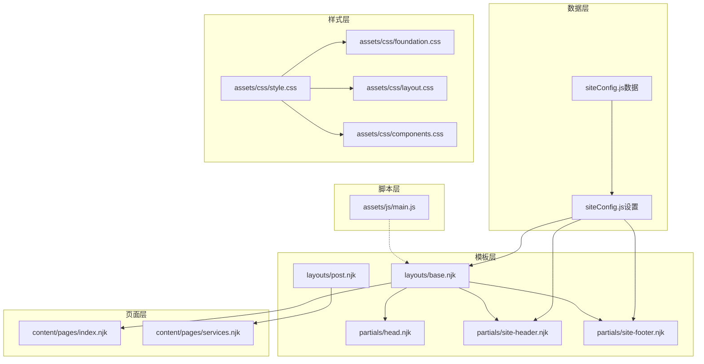
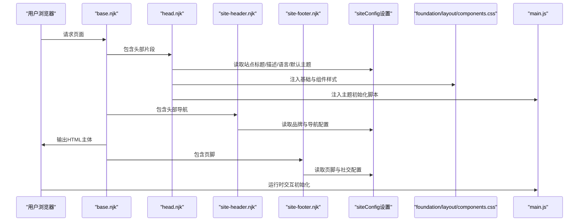
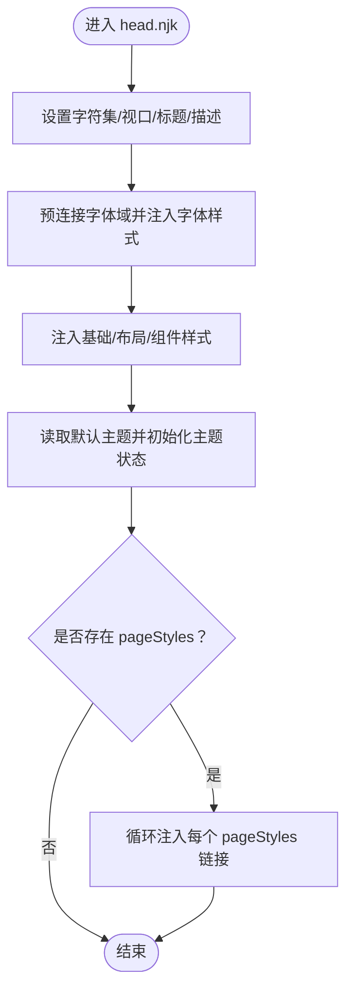
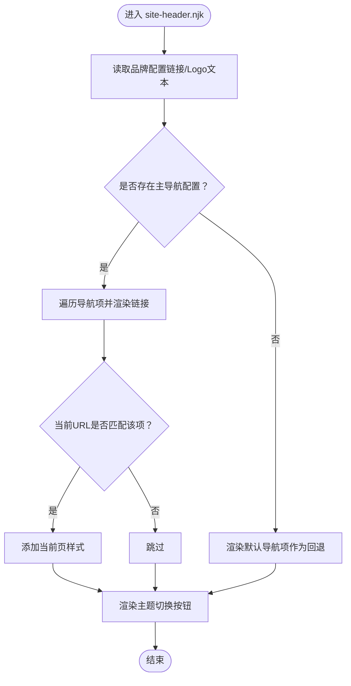
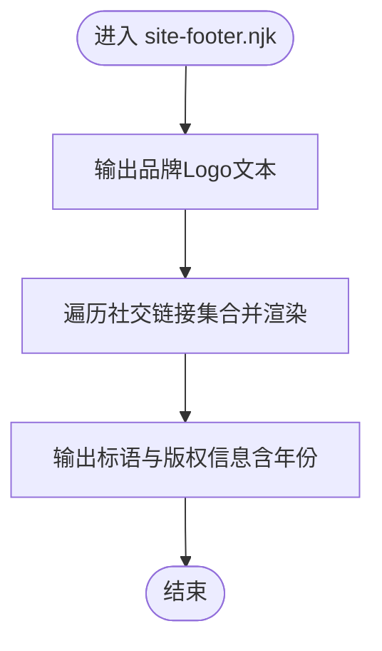
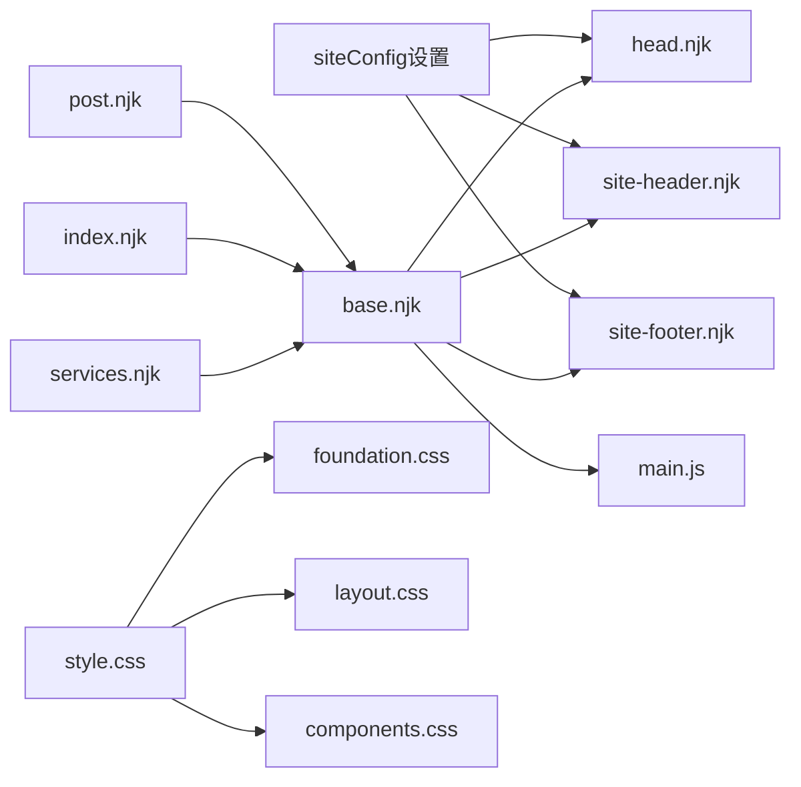

# 部分模板与组件

<cite>
**本文引用的文件**
- [head.njk](file://src/_includes/partials/head.njk)
- [site-header.njk](file://src/_includes/partials/site-header.njk)
- [site-footer.njk](file://src/_includes/partials/site-footer.njk)
- [base.njk](file://src/_includes/layouts/base.njk)
- [post.njk](file://src/_includes/layouts/post.njk)
- [siteConfig.js（数据）](file://src/_data/siteConfig.js)
- [siteConfig.js（设置）](file://src/content/settings/siteConfig.js)
- [index.njk](file://src/content/pages/index.njk)
- [services.njk](file://src/content/pages/services.njk)
- [main.js](file://src/assets/js/main.js)
- [foundation.css](file://src/assets/css/foundation.css)
- [layout.css](file://src/assets/css/layout.css)
- [components.css](file://src/assets/css/components.css)
- [style.css](file://src/assets/css/style.css)
- [package.json](file://package.json)
</cite>

## 目录
1. [引言](#引言)
2. [项目结构](#项目结构)
3. [核心组件](#核心组件)
4. [架构总览](#架构总览)
5. [组件详解](#组件详解)
6. [依赖关系与加载顺序](#依赖关系与加载顺序)
7. [性能考量](#性能考量)
8. [故障排查指南](#故障排查指南)
9. [结论](#结论)
10. [附录：自定义组件开发指南](#附录自定义组件开发指南)

## 引言
本文件聚焦于 Eleventy 项目中的“部分模板”与“组件系统”，系统性梳理 partials 目录下的 head、site-header、site-footer 三大组件的设计理念、参数传递、条件渲染与样式集成机制；阐述组件复用策略与模块化设计原则；给出自定义组件开发的完整指南（命名规范、参数设计、性能考虑）；解释组件间依赖关系与加载顺序；并提供组件测试与调试的最佳实践。

## 项目结构
本项目采用“数据驱动 + Nunjucks 模板 + Eleventy 构建”的静态站点生成架构。核心路径如下：
- 数据层：src/_data 与 src/content/settings 提供全局配置与页面级配置
- 模板层：src/_includes/layouts 与 src/_includes/partials 提供布局与可复用片段
- 页面层：src/content/pages 下的各页面使用布局与样式注入
- 样式层：src/assets/css 提供主题变量、布局与组件样式
- 脚本层：src/assets/js/main.js 提供运行时交互逻辑

图表来源
- [base.njk:1-20](file://src/_includes/layouts/base.njk#L1-L20)
- [head.njk:1-27](file://src/_includes/partials/head.njk#L1-L27)
- [site-header.njk:1-44](file://src/_includes/partials/site-header.njk#L1-L44)
- [site-footer.njk:1-13](file://src/_includes/partials/site-footer.njk#L1-L13)
- [siteConfig.js（数据）:1-2](file://src/_data/siteConfig.js#L1-L2)
- [siteConfig.js（设置）:1-168](file://src/content/settings/siteConfig.js#L1-L168)
- [style.css:1-6](file://src/assets/css/style.css#L1-L6)
- [main.js:1-800](file://src/assets/js/main.js#L1-L800)

章节来源
- [base.njk:1-20](file://src/_includes/layouts/base.njk#L1-L20)
- [head.njk:1-27](file://src/_includes/partials/head.njk#L1-L27)
- [site-header.njk:1-44](file://src/_includes/partials/site-header.njk#L1-L44)
- [site-footer.njk:1-13](file://src/_includes/partials/site-footer.njk#L1-L13)
- [siteConfig.js（数据）:1-2](file://src/_data/siteConfig.js#L1-L2)
- [siteConfig.js（设置）:1-168](file://src/content/settings/siteConfig.js#L1-L168)
- [style.css:1-6](file://src/assets/css/style.css#L1-L6)

## 核心组件
- head.njk：负责 HTML 头部元信息、字体与样式资源注入、主题初始化脚本与页面级样式注入点
- site-header.njk：负责站点导航、菜单、主题切换按钮与响应式汉堡菜单
- site-footer.njk：负责站点页脚信息、社交链接与版权信息

章节来源
- [head.njk:1-27](file://src/_includes/partials/head.njk#L1-L27)
- [site-header.njk:1-44](file://src/_includes/partials/site-header.njk#L1-L44)
- [site-footer.njk:1-13](file://src/_includes/partials/site-footer.njk#L1-L13)

## 架构总览
head、site-header、site-footer 通过 base.njk 被统一引入到页面布局中；页面可通过 front matter 注入 bodyClass 与 pageStyles，实现页面级样式覆盖与行为差异；siteConfig 提供全局品牌、导航、页脚与主题等配置；foundation.css 定义主题变量，layout.css 与 components.css 提供布局与通用组件样式；main.js 在运行时处理导航、目录、图片灯箱等交互。

图表来源
- [base.njk:1-20](file://src/_includes/layouts/base.njk#L1-L20)
- [head.njk:1-27](file://src/_includes/partials/head.njk#L1-L27)
- [site-header.njk:1-44](file://src/_includes/partials/site-header.njk#L1-L44)
- [site-footer.njk:1-13](file://src/_includes/partials/site-footer.njk#L1-L13)
- [siteConfig.js（设置）:1-168](file://src/content/settings/siteConfig.js#L1-L168)
- [foundation.css:1-200](file://src/assets/css/foundation.css#L1-L200)
- [layout.css:1-200](file://src/assets/css/layout.css#L1-L200)
- [components.css:1-200](file://src/assets/css/components.css#L1-L200)
- [main.js:1-800](file://src/assets/js/main.js#L1-L800)

## 组件详解

### head.njk：头部组件
- 元信息与 SEO
  - 字符集、视口、标题与描述均来自数据层与页面上下文，标题通过过滤器格式化，描述回退至站点配置
- 资源与字体
  - 预连接字体域，注入基础、布局与组件样式文件，并带版本号缓存控制
- 主题初始化
  - 读取站点默认主题，结合本地存储决定初始主题，设置根元素 data-theme 属性
- 页面级样式注入
  - 支持通过 front matter 的 pageStyles 数组动态注入额外样式，使用特定属性标记以便识别

图表来源
- [head.njk:1-27](file://src/_includes/partials/head.njk#L1-L27)

章节来源
- [head.njk:1-27](file://src/_includes/partials/head.njk#L1-L27)
- [base.njk:3-5](file://src/_includes/layouts/base.njk#L3-L5)

### site-header.njk：站点头部
- 品牌与导航
  - 读取品牌主页链接与 Logo 文本，使用默认值兜底
  - 读取主导航数组，支持根据当前页面 URL 设置“当前页”高亮
- 图标与可访问性
  - 使用 SVG 图标区分首页、分类页、服务页等；按钮具备 aria-label 与 aria-expanded
- 主题切换
  - 提供主题切换按钮，图标随主题切换显示
- 响应式菜单
  - 导航链接区配合汉堡菜单，移动端隐藏桌面端显示

图表来源
- [site-header.njk:1-44](file://src/_includes/partials/site-header.njk#L1-L44)
- [siteConfig.js（设置）:1-168](file://src/content/settings/siteConfig.js#L1-L168)

章节来源
- [site-header.njk:1-44](file://src/_includes/partials/site-header.njk#L1-L44)
- [siteConfig.js（设置）:1-168](file://src/content/settings/siteConfig.js#L1-L168)

### site-footer.njk：底部组件
- 社交与版权
  - 遍历页脚社交链接集合，渲染超链接与文本
  - 渲染标语与版权信息，年份来自页面日期，版权归属来自配置
- 可扩展性
  - 通过 siteConfig.footer.socialLinks 扩展社交入口

图表来源
- [site-footer.njk:1-13](file://src/_includes/partials/site-footer.njk#L1-L13)
- [siteConfig.js（设置）:1-168](file://src/content/settings/siteConfig.js#L1-L168)

章节来源
- [site-footer.njk:1-13](file://src/_includes/partials/site-footer.njk#L1-L13)
- [siteConfig.js（设置）:1-168](file://src/content/settings/siteConfig.js#L1-L168)

### 布局与页面使用
- base.njk 将 head、site-header、site-footer 统一包裹在 HTML 结构中，content 通过安全输出插入主体
- post.njk 作为文章布局，front matter 中声明布局、bodyClass 与 pageStyles，以注入文章专用样式
- index.njk 与 services.njk 同样通过 front matter 指定布局与页面级样式，实现差异化展示

章节来源
- [base.njk:1-20](file://src/_includes/layouts/base.njk#L1-L20)
- [post.njk:1-49](file://src/_includes/layouts/post.njk#L1-L49)
- [index.njk:1-94](file://src/content/pages/index.njk#L1-L94)
- [services.njk:1-56](file://src/content/pages/services.njk#L1-L56)

## 依赖关系与加载顺序
- 数据依赖
  - siteConfig（设置）为 head、site-header、site-footer 的唯一真实来源，siteConfig（数据）导出该对象供模板使用
- 模板依赖
  - base.njk 依赖 head、site-header、site-footer；post.njk 依赖 base.njk
  - 页面（如 index.njk、services.njk）依赖 base.njk 或 post.njk
- 样式依赖
  - style.css 通过 @import 组织 foundation、layout、components、alerts、code 等样式
  - head.njk 显式注入基础与组件样式，post.njk 通过 front matter 注入文章专用样式
- 运行时依赖
  - main.js 在 base.njk 底部被引入，负责导航、目录、图片灯箱等交互初始化

图表来源
- [siteConfig.js（设置）:1-168](file://src/content/settings/siteConfig.js#L1-L168)
- [base.njk:1-20](file://src/_includes/layouts/base.njk#L1-L20)
- [head.njk:1-27](file://src/_includes/partials/head.njk#L1-L27)
- [site-header.njk:1-44](file://src/_includes/partials/site-header.njk#L1-L44)
- [site-footer.njk:1-13](file://src/_includes/partials/site-footer.njk#L1-L13)
- [post.njk:1-49](file://src/_includes/layouts/post.njk#L1-L49)
- [index.njk:1-94](file://src/content/pages/index.njk#L1-L94)
- [services.njk:1-56](file://src/content/pages/services.njk#L1-L56)
- [style.css:1-6](file://src/assets/css/style.css#L1-L6)
- [foundation.css:1-200](file://src/assets/css/foundation.css#L1-L200)
- [layout.css:1-200](file://src/assets/css/layout.css#L1-L200)
- [components.css:1-200](file://src/assets/css/components.css#L1-L200)
- [main.js:1-800](file://src/assets/js/main.js#L1-L800)

章节来源
- [siteConfig.js（数据）:1-2](file://src/_data/siteConfig.js#L1-L2)
- [siteConfig.js（设置）:1-168](file://src/content/settings/siteConfig.js#L1-L168)
- [base.njk:1-20](file://src/_includes/layouts/base.njk#L1-L20)
- [post.njk:1-49](file://src/_includes/layouts/post.njk#L1-L49)
- [style.css:1-6](file://src/assets/css/style.css#L1-L6)

## 性能考量
- 样式加载
  - head.njk 中的基础与组件样式带版本号，有助于缓存控制；post.njk 通过 front matter 注入页面级样式，避免全局样式冗余
- 主题切换
  - head.njk 的主题初始化脚本在首屏即生效，减少闪烁；主题变量集中在 foundation.css，便于统一维护
- 运行时脚本
  - main.js 对滚动、点击、键盘事件采用被动监听与节流策略（如滚动事件），减少主线程压力
- 资源预连接
  - head.njk 预连接字体域，缩短首屏字体加载时间

章节来源
- [head.njk:1-27](file://src/_includes/partials/head.njk#L1-L27)
- [post.njk:1-49](file://src/_includes/layouts/post.njk#L1-L49)
- [foundation.css:1-200](file://src/assets/css/foundation.css#L1-L200)
- [main.js:1-800](file://src/assets/js/main.js#L1-L800)

## 故障排查指南
- 标题/描述异常
  - 检查 head.njk 中标题与描述的数据来源与回退逻辑，确认 siteConfig.meta 是否正确
- 导航不显示或高亮错误
  - 检查 siteConfig.navigation.main 是否存在；确认当前页面 URL 与导航项 url 是否一致
- 主题未生效或闪烁
  - 检查 head.njk 的主题初始化脚本是否执行；确认 localStorage 中是否有保存的主题值；检查 data-theme 属性是否正确设置
- 页面样式缺失
  - 检查页面 front matter 中的 pageStyles 是否正确；确认 style.css 的 @import 是否包含对应样式文件
- 交互失效
  - 检查 base.njk 是否引入 main.js；确认 main.js 中对应初始化函数是否在 DOMContentLoaded 后执行

章节来源
- [head.njk:1-27](file://src/_includes/partials/head.njk#L1-L27)
- [site-header.njk:1-44](file://src/_includes/partials/site-header.njk#L1-L44)
- [site-footer.njk:1-13](file://src/_includes/partials/site-footer.njk#L1-L13)
- [base.njk:1-20](file://src/_includes/layouts/base.njk#L1-L20)
- [post.njk:1-49](file://src/_includes/layouts/post.njk#L1-L49)
- [style.css:1-6](file://src/assets/css/style.css#L1-L6)
- [main.js:1-800](file://src/assets/js/main.js#L1-L800)

## 结论
本项目通过“数据驱动 + 模板片段 + 布局组合”的方式实现了高度模块化的组件体系。head、site-header、site-footer 三大组件职责清晰、参数来源统一、样式与主题解耦，既保证了跨页面一致性，又提供了灵活的页面级扩展能力。配合合理的样式组织与运行时脚本，整体具备良好的可维护性与性能表现。

## 附录：自定义组件开发指南
- 命名规范
  - 组件文件使用 .njk 扩展，放置于 src/_includes/partials 目录；建议以语义化名称命名，如 site-nav.njk、breadcrumb.njk
- 参数设计
  - 优先从 siteConfig 获取全局配置；对可选参数提供默认值；对页面特有数据通过 front matter 传入
- 条件渲染
  - 使用 Nunjucks 的 if/else 与 for 循环实现条件与列表渲染；对缺失数据提供回退方案
- 样式集成
  - 通过 head.njk 注入全局样式；通过页面 front matter 的 pageStyles 注入页面级样式；遵循 foundation.css 的主题变量约定
- 性能考虑
  - 避免在组件中进行重型计算；尽量使用数据层提供的聚合数据；合理拆分样式与脚本，按需加载
- 依赖与顺序
  - 组件应在 base.njk 中统一引入；页面 front matter 指定布局与样式；确保 main.js 在页面底部加载
- 测试与调试
  - 使用最小可用页面验证组件；逐步增加复杂度；利用浏览器开发者工具检查 DOM 结构与样式变量；关注运行时脚本的事件绑定与内存释放

章节来源
- [base.njk:1-20](file://src/_includes/layouts/base.njk#L1-L20)
- [head.njk:1-27](file://src/_includes/partials/head.njk#L1-L27)
- [siteConfig.js（设置）:1-168](file://src/content/settings/siteConfig.js#L1-L168)
- [style.css:1-6](file://src/assets/css/style.css#L1-L6)
- [main.js:1-800](file://src/assets/js/main.js#L1-L800)
- [package.json:1-35](file://package.json#L1-L35)