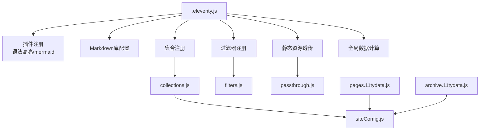
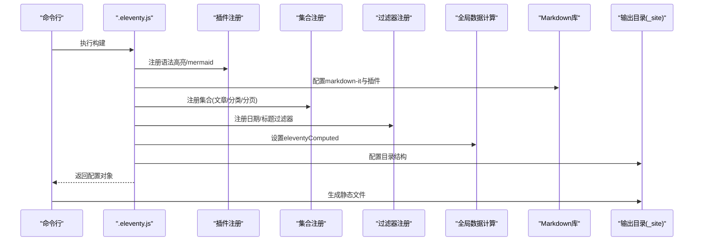
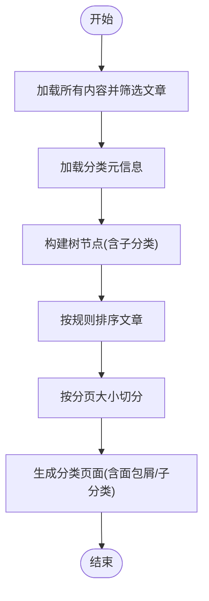
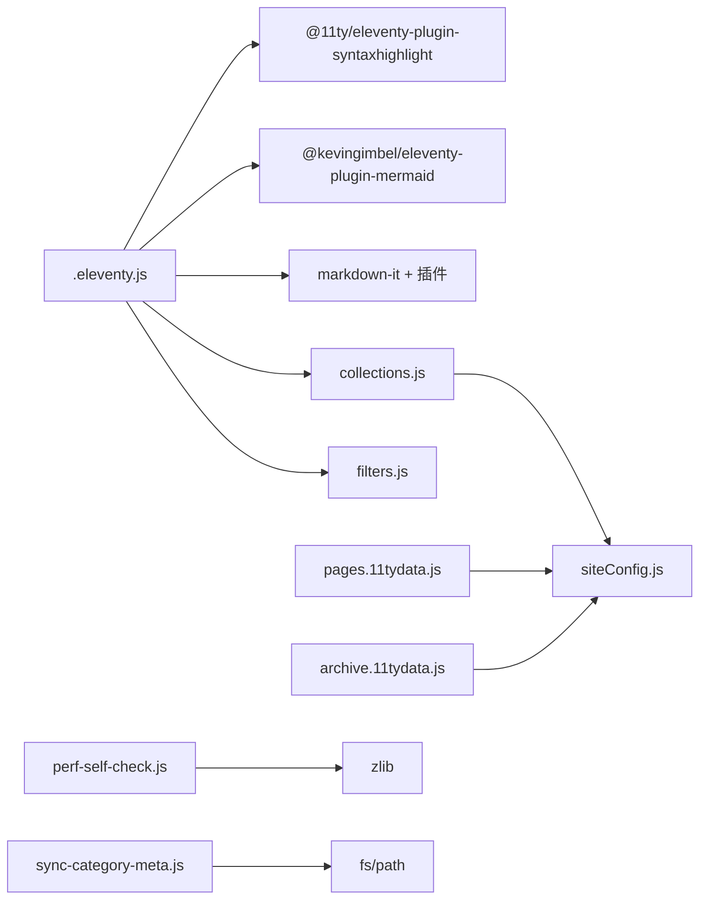

# Eleventy配置

<cite>
**本文引用的文件**
- [.eleventy.js](file://.eleventy.js)
- [eleventy/config/collections.js](file://eleventy/config/collections.js)
- [eleventy/config/filters.js](file://eleventy/config/filters.js)
- [eleventy/config/passthrough.js](file://eleventy/config/passthrough.js)
- [src/_data/siteConfig.js](file://src/_data/siteConfig.js)
- [src/content/settings/siteConfig.js](file://src/content/settings/siteConfig.js)
- [src/content/pages/archive.11tydata.js](file://src/content/pages/archive.11tydata.js)
- [src/content/pages/pages.11tydata.js](file://src/content/pages/pages.11tydata.js)
- [src/_data/moments.json](file://src/_data/moments.json)
- [scripts/sync-category-meta.js](file://scripts/sync-category-meta.js)
- [scripts/perf-self-check.js](file://scripts/perf-self-check.js)
- [package.json](file://package.json)
</cite>

## 目录
1. [简介](#简介)
2. [项目结构](#项目结构)
3. [核心组件](#核心组件)
4. [架构总览](#架构总览)
5. [详细组件分析](#详细组件分析)
6. [依赖关系分析](#依赖关系分析)
7. [性能考量](#性能考量)
8. [故障排查指南](#故障排查指南)
9. [结论](#结论)
10. [附录](#附录)

## 简介
本文件系统性解析11ty RainyNight项目的Eleventy配置体系，围绕.eleventy.js配置文件展开，深入说明插件配置、集合（Collection）定义、过滤器（Filter）注册、全局数据处理、路径与输出格式、构建选项等关键配置项，并给出默认行为与自定义方法、配置变更对构建过程与输出结果的影响分析、模块化设计与可扩展性说明，以及常见配置场景的解决方案与性能优化建议。

## 项目结构
RainyNight采用“配置模块化 + 数据驱动 + 构建脚本”的组织方式：
- 配置入口：.eleventy.js
- 配置分层：
  - 插件与Markdown库：在入口中注册
  - 集合：独立模块导出注册函数
  - 过滤器：独立模块导出注册函数
  - 静态资源透传：独立模块导出路径映射
- 数据层：
  - 全局配置：src/content/settings/siteConfig.js
  - 配置桥接：src/_data/siteConfig.js
  - 页面级数据：各页面的11tydata.js
  - 其他数据：src/_data/*.json
- 构建脚本：scripts/* 提供清理、同步元信息、性能检查等任务

图表来源
- [.eleventy.js:36-181](file://.eleventy.js#L36-L181)
- [eleventy/config/collections.js:219-371](file://eleventy/config/collections.js#L219-L371)
- [eleventy/config/filters.js:6-42](file://eleventy/config/filters.js#L6-L42)
- [eleventy/config/passthrough.js:1-7](file://eleventy/config/passthrough.js#L1-L7)
- [src/content/settings/siteConfig.js:1-168](file://src/content/settings/siteConfig.js#L1-L168)
- [src/content/pages/pages.11tydata.js:15-30](file://src/content/pages/pages.11tydata.js#L15-L30)
- [src/content/pages/archive.11tydata.js:7-21](file://src/content/pages/archive.11tydata.js#L7-L21)

章节来源
- [.eleventy.js:36-181](file://.eleventy.js#L36-L181)
- [package.json:6-17](file://package.json#L6-L17)

## 核心组件
本节聚焦.eleventy.js中的关键配置点与职责划分，涵盖插件、集合、过滤器、全局数据、Markdown库、目录结构与输出格式等。

- 插件与Markdown库
  - 注册语法高亮插件与Mermaid插件，增强代码块与图表渲染能力。
  - 自定义Markdown库，启用HTML、换行、链接识别，并集成脚注与GitHub Alerts插件。
- 静态资源透传
  - 将src/assets与src/static复制到输出目录，分别映射到assets与根目录。
- 集合注册
  - 注册日期校验集合，强制文章文件名包含@符号。
  - 注册多个集合：posts、categories、categoriesList、categoryPages、folderGroups。
- 过滤器注册
  - 注册日期类过滤器（可读日期、HTML日期字符串、年份、归档月份、归档月份标签）。
  - 注册标题类过滤器（格式化标题，避免重复拼接站点标题）。
- 全局数据计算（eleventyComputed）
  - 针对文章输入（posts/*.md）自动推断标题、子分类、布局、永久链接、发布时间、更新时间、标签、bodyClass、页面样式等。
  - 对于非文章输入，保留原有数据。
- 目录与输出
  - 输入目录：src
  - 输出目录：_site
  - 包含目录：_includes
  - 全局数据目录：_data

章节来源
- [.eleventy.js:47-48](file://.eleventy.js#L47-L48)
- [.eleventy.js:159-170](file://.eleventy.js#L159-L170)
- [.eleventy.js:50](file://.eleventy.js#L50)
- [.eleventy.js:57-72](file://.eleventy.js#L57-L72)
- [.eleventy.js:75-157](file://.eleventy.js#L75-L157)
- [.eleventy.js:172-179](file://.eleventy.js#L172-L179)

## 架构总览
下面以序列图展示一次构建的关键流程：入口加载配置、注册插件与集合、处理全局数据、渲染模板与生成静态文件。

图表来源
- [.eleventy.js:36-181](file://.eleventy.js#L36-L181)

## 详细组件分析

### 插件与Markdown库
- 插件
  - 语法高亮：增强代码块渲染。
  - Mermaid：支持流程图、时序图等图表。
- Markdown库
  - 启用HTML内联、软换行、链接识别。
  - 集成脚注与GitHub Alerts，提升文档表现力。
- 影响
  - 渲染质量与交互性提升；构建时间略有增加。

章节来源
- [.eleventy.js:47-48](file://.eleventy.js#L47-L48)
- [.eleventy.js:159-170](file://.eleventy.js#L159-L170)

### 静态资源透传
- 配置
  - src/assets -> assets
  - src/static -> 根目录/
- 影响
  - 无需在模板中手动拷贝资源；便于版本控制与缓存策略。

章节来源
- [eleventy/config/passthrough.js:1-7](file://eleventy/config/passthrough.js#L1-L7)
- [.eleventy.js:50](file://.eleventy.js#L50)

### 集合（Collections）
- 功能概览
  - posts：筛选并按日期倒序的文章集合。
  - categories：按层级路径聚合文章。
  - categoriesList：构建树形节点，包含元信息与子分类描述。
  - categoryPages：按分页大小生成分类页面，支持面包屑与子分类列表。
  - folderGroups：按顶层分类与子分类组合统计数量与文章列表。
- 关键逻辑
  - 分类元信息来自src/content/settings/categoryDescriptions.json，支持默认描述与子分类名称/描述。
  - 分页大小来源于全局配置siteConfig.pagination.categoryPageSize。
  - 文章排序优先级：categoryOrder（数字越小越前），其次按日期降序，最后按标题本地化排序。
- 影响
  - 影响分类页、归档页、首页等页面的数据来源与渲染结果。

图表来源
- [eleventy/config/collections.js:219-371](file://eleventy/config/collections.js#L219-L371)
- [src/content/settings/siteConfig.js:40-49](file://src/content/settings/siteConfig.js#L40-L49)

章节来源
- [eleventy/config/collections.js:219-371](file://eleventy/config/collections.js#L219-L371)

### 过滤器（Filters）
- 日期过滤器
  - 可读日期、HTML日期字符串、年份、归档月份、归档月份标签（中文格式）。
- 标题过滤器
  - formatTitle：避免重复拼接站点标题，若标题已包含站点标题则直接返回。
- 影响
  - 模板中日期与标题的呈现一致性与可读性提升。

章节来源
- [eleventy/config/filters.js:6-42](file://eleventy/config/filters.js#L6-L42)

### 全局数据计算（eleventyComputed）
- 针对文章输入（posts/*.md）自动推断：
  - 标题：若front matter未提供，则从文件名“标题@分类”中提取标题。
  - 子分类：从文件名提取子分类代码，若未提供则为null。
  - 布局：默认使用“layouts/post.njk”，否则沿用front matter。
  - 永久链接：若未提供或为占位slug，则使用page.fileSlug或空串；最终生成“/posts/{slug}/”。
  - 发布时间：若未提供则回退到date或当前时间。
  - 更新时间：基于文件mtime与publishDate对比，超过一分钟且mtime不超过当前时间才更新。
  - 标签：确保包含“posts”标签。
  - bodyClass：默认“no-grid-page post-page”，否则沿用front matter。
  - 页面样式：默认注入alerts、code、pages/post.css等样式数组。
- 非文章输入：保留原有front matter与computed值。
- 影响
  - 大幅减少front matter重复配置；提升文章默认行为的一致性。

章节来源
- [.eleventy.js:75-157](file://.eleventy.js#L75-L157)

### 目录与输出格式
- 目录结构
  - input: src
  - output: _site
  - includes: _includes
  - data: _data
- 影响
  - 控制构建范围与输出位置；影响模板查找与数据加载路径。

章节来源
- [.eleventy.js:172-179](file://.eleventy.js#L172-L179)

### 页面级数据与全局配置
- 全局配置
  - siteConfig集中管理品牌、导航、页脚、元信息、主题、分页、页面文案等。
  - src/_data/siteConfig.js作为桥接，指向实际配置文件。
- 页面级数据
  - pages.11tydata.js：根据页面slug动态设置标题，优先取siteConfig中对应页面标题。
  - archive.11tydata.js：基于siteConfig.pagination.archivePageSize设置归档分页大小与永久链接。
- 影响
  - 页面标题与分页行为由全局配置统一控制，便于维护与一致性。

章节来源
- [src/content/settings/siteConfig.js:1-168](file://src/content/settings/siteConfig.js#L1-L168)
- [src/_data/siteConfig.js:1-2](file://src/_data/siteConfig.js#L1-L2)
- [src/content/pages/pages.11tydata.js:15-30](file://src/content/pages/pages.11tydata.js#L15-L30)
- [src/content/pages/archive.11tydata.js:7-21](file://src/content/pages/archive.11tydata.js#L7-L21)

### 构建脚本与工作流
- 脚本
  - clean:site、update-dates、sync-meta、css:optimize、perf:check、debug等。
  - build流程：清理站点、同步分类元信息、构建、CSS优化、性能自检。
- 影响
  - 规范化构建流程，保证输出质量与体积预算。

章节来源
- [package.json:6-17](file://package.json#L6-L17)
- [scripts/sync-category-meta.js:36-205](file://scripts/sync-category-meta.js#L36-L205)
- [scripts/perf-self-check.js:10-15](file://scripts/perf-self-check.js#L10-L15)

## 依赖关系分析
- 配置入口依赖
  - 插件与Markdown库：@11ty/eleventy-plugin-syntaxhighlight、@kevingimbel/eleventy-plugin-mermaid、markdown-it、markdown-it-footnote、markdown-it-github-alerts。
  - 过滤器：luxon。
  - 集合：gray-matter。
- 数据依赖
  - siteConfig提供分页、页面文案等全局参数，被集合与页面级数据使用。
- 构建脚本依赖
  - perf-self-check基于zlib进行gzip体积评估；sync-category-meta扫描文章目录生成分类元信息。

图表来源
- [.eleventy.js:4-11](file://.eleventy.js#L4-L11)
- [eleventy/config/collections.js:3](file://eleventy/config/collections.js#L3)
- [eleventy/config/filters.js:1](file://eleventy/config/filters.js#L1)
- [src/content/settings/siteConfig.js:1-168](file://src/content/settings/siteConfig.js#L1-L168)
- [src/content/pages/pages.11tydata.js:15-30](file://src/content/pages/pages.11tydata.js#L15-L30)
- [src/content/pages/archive.11tydata.js:7-21](file://src/content/pages/archive.11tydata.js#L7-L21)
- [scripts/perf-self-check.js:3-6](file://scripts/perf-self-check.js#L3-L6)
- [scripts/sync-category-meta.js:1-2](file://scripts/sync-category-meta.js#L1-L2)

章节来源
- [.eleventy.js:4-11](file://.eleventy.js#L4-L11)
- [package.json:22-33](file://package.json#L22-L33)

## 性能考量
- 体积预算
  - HTML/CSS/JS总大小与最大单文件限制在脚本中设定，构建完成后自检并通过Markdown报告输出。
- 优化建议
  - 使用构建脚本中的CSS优化步骤，减少冗余与重复样式。
  - 控制文章数量与图片尺寸，避免单文件过大。
  - 合理设置分页大小，平衡加载性能与可读性。
  - 利用透传资源的版本查询参数（如样式文件带版本号）提升缓存命中率。

章节来源
- [scripts/perf-self-check.js:10-15](file://scripts/perf-self-check.js#L10-L15)
- [scripts/perf-self-check.js:170-199](file://scripts/perf-self-check.js#L170-L199)
- [.eleventy.js:151-156](file://.eleventy.js#L151-L156)

## 故障排查指南
- 文章文件名格式错误
  - 现象：构建时报错，提示文章文件名必须包含@符号。
  - 原因：postValidator集合强制校验。
  - 解决：确保文件名为“标题@分类.md”格式。
- 缺失slug
  - 现象：文章永久链接可能使用fileSlug或空串。
  - 原因：eleventyComputed对permalink的占位判断。
  - 解决：在front matter中提供slug，或确保文件名能正确解析。
- 更新时间异常
  - 现象：updated字段为空或不更新。
  - 原因：文件mtime与publishDate差异小于等于一分钟，或mtime大于当前时间。
  - 解决：确保修改时间合理，或手动设置updated。
- 分类元信息缺失
  - 现象：分类描述为空或不生效。
  - 原因：categoryDescriptions.json格式不正确或缺失。
  - 解决：运行sync-meta脚本生成/同步元信息，编辑categoryDescriptions.json补充描述。
- 构建失败或体积超限
  - 现象：perf自检报告提示警告。
  - 原因：HTML/CSS/JS总大小或单文件超预算。
  - 解决：优化资源体积，减少不必要的依赖与样式。

章节来源
- [.eleventy.js:57-72](file://.eleventy.js#L57-L72)
- [.eleventy.js:102-111](file://.eleventy.js#L102-L111)
- [.eleventy.js:117-135](file://.eleventy.js#L117-L135)
- [scripts/sync-category-meta.js:36-205](file://scripts/sync-category-meta.js#L36-L205)
- [scripts/perf-self-check.js:87-126](file://scripts/perf-self-check.js#L87-L126)

## 结论
RainyNight的Eleventy配置通过模块化设计实现了高内聚、低耦合的可维护性：入口负责装配，集合与过滤器独立封装，全局配置统一驱动页面数据。默认行为与自定义方法并存，既保证开箱即用，又允许灵活扩展。结合构建脚本与性能自检，可在保证质量的同时优化构建效率与输出体积。

## 附录

### 常见配置场景与解决方案
- 统一设置文章默认布局与样式
  - 方法：在eleventyComputed中为文章输入设置layout与pageStyles。
  - 影响：减少front matter重复配置，统一文章样式。
- 动态设置页面标题
  - 方法：使用pages.11tydata.js根据slug从siteConfig取标题。
  - 影响：标题来源集中，便于多语言或多站点迁移。
- 自动生成分类与子分类元信息
  - 方法：运行sync-meta脚本扫描文章目录并生成categoryDescriptions.json。
  - 影响：避免手工维护分类描述，减少遗漏。
- 控制分页大小
  - 方法：在siteConfig.pagination中设置categoryPageSize、archivePageSize等。
  - 影响：影响分类页、归档页的加载性能与可读性。

章节来源
- [.eleventy.js:98-156](file://.eleventy.js#L98-L156)
- [src/content/pages/pages.11tydata.js:15-30](file://src/content/pages/pages.11tydata.js#L15-L30)
- [scripts/sync-category-meta.js:36-205](file://scripts/sync-category-meta.js#L36-L205)
- [src/content/settings/siteConfig.js:40-49](file://src/content/settings/siteConfig.js#L40-L49)