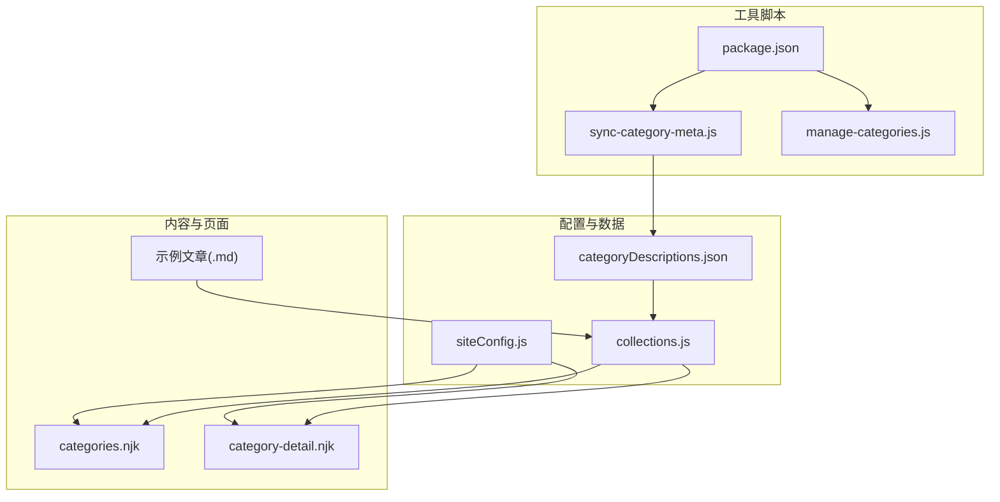
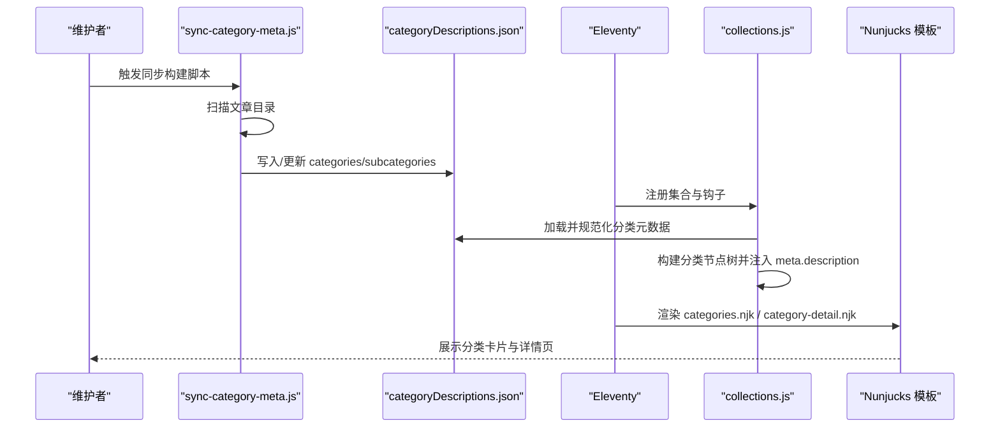
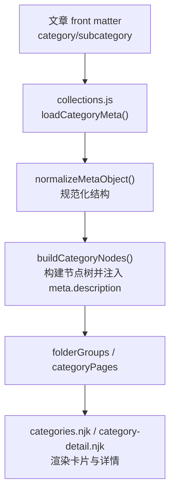
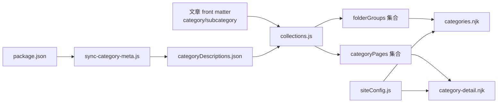

# 分类配置

<cite>
**本文引用的文件**
- [categoryDescriptions.json](file://src/content/settings/categoryDescriptions.json)
- [siteConfig.js](file://src/content/settings/siteConfig.js)
- [collections.js](file://eleventy/config/collections.js)
- [categories.njk](file://src/content/pages/categories.njk)
- [category-detail.njk](file://src/content/pages/category-detail.njk)
- [manage-categories.js](file://scripts/manage-categories.js)
- [sync-category-meta.js](file://scripts/sync-category-meta.js)
- [建站需求篇：估算更新频率@xfq.md](file://src/content/posts/建站需求篇/建站需求清单：估算更新频率@xfq.md)
- [为什么个人网站要写清楚“不做什么”@xfq.md](file://src/content/posts/方案策划篇/为什么个人网站要写清楚'不做什么'@xfq.md)
- [package.json](file://package.json)
</cite>

## 目录
1. [简介](#简介)
2. [项目结构](#项目结构)
3. [核心组件](#核心组件)
4. [架构总览](#架构总览)
5. [详细组件分析](#详细组件分析)
6. [依赖关系分析](#依赖关系分析)
7. [性能考量](#性能考量)
8. [故障排查指南](#故障排查指南)
9. [结论](#结论)
10. [附录](#附录)

## 简介
本文件系统性说明 11ty RainyNight 的“分类描述配置系统”。目标是帮助内容作者与维护者理解：
- 分类描述文件的结构与作用机制
- 分类 ID、分类名称、描述文本、子分类配置等字段的含义与使用方法
- 分类配置与内容分类系统的集成方式
- 分类描述的本地化与多语言支持思路
- 分类配置的最佳实践与维护建议
- 分类描述在页面渲染与导航中的具体应用

## 项目结构
围绕分类描述配置的关键文件与职责如下：
- 配置与数据层
  - 分类描述配置：src/content/settings/categoryDescriptions.json
  - 全站配置：src/content/settings/siteConfig.js
  - Eleventy 集成：eleventy/config/collections.js
- 内容与页面层
  - 归档总览页：src/content/pages/categories.njk
  - 分类详情页：src/content/pages/category-detail.njk
  - 示例文章（含分类与子分类）：src/content/posts/*/...
- 工具脚本
  - 自动同步与规范化：scripts/sync-category-meta.js
  - 手动管理与重命名/删除：scripts/manage-categories.js
  - 构建链路：package.json 中的构建脚本

图表来源
- [collections.js:123-127](file://eleventy/config/collections.js#L123-L127)
- [categoryDescriptions.json:1-60](file://src/content/settings/categoryDescriptions.json#L1-L60)
- [siteConfig.js:111-124](file://src/content/settings/siteConfig.js#L111-L124)
- [categories.njk:1-67](file://src/content/pages/categories.njk#L1-L67)
- [category-detail.njk:1-80](file://src/content/pages/category-detail.njk#L1-L80)
- [package.json:6-16](file://package.json#L6-L16)

章节来源
- [collections.js:1-377](file://eleventy/config/collections.js#L1-L377)
- [categoryDescriptions.json:1-60](file://src/content/settings/categoryDescriptions.json#L1-L60)
- [siteConfig.js:1-168](file://src/content/settings/siteConfig.js#L1-L168)
- [categories.njk:1-67](file://src/content/pages/categories.njk#L1-L67)
- [category-detail.njk:1-80](file://src/content/pages/category-detail.njk#L1-L80)
- [package.json:1-35](file://package.json#L1-L35)

## 核心组件
- 分类描述配置文件（categoryDescriptions.json）
  - 结构要点：顶层对象包含 categories 字段；每个分类条目可包含 subcategories 子项；每个子项包含 name 与 description 字段。
  - 作用：为分类与子分类提供显示名称与描述文本，供页面渲染使用。
- Eleventy 集成（collections.js）
  - 加载与规范化：安全加载 JSON，规范化为统一结构，确保 description 字段可用。
  - 构建节点树：根据文章路径与 front matter 的 subcategory 字段，构建分类树并注入 meta.description。
  - 输出集合：提供 categoriesList、categoryPages、folderGroups 等集合，供模板使用。
- 页面模板（categories.njk、category-detail.njk）
  - 归档总览页：展示按“文件夹分组”的分类卡片，包含标题、描述与数量。
  - 分类详情页：展示当前分类下的子分类卡片、文章列表与分页。
- 工具脚本
  - 自动同步：扫描文章目录，自动生成/更新 categoryDescriptions.json 的 categories 与 subcategories 结构。
  - 手动管理：提供列出、重命名、删除分类及设置元信息的命令行工具。

章节来源
- [categoryDescriptions.json:1-60](file://src/content/settings/categoryDescriptions.json#L1-L60)
- [collections.js:123-127](file://eleventy/config/collections.js#L123-L127)
- [collections.js:145-217](file://eleventy/config/collections.js#L145-L217)
- [collections.js:318-371](file://eleventy/config/collections.js#L318-L371)
- [categories.njk:35-52](file://src/content/pages/categories.njk#L35-L52)
- [category-detail.njk:33-51](file://src/content/pages/category-detail.njk#L33-L51)
- [sync-category-meta.js:36-204](file://scripts/sync-category-meta.js#L36-L204)
- [manage-categories.js:63-211](file://scripts/manage-categories.js#L63-L211)

## 架构总览
分类描述配置系统在构建期与运行期的交互流程如下：

图表来源
- [sync-category-meta.js:36-204](file://scripts/sync-category-meta.js#L36-L204)
- [collections.js:123-127](file://eleventy/config/collections.js#L123-L127)
- [collections.js:145-217](file://eleventy/config/collections.js#L145-L217)
- [categories.njk:35-52](file://src/content/pages/categories.njk#L35-L52)
- [category-detail.njk:25-51](file://src/content/pages/category-detail.njk#L25-L51)

## 详细组件分析

### 分类描述文件结构与字段说明
- 文件位置：src/content/settings/categoryDescriptions.json
- 结构概览
  - categories：顶级对象，键为分类路径（如“项目速览”），值为该分类的元信息。
  - 每个分类条目可包含：
    - subcategories：子分类映射，键为子分类代码（如“xs”），值为包含 name 与 description 的对象。
- 字段语义
  - 分类 ID：JSON 键名（分类路径字符串）。例如“项目速览”。
  - 分类名称（显示名）：子分类条目中的 name 字段；若不存在则回退为子分类代码或顶级分类名。
  - 描述文本：子分类条目中的 description 字段；若为空则回退为“暂无简介”。
  - 图标：当前配置未定义图标字段；如需图标，可在模板中通过分类路径映射外部图标资源。

章节来源
- [categoryDescriptions.json:1-60](file://src/content/settings/categoryDescriptions.json#L1-L60)
- [collections.js:129-143](file://eleventy/config/collections.js#L129-L143)
- [collections.js:342-358](file://eleventy/config/collections.js#L342-L358)

### 分类配置与内容分类系统的集成
- 文章侧分类标记
  - 顶级分类：front matter 中的 category 字段（如“建站需求篇”）。
  - 子分类：front matter 中的 subcategory 字段（如“xfq”）。
- Eleventy 集成点
  - 加载元数据：loadCategoryMeta 从 categoryDescriptions.json 安全加载并规范化。
  - 构建节点树：buildCategoryNodes 根据文章路径与 subcategory 构建父子节点，并将 meta.description 注入节点。
  - 输出集合：
    - folderGroups：按“文件夹分组”聚合分类卡片，包含标题、描述、数量与链接。
    - categoryPages：生成分类详情页数据（含面包屑、子分类、文章列表与分页）。
- 页面渲染
  - 归档总览页：遍历 folderGroups，渲染分类卡片与描述。
  - 分类详情页：展示 meta.description、子分类卡片与文章列表。

图表来源
- [collections.js:123-127](file://eleventy/config/collections.js#L123-L127)
- [collections.js:94-121](file://eleventy/config/collections.js#L94-L121)
- [collections.js:145-217](file://eleventy/config/collections.js#L145-L217)
- [collections.js:318-371](file://eleventy/config/collections.js#L318-L371)
- [categories.njk:35-52](file://src/content/pages/categories.njk#L35-L52)
- [category-detail.njk:25-51](file://src/content/pages/category-detail.njk#L25-L51)

章节来源
- [collections.js:123-127](file://eleventy/config/collections.js#L123-L127)
- [collections.js:145-217](file://eleventy/config/collections.js#L145-L217)
- [collections.js:318-371](file://eleventy/config/collections.js#L318-L371)
- [建站需求篇：估算更新频率@xfq.md:5-5](file://src/content/posts/建站需求篇/建站需求清单：估算更新频率@xfq.md#L5-L5)
- [为什么个人网站要写清楚“不做什么”@xfq.md:5-7](file://src/content/posts/方案策划篇/为什么个人网站要写清楚'不做什么'@xfq.md#L5-L7)

### 分类描述在页面渲染与导航中的应用
- 归档总览页（categories.njk）
  - 使用 siteConfig.pages.categories 的文案配置（如 sidebarTitle、docUnit）。
  - 渲染每个分类卡片时，若存在 description 则显示描述文本。
- 分类详情页（category-detail.njk）
  - 显示 meta.description（来自分类元数据）。
  - 展示子分类卡片与文章列表，并提供分页与面包屑导航。

章节来源
- [categories.njk:8-16](file://src/content/pages/categories.njk#L8-L16)
- [categories.njk:35-52](file://src/content/pages/categories.njk#L35-L52)
- [category-detail.njk:12-13](file://src/content/pages/category-detail.njk#L12-L13)
- [category-detail.njk:25-51](file://src/content/pages/category-detail.njk#L25-L51)

### 本地化与多语言支持（建议方案）
- 当前实现
  - 分类描述文本为中文（如“暂无简介”）。
- 建议方案
  - 在 categoryDescriptions.json 中为每个分类条目增加多语言字段（如 zh、en），并在模板中按 siteConfig.meta.lang 或页面 front matter 的 lang 选择对应语言文本。
  - 在 Eleventy 集成层增加语言选择逻辑，优先使用当前语言的描述文本，否则回退至默认语言。
  - 对于图标与文案，统一通过 siteConfig.pages.* 配置集中管理，便于切换语言。

章节来源
- [siteConfig.js:27-34](file://src/content/settings/siteConfig.js#L27-L34)
- [categoryDescriptions.json:1-60](file://src/content/settings/categoryDescriptions.json#L1-L60)

### 最佳实践与维护建议
- 使用自动同步脚本
  - 在构建前执行同步，确保 categoryDescriptions.json 与实际文章目录一致。
  - 避免手动维护导致的遗漏或冗余。
- 规范化命名
  - 分类 ID 使用稳定路径字符串，避免频繁变更。
  - 子分类代码保持简洁且唯一，便于模板映射。
- 描述文本质量
  - 子分类 description 应简洁明确，避免空字符串；若暂时无内容，保留默认提示。
- 模板一致性
  - 在 categories.njk 与 category-detail.njk 中统一使用 meta.description 与 siteConfig 的文案配置。
- 命令行工具
  - 使用 manage-categories.js 进行批量重命名、删除与元信息设置，减少手工修改风险。

章节来源
- [sync-category-meta.js:36-204](file://scripts/sync-category-meta.js#L36-L204)
- [manage-categories.js:63-211](file://scripts/manage-categories.js#L63-L211)
- [package.json:6-16](file://package.json#L6-L16)

## 依赖关系分析
- 配置与数据
  - categoryDescriptions.json 由 sync-category-meta.js 生成/更新，由 collections.js 加载并规范化。
  - siteConfig.js 提供页面文案与分页配置，被 Nunjucks 模板引用。
- 内容与页面
  - 文章 front matter 的 category 与 subcategory 决定分类归属，collections.js 将其映射到节点树。
  - categories.njk 与 category-detail.njk 依赖 folderGroups 与 categoryPages 集合。
- 工具脚本
  - package.json 的构建脚本串联 sync-category-meta.js 与 Eleventy 构建流程。

图表来源
- [collections.js:123-127](file://eleventy/config/collections.js#L123-L127)
- [collections.js:318-371](file://eleventy/config/collections.js#L318-L371)
- [categories.njk:1-67](file://src/content/pages/categories.njk#L1-L67)
- [category-detail.njk:1-80](file://src/content/pages/category-detail.njk#L1-L80)
- [sync-category-meta.js:36-204](file://scripts/sync-category-meta.js#L36-L204)
- [package.json:6-16](file://package.json#L6-L16)

章节来源
- [collections.js:123-127](file://eleventy/config/collections.js#L123-L127)
- [collections.js:318-371](file://eleventy/config/collections.js#L318-L371)
- [categoryDescriptions.json:1-60](file://src/content/settings/categoryDescriptions.json#L1-L60)
- [siteConfig.js:111-124](file://src/content/settings/siteConfig.js#L111-L124)
- [package.json:6-16](file://package.json#L6-L16)

## 性能考量
- 同步与加载
  - 同步脚本仅在构建期运行，避免在生产环境重复扫描。
  - collections.js 对 JSON 的加载与解析做了异常保护与默认值回退，保证稳定性。
- 渲染复杂度
  - 分类节点树构建与集合输出在 Eleventy 构建阶段完成，页面渲染仅进行模板遍历，开销可控。
- 建议
  - 控制分类层级深度与子分类数量，避免页面渲染压力过大。
  - 对于大量文章的站点，合理设置分页大小以平衡加载与交互体验。

## 故障排查指南
- 分类描述未显示
  - 检查 categoryDescriptions.json 是否存在对应分类与子分类条目，且 description 字段非空。
  - 确认文章 front matter 的 category 与 subcategory 是否正确。
- 子分类未生成
  - 执行同步脚本，确保 categoryDescriptions.json 的 subcategories 与实际文章一致。
- 重命名或删除分类后页面异常
  - 使用 manage-categories.js 的 rename/delete 命令更新文章与元数据。
- 构建失败或 JSON 解析错误
  - 检查 categoryDescriptions.json 语法，必要时删除后由同步脚本重建。

章节来源
- [sync-category-meta.js:36-204](file://scripts/sync-category-meta.js#L36-L204)
- [manage-categories.js:95-174](file://scripts/manage-categories.js#L95-L174)
- [collections.js:63-71](file://eleventy/config/collections.js#L63-L71)

## 结论
11ty RainyNight 的分类描述配置系统通过“自动同步 + 手动管理 + Eleventy 集成 + 模板渲染”的闭环，实现了对分类与子分类的结构化管理与可视化呈现。遵循本文的最佳实践与维护建议，可确保分类体系稳定、易维护、可扩展，并为页面导航与内容展示提供一致、清晰的用户体验。

## 附录
- 关键字段一览
  - 分类 ID：categoryDescriptions.json 中的分类路径键名
  - 分类名称：子分类条目的 name 字段，或回退为子分类代码/顶级分类名
  - 描述文本：子分类条目的 description 字段，或回退为“暂无简介”
  - 子分类代码：文章 front matter 的 subcategory 字段
- 相关文件路径
  - 分类描述配置：src/content/settings/categoryDescriptions.json
  - 全站配置：src/content/settings/siteConfig.js
  - Eleventy 集成：eleventy/config/collections.js
  - 归档总览页：src/content/pages/categories.njk
  - 分类详情页：src/content/pages/category-detail.njk
  - 自动同步脚本：scripts/sync-category-meta.js
  - 手动管理脚本：scripts/manage-categories.js
  - 构建脚本：package.json