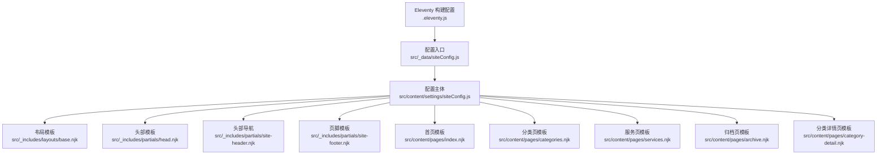
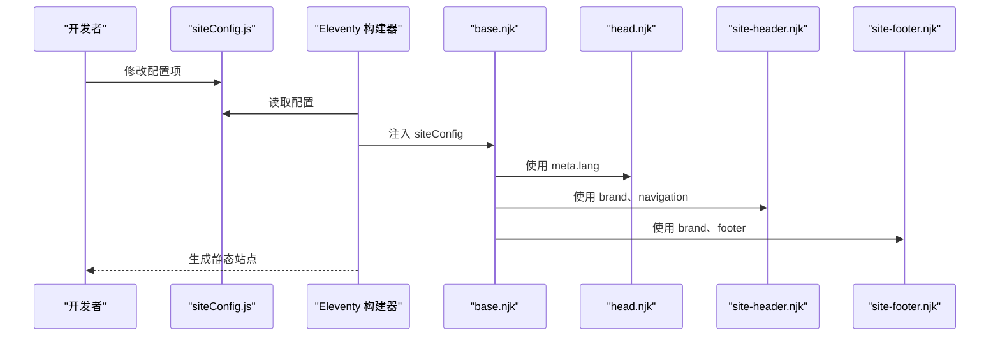
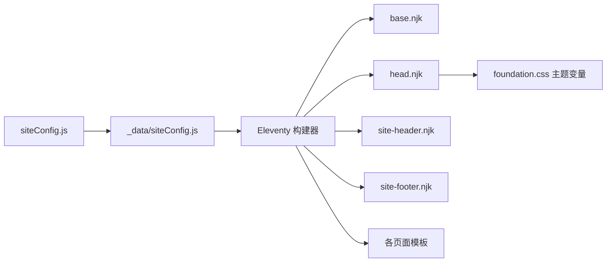

# 站点配置

<cite>
**本文引用的文件**
- [src/_data/siteConfig.js](file://src/_data/siteConfig.js)
- [src/content/settings/siteConfig.js](file://src/content/settings/siteConfig.js)
- [src/_includes/layouts/base.njk](file://src/_includes/layouts/base.njk)
- [src/_includes/partials/head.njk](file://src/_includes/partials/head.njk)
- [src/_includes/partials/site-header.njk](file://src/_includes/partials/site-header.njk)
- [src/_includes/partials/site-footer.njk](file://src/_includes/partials/site-footer.njk)
- [.eleventy.js](file://.eleventy.js)
- [src/content/pages/index.njk](file://src/content/pages/index.njk)
- [src/content/pages/categories.njk](file://src/content/pages/categories.njk)
- [src/content/pages/services.njk](file://src/content/pages/services.njk)
- [src/content/pages/archive.njk](file://src/content/pages/archive.njk)
- [src/content/pages/category-detail.njk](file://src/content/pages/category-detail.njk)
- [src/assets/css/foundation.css](file://src/assets/css/foundation.css)
</cite>

## 目录
1. [引言](#引言)
2. [项目结构](#项目结构)
3. [核心组件](#核心组件)
4. [架构总览](#架构总览)
5. [详细组件分析](#详细组件分析)
6. [依赖关系分析](#依赖关系分析)
7. [性能考量](#性能考量)
8. [故障排查指南](#故障排查指南)
9. [结论](#结论)
10. [附录](#附录)

## 引言
本文件系统性梳理 11ty RainyNight 的站点配置体系，聚焦集中式配置文件 siteConfig.js 的设计理念与实现方式，逐项解析品牌、导航、页脚、元数据、主题、分页、页面文案等模块的结构、作用、默认值、可选值与使用场景，并结合模板与 Eleventy 配置说明配置变更对网站外观与功能的影响。同时提供常见配置场景示例与最佳实践建议，帮助读者高效地定制与维护站点。

## 项目结构
站点配置通过集中式配置文件统一管理，模板通过 Nunjucks 访问全局数据对象 siteConfig，Eleventy 在构建阶段将配置注入到页面上下文中，最终渲染出一致的视觉与交互体验。

**图表来源**
- [src/_data/siteConfig.js:1-2](file://src/_data/siteConfig.js#L1-L2)
- [src/content/settings/siteConfig.js:1-168](file://src/content/settings/siteConfig.js#L1-L168)
- [src/_includes/layouts/base.njk:1-20](file://src/_includes/layouts/base.njk#L1-L20)
- [src/_includes/partials/head.njk:1-27](file://src/_includes/partials/head.njk#L1-L27)
- [src/_includes/partials/site-header.njk:1-44](file://src/_includes/partials/site-header.njk#L1-L44)
- [src/_includes/partials/site-footer.njk:1-13](file://src/_includes/partials/site-footer.njk#L1-L13)
- [src/content/pages/index.njk:1-94](file://src/content/pages/index.njk#L1-L94)
- [src/content/pages/categories.njk:1-67](file://src/content/pages/categories.njk#L1-L67)
- [src/content/pages/services.njk:1-56](file://src/content/pages/services.njk#L1-L56)
- [src/content/pages/archive.njk:1-57](file://src/content/pages/archive.njk#L1-L57)
- [src/content/pages/category-detail.njk:33-79](file://src/content/pages/category-detail.njk#L33-L79)
- [.eleventy.js:36-181](file://.eleventy.js#L36-L181)

**章节来源**
- [src/_data/siteConfig.js:1-2](file://src/_data/siteConfig.js#L1-L2)
- [src/content/settings/siteConfig.js:1-168](file://src/content/settings/siteConfig.js#L1-L168)
- [src/_includes/layouts/base.njk:1-20](file://src/_includes/layouts/base.njk#L1-L20)
- [src/_includes/partials/head.njk:1-27](file://src/_includes/partials/head.njk#L1-L27)
- [src/_includes/partials/site-header.njk:1-44](file://src/_includes/partials/site-header.njk#L1-L44)
- [src/_includes/partials/site-footer.njk:1-13](file://src/_includes/partials/site-footer.njk#L1-L13)
- [.eleventy.js:36-181](file://.eleventy.js#L36-L181)

## 核心组件
- 集中式配置入口：通过 _data/siteConfig.js 导出 content/settings/siteConfig.js，使模板与 Eleventy 全局数据均可访问。
- 配置主体：content/settings/siteConfig.js 定义品牌、导航、页脚、元数据、主题、分页、页面文案等模块。
- 模板消费：各 Nunjucks 模板通过 siteConfig 读取对应模块，实现文案与结构的统一管理。
- 构建注入：Eleventy 在构建阶段将配置注入到页面上下文，确保运行时可用。

**章节来源**
- [src/_data/siteConfig.js:1-2](file://src/_data/siteConfig.js#L1-L2)
- [src/content/settings/siteConfig.js:1-168](file://src/content/settings/siteConfig.js#L1-L168)
- [src/_includes/layouts/base.njk:1-20](file://src/_includes/layouts/base.njk#L1-L20)
- [src/_includes/partials/head.njk:1-27](file://src/_includes/partials/head.njk#L1-L27)
- [src/_includes/partials/site-header.njk:1-44](file://src/_includes/partials/site-header.njk#L1-L44)
- [src/_includes/partials/site-footer.njk:1-13](file://src/_includes/partials/site-footer.njk#L1-L13)
- [.eleventy.js:36-181](file://.eleventy.js#L36-L181)

## 架构总览
配置从定义到渲染的关键路径如下：

**图表来源**
- [src/content/settings/siteConfig.js:1-168](file://src/content/settings/siteConfig.js#L1-L168)
- [.eleventy.js:36-181](file://.eleventy.js#L36-L181)
- [src/_includes/layouts/base.njk:1-20](file://src/_includes/layouts/base.njk#L1-L20)
- [src/_includes/partials/head.njk:1-27](file://src/_includes/partials/head.njk#L1-L27)
- [src/_includes/partials/site-header.njk:1-44](file://src/_includes/partials/site-header.njk#L1-L44)
- [src/_includes/partials/site-footer.njk:1-13](file://src/_includes/partials/site-footer.njk#L1-L13)

## 详细组件分析

### 品牌配置（brand）
- 结构与字段
  - logoText：字符串，作为站点 LOGO 文本显示。
  - homeUrl：字符串，首页链接地址。
- 默认值与可选值
  - 默认值：见配置文件中定义。
  - 可选值：任意有效字符串，建议使用绝对或相对路径。
- 使用场景
  - 头部 LOGO 区域显示与点击跳转。
  - 页脚 LOGO 显示。
- 影响分析
  - 更改 logoText 将直接影响头部与页脚的品牌展示文本。
  - 更改 homeUrl 将影响头部 LOGO 的跳转目标。
- 最佳实践
  - 保持 logoText 简洁，避免过长导致移动端截断。
  - homeUrl 建议使用稳定路径，避免频繁变更。

**章节来源**
- [src/content/settings/siteConfig.js:5-8](file://src/content/settings/siteConfig.js#L5-L8)
- [src/_includes/partials/site-header.njk:2-6](file://src/_includes/partials/site-header.njk#L2-L6)
- [src/_includes/partials/site-footer.njk:2](file://src/_includes/partials/site-footer.njk#L2)

### 导航配置（navigation）
- 结构与字段
  - main：数组，元素为对象，包含 text（显示文本）与 url（链接地址）。
- 默认值与可选值
  - 默认值：包含首页、内容归档、页面说明三个常用入口。
  - 可选值：可增删条目，url 建议使用稳定路径。
- 使用场景
  - 头部主导航菜单渲染。
- 影响分析
  - 更改 main 数组将直接影响头部导航的入口数量与顺序。
  - url 变化将改变导航点击后的跳转目标。
- 最佳实践
  - 保持导航层级简洁，避免过多入口造成认知负担。
  - 为重要页面设置明确的 text 与 url，便于 SEO 与可访问性。

**章节来源**
- [src/content/settings/siteConfig.js:10-16](file://src/content/settings/siteConfig.js#L10-L16)
- [src/_includes/partials/site-header.njk:14-32](file://src/_includes/partials/site-header.njk#L14-L32)

### 页脚配置（footer）
- 结构与字段
  - copyrightOwner：字符串，版权归属者。
  - tagline：字符串，副标语。
  - socialLinks：数组，元素为对象，包含 text、url、icon。
- 默认值与可选值
  - 默认值：包含若干社交链接示例。
  - 可选值：可增删条目，icon 建议使用 Font Awesome 类名。
- 使用场景
  - 页脚品牌信息、标语与社交链接展示。
- 影响分析
  - 更改 copyrightOwner 与 tagline 将影响页脚文案。
  - 更改 socialLinks 将影响页脚社交区的展示与跳转。
- 最佳实践
  - 社交链接指向真实、稳定的外部资源。
  - icon 与 text 保持一致性，提升识别度。

**章节来源**
- [src/content/settings/siteConfig.js:18-25](file://src/content/settings/siteConfig.js#L18-L25)
- [src/_includes/partials/site-footer.njk:1-12](file://src/_includes/partials/site-footer.njk#L1-L12)

### 元数据配置（meta）
- 结构与字段
  - title：字符串，页面标题模板基底。
  - description：字符串，页面描述。
  - author：字符串，作者。
  - email：字符串，联系邮箱。
  - url：字符串，站点根 URL。
  - lang：字符串，页面语言代码。
- 默认值与可选值
  - 默认值：见配置文件中定义。
  - 可选值：lang 建议遵循标准语言代码。
- 使用场景
  - head.njk 中注入 HTML <title> 与 meta description。
  - 基础布局 base.njk 设置 html lang。
- 影响分析
  - 更改 lang 将影响页面语言属性，影响浏览器与搜索引擎识别。
  - 更改 title 与 description 将影响 SEO 与社交分享预览。
- 最佳实践
  - title 与 description 应简洁明确，符合页面内容。
  - lang 与 url 保持与实际部署环境一致。

**章节来源**
- [src/content/settings/siteConfig.js:27-34](file://src/content/settings/siteConfig.js#L27-L34)
- [src/_includes/layouts/base.njk:2](file://src/_includes/layouts/base.njk#L2)
- [src/_includes/partials/head.njk:3-4](file://src/_includes/partials/head.njk#L3-L4)

### 主题配置（theme）
- 结构与字段
  - default：字符串，可选值为 light 或 dark，决定默认主题。
- 默认值与可选值
  - 默认值：light。
  - 可选值：light、dark。
- 使用场景
  - head.njk 中通过脚本读取默认主题，并结合本地存储实现主题切换。
  - foundation.css 中通过 [data-theme] 属性应用明暗两套变量。
- 影响分析
  - 更改 default 将影响首次加载的主题状态。
  - 用户切换主题后，localStorage 会持久化选择，覆盖默认值。
- 最佳实践
  - 保持 default 与站点整体风格一致。
  - 提供清晰的主题切换按钮与图标提示。

**章节来源**
- [src/content/settings/siteConfig.js:36-38](file://src/content/settings/siteConfig.js#L36-L38)
- [src/_includes/partials/head.njk:11-21](file://src/_includes/partials/head.njk#L11-L21)
- [src/assets/css/foundation.css:1-200](file://src/assets/css/foundation.css#L1-L200)

### 分页配置（pagination）
- 结构与字段
  - archivePageSize：整数，归档页每页条目数。
  - categoryPageSize：整数，分类详情页每页条目数。
  - recordsPageSize：整数，记录页每页条目数。
  - labels：对象，包含 previousPage、nextPage、pageIndicator（含占位符 {current}、{total}）。
- 默认值与可选值
  - 默认值：见配置文件中定义。
  - 可选值：正整数；labels 中的占位符不可更改。
- 使用场景
  - archive.njk 与 category-detail.njk 中渲染分页控件与页码指示。
- 影响分析
  - 更改 pageSize 将影响分页数量与加载性能。
  - 更改 labels 将影响分页按钮文案与页码提示文案。
- 最佳实践
  - 根据内容密度与性能平衡选择合适的 pageSize。
  - labels 文案应简洁易懂，符合用户阅读习惯。

**章节来源**
- [src/content/settings/siteConfig.js:40-49](file://src/content/settings/siteConfig.js#L40-L49)
- [src/content/pages/archive.njk:1-57](file://src/content/pages/archive.njk#L1-L57)
- [src/content/pages/category-detail.njk:33-79](file://src/content/pages/category-detail.njk#L33-L79)

### 页面文案配置（pages.*）
- 结构与字段
  - home：首页模块，包含 title、hero（title、subtitle、descriptionLines）、audience（title、items[]）、features（title、items[]）、closing（label、headline、description、actionText、actionUrl）。
  - categories：分类总览模块，包含 title、subtitle、sidebarTitle、docUnit、monthUnit。
  - categoryDetail：分类详情模块，包含 allLabel、docUnit、childUnit、backToOverview。
  - archive：全部文档模块，包含 title、subtitle。
  - services：页面说明模块，包含 title、headerTitle、subtitleBackground、headerMetaLines[]、items[]（number、title、description、bullets[]、linkText、linkUrl）、cta（title、linkText、linkUrl）。
- 默认值与可选值
  - 默认值：见配置文件中定义。
  - 可选值：字符串、数组、对象，按模板结构进行扩展或裁剪。
- 使用场景
  - 各页面模板通过 siteConfig.pages.* 读取对应文案，实现页面标题、段落、列表等的统一管理。
- 影响分析
  - 更改文案将直接影响页面内容呈现与用户体验。
  - 扩展 items[] 将增加页面元素数量，需注意布局与可读性。
- 最佳实践
  - 文案应围绕目标受众与页面目的展开，避免冗长。
  - 保持文案结构清晰，便于翻译与多语言扩展。

**章节来源**
- [src/content/settings/siteConfig.js:51-164](file://src/content/settings/siteConfig.js#L51-L164)
- [src/content/pages/index.njk:1-94](file://src/content/pages/index.njk#L1-L94)
- [src/content/pages/categories.njk:1-67](file://src/content/pages/categories.njk#L1-L67)
- [src/content/pages/services.njk:1-56](file://src/content/pages/services.njk#L1-L56)

## 依赖关系分析
- 配置依赖链
  - src/_data/siteConfig.js 依赖 src/content/settings/siteConfig.js。
  - 模板依赖 siteConfig（由 Eleventy 注入）。
  - head.njk 依赖 meta 与 theme。
  - site-header.njk 依赖 brand 与 navigation。
  - site-footer.njk 依赖 brand 与 footer。
  - 页面模板依赖 pages.*。
- 耦合与内聚
  - 配置集中于单一文件，内聚性强，耦合度低。
  - 模板通过键路径访问配置，解耦了数据与视图。
- 外部依赖
  - Eleventy 在构建阶段注入全局数据，确保模板可访问 siteConfig。
  - CSS 通过 [data-theme] 属性响应主题切换。

**图表来源**
- [src/_data/siteConfig.js:1-2](file://src/_data/siteConfig.js#L1-L2)
- [src/content/settings/siteConfig.js:1-168](file://src/content/settings/siteConfig.js#L1-L168)
- [.eleventy.js:36-181](file://.eleventy.js#L36-L181)
- [src/_includes/layouts/base.njk:1-20](file://src/_includes/layouts/base.njk#L1-L20)
- [src/_includes/partials/head.njk:1-27](file://src/_includes/partials/head.njk#L1-L27)
- [src/_includes/partials/site-header.njk:1-44](file://src/_includes/partials/site-header.njk#L1-L44)
- [src/_includes/partials/site-footer.njk:1-13](file://src/_includes/partials/site-footer.njk#L1-L13)
- [src/assets/css/foundation.css:1-200](file://src/assets/css/foundation.css#L1-L200)

**章节来源**
- [src/_data/siteConfig.js:1-2](file://src/_data/siteConfig.js#L1-L2)
- [src/content/settings/siteConfig.js:1-168](file://src/content/settings/siteConfig.js#L1-L168)
- [.eleventy.js:36-181](file://.eleventy.js#L36-L181)

## 性能考量
- 配置体积与加载
  - 配置为静态 JSON 对象，构建时一次性注入，运行时无额外网络请求。
- 主题切换
  - 主题切换通过 [data-theme] 属性与 CSS 变量实现，无重绘开销。
- 分页策略
  - 通过 pageSize 控制单页数据量，减少 DOM 渲染压力；labels 文案简洁有助于提升交互反馈速度。
- 建议
  - 控制 pages.* 中 items[] 的规模，避免单页元素过多。
  - 合理设置 pageSize，兼顾加载速度与用户体验。

[本节为通用指导，无需特定文件引用]

## 故障排查指南
- 配置未生效
  - 确认 src/_data/siteConfig.js 是否正确导出 content/settings/siteConfig.js。
  - 确认 Eleventy 构建配置是否正常加载数据目录。
- 主题未按预期切换
  - 检查 head.njk 中默认主题逻辑与 localStorage 存储值。
  - 确认 foundation.css 中 [data-theme] 规则是否正确应用。
- 导航或页脚异常
  - 检查 navigation.main 与 footer.socialLinks 的结构与必填字段。
  - 确认模板中对 siteConfig 的访问路径是否正确。
- 分页显示异常
  - 检查 archivePageSize、categoryPageSize、recordsPageSize 是否为正整数。
  - 确认模板中分页标签替换逻辑与 labels 占位符一致。

**章节来源**
- [src/_data/siteConfig.js:1-2](file://src/_data/siteConfig.js#L1-L2)
- [src/_includes/partials/head.njk:11-21](file://src/_includes/partials/head.njk#L11-L21)
- [src/assets/css/foundation.css:1-200](file://src/assets/css/foundation.css#L1-L200)
- [src/_includes/partials/site-header.njk:14-32](file://src/_includes/partials/site-header.njk#L14-L32)
- [src/_includes/partials/site-footer.njk:1-12](file://src/_includes/partials/site-footer.njk#L1-L12)
- [src/content/settings/siteConfig.js:40-49](file://src/content/settings/siteConfig.js#L40-L49)

## 结论
RainyNight 的站点配置采用集中式设计，将品牌、导航、页脚、元数据、主题、分页与页面文案统一管理，配合 Eleventy 的全局数据注入机制，在模板中以 siteConfig 为唯一数据源，实现了高内聚、低耦合的配置体系。通过合理设置各模块参数，可在不修改模板的前提下显著影响站点外观与功能表现。建议在团队协作中约定配置规范与变更流程，确保配置的一致性与可维护性。

[本节为总结性内容，无需特定文件引用]

## 附录

### 常见配置场景与最佳实践
- 场景一：更换品牌名称与首页链接
  - 操作：修改 brand.logoText 与 brand.homeUrl。
  - 影响：头部 LOGO 文本与点击跳转变化。
  - 最佳实践：保持链接稳定，避免频繁变更。
- 场景二：新增导航入口
  - 操作：向 navigation.main 添加新条目（text、url）。
  - 影响：头部导航新增入口。
  - 最佳实践：控制入口数量，确保语义清晰。
- 场景三：调整分页尺寸与文案
  - 操作：修改 pagination.* 与 pagination.labels。
  - 影响：分页数量与按钮文案变化。
  - 最佳实践：根据内容密度调整 pageSize，文案简洁明确。
- 场景四：切换默认主题
  - 操作：修改 theme.default。
  - 影响：首次加载主题变化。
  - 最佳实践：与站点整体风格保持一致。

**章节来源**
- [src/content/settings/siteConfig.js:5-8](file://src/content/settings/siteConfig.js#L5-L8)
- [src/content/settings/siteConfig.js:10-16](file://src/content/settings/siteConfig.js#L10-L16)
- [src/content/settings/siteConfig.js:40-49](file://src/content/settings/siteConfig.js#L40-L49)
- [src/content/settings/siteConfig.js:36-38](file://src/content/settings/siteConfig.js#L36-L38)