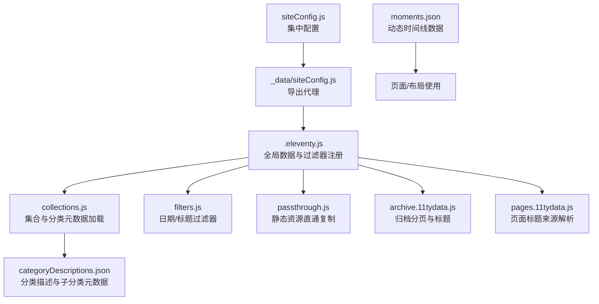
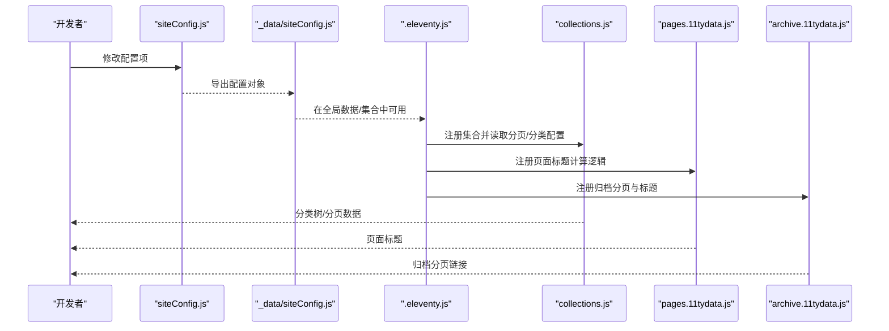
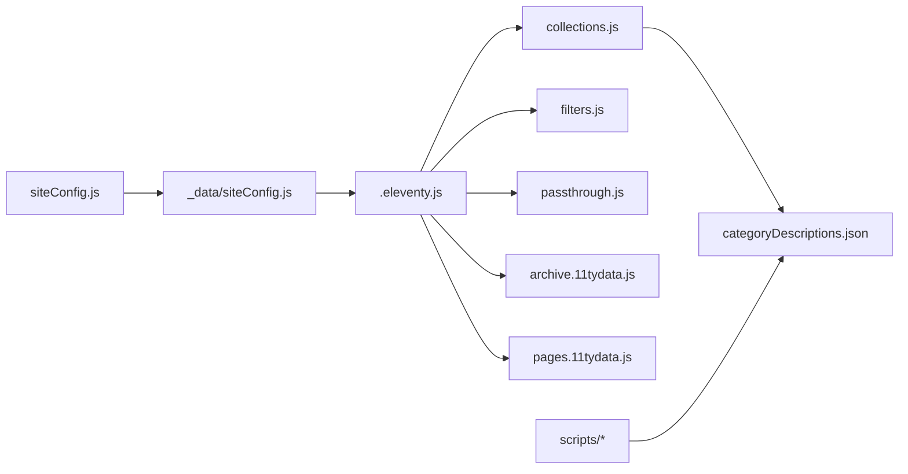

# 配置系统

<cite>
**本文引用的文件**
- [siteConfig.js](file://src/content/settings/siteConfig.js)
- [.eleventy.js](file://.eleventy.js)
- [collections.js](file://eleventy/config/collections.js)
- [filters.js](file://eleventy/config/filters.js)
- [passthrough.js](file://eleventy/config/passthrough.js)
- [categoryDescriptions.json](file://src/content/settings/categoryDescriptions.json)
- [archive.11tydata.js](file://src/content/pages/archive.11tydata.js)
- [pages.11tydata.js](file://src/content/pages/pages.11tydata.js)
- [moments.json](file://src/_data/moments.json)
- [sync-category-meta.js](file://scripts/sync-category-meta.js)
- [manage-categories.js](file://scripts/manage-categories.js)
- [package.json](file://package.json)
</cite>

## 目录
1. [简介](#简介)
2. [项目结构](#项目结构)
3. [核心组件](#核心组件)
4. [架构总览](#架构总览)
5. [详细组件分析](#详细组件分析)
6. [依赖关系分析](#依赖关系分析)
7. [性能考量](#性能考量)
8. [故障排查指南](#故障排查指南)
9. [结论](#结论)
10. [附录](#附录)

## 简介
本文件系统性阐述 11ty RainyNight 的集中式配置管理方案，围绕全站统一配置、Eleventy 构建配置、分类元数据与页面级配置联动展开。重点说明 siteConfig.js 中的配置项（品牌、导航、页脚、元信息、主题、分页、页面文案等）及其在 Eleventy 生命周期中的应用；解释分类描述系统的配置方法、继承与覆盖机制；给出配置变更影响分析与最佳实践，并提供常见场景的配置模板与步骤。

## 项目结构
配置系统由“集中配置 + Eleventy 配置 + 分类元数据 + 页面级配置”构成，通过 _data 导入与集合注册实现跨模板共享与复用。

图表来源
- [siteConfig.js:1-168](file://src/content/settings/siteConfig.js#L1-L168)
- [_data/siteConfig.js:1-2](file://src/_data/siteConfig.js#L1-L2)
- [.eleventy.js:36-181](file://.eleventy.js#L36-L181)
- [collections.js:1-377](file://eleventy/config/collections.js#L1-L377)
- [filters.js:1-43](file://eleventy/config/filters.js#L1-L43)
- [passthrough.js:1-7](file://eleventy/config/passthrough.js#L1-L7)
- [categoryDescriptions.json:1-60](file://src/content/settings/categoryDescriptions.json#L1-L60)
- [archive.11tydata.js:1-22](file://src/content/pages/archive.11tydata.js#L1-L22)
- [pages.11tydata.js:1-31](file://src/content/pages/pages.11tydata.js#L1-L31)
- [moments.json:1-123](file://src/_data/moments.json#L1-L123)

章节来源
- [.eleventy.js:36-181](file://.eleventy.js#L36-L181)
- [siteConfig.js:1-168](file://src/content/settings/siteConfig.js#L1-L168)

## 核心组件
- 集中配置：siteConfig.js 提供品牌、导航、页脚、元信息、主题、分页、页面文案等全站统一配置。
- Eleventy 配置：.eleventy.js 注册插件、过滤器、集合、全局数据与 Markdown 库，定义输入输出目录。
- 分类元数据：categoryDescriptions.json 定义分类与子分类的描述与名称，collections.js 加载并注入到分类节点。
- 页面级配置：archive.11tydata.js、pages.11tydata.js 读取 siteConfig 并覆盖特定页面标题与分页行为。
- 数据与脚本：moments.json 提供动态时间线数据；sync-category-meta.js、manage-categories.js 协助同步与维护分类元数据。

章节来源
- [siteConfig.js:1-168](file://src/content/settings/siteConfig.js#L1-L168)
- [.eleventy.js:36-181](file://.eleventy.js#L36-L181)
- [collections.js:123-143](file://eleventy/config/collections.js#L123-L143)
- [archive.11tydata.js:1-22](file://src/content/pages/archive.11tydata.js#L1-L22)
- [pages.11tydata.js:1-31](file://src/content/pages/pages.11tydata.js#L1-L31)
- [moments.json:1-123](file://src/_data/moments.json#L1-L123)
- [sync-category-meta.js:36-205](file://scripts/sync-category-meta.js#L36-L205)
- [manage-categories.js:63-212](file://scripts/manage-categories.js#L63-L212)

## 架构总览
集中式配置贯穿 Eleventy 生命周期：siteConfig 作为单一真相源，被 _data 代理导出并在集合、过滤器、页面数据中消费；分类元数据与页面数据进一步细化分类展示与页面标题。

图表来源
- [siteConfig.js:1-168](file://src/content/settings/siteConfig.js#L1-L168)
- [_data/siteConfig.js:1-2](file://src/_data/siteConfig.js#L1-L2)
- [.eleventy.js:36-181](file://.eleventy.js#L36-L181)
- [collections.js:219-316](file://eleventy/config/collections.js#L219-L316)
- [pages.11tydata.js:15-30](file://src/content/pages/pages.11tydata.js#L15-L30)
- [archive.11tydata.js:7-21](file://src/content/pages/archive.11tydata.js#L7-L21)

## 详细组件分析

### siteConfig.js 配置项详解
siteConfig.js 采用“键空间分层”的集中配置模式，便于在模板与集合中按需读取。以下为关键键位与职责概览（默认值与可选值以注释说明）：

- brand
  - logoText: 文本型，用于站点 Logo 文案，默认值见配置文件。
  - homeUrl: 字符串，首页路径，默认值见配置文件。
- navigation.main: 数组，每个元素含 text/url，用于主导航菜单。
- footer.copyrightOwner: 版权归属，默认值见配置文件。
- footer.tagline: 副标题/标语，默认值见配置文件。
- footer.socialLinks: 社交链接数组，元素含 text/url/icon。
- meta.title/description/author/email/url/lang: SEO 基础元信息。
- theme.default: 主题默认值（如 light），用于切换主题。
- pagination: 分页配置
  - archivePageSize: 归档分页大小，默认 20。
  - categoryPageSize: 分类页分页大小，默认 10。
  - recordsPageSize: 记录页分页大小，默认 8。
  - labels: 分页标签，包含 previousPage、nextPage、pageIndicator。
- pages.home: 首页文案与入口
  - title: 页面标题。
  - hero.title/subtitle/descriptionLines: 英雄区标题、副标题与描述行。
  - audience.items: 适合人群条目，含 icon/title/description。
  - features.items: 核心入口条目，含 title/description/url。
  - closing.label/headline/description/actionText/actionUrl: 结束语区块。
- pages.categories: 分类总览页
  - title/subtitle/sidebarTitle/docUnit/monthUnit: 标题、副标题、侧边栏标题与单位。
- pages.categoryDetail: 分类详情页
  - allLabel/docUnit/childUnit/backToOverview: 标签与返回链接。
- pages.archive: 全部文档页
  - title/subtitle: 标题与副标题。
- pages.services: 服务说明页
  - title/headerTitle/subtitleBackground/headerMetaLines: 标题层级与元信息行。
  - items: 说明条目数组，含 number/title/description/bullets。
  - cta.title/linkText/linkUrl: 行动号召区块。

使用示例与路径
- 导航与页脚：在布局模板中读取 navigation.footer.socialLinks。
- SEO：在 head.njk 中读取 meta.*。
- 首页内容：在首页模板中读取 pages.home.*。
- 分类页文案：在分类页模板中读取 pages.categories.* 与 pages.categoryDetail.*。

章节来源
- [siteConfig.js:1-168](file://src/content/settings/siteConfig.js#L1-L168)

### Eleventy 配置文件结构与功能
.eleventy.js 的职责包括：
- 插件注册：语法高亮、Mermaid、脚注、GitHub Alerts。
- 静态资源直通复制：通过 passthroughPaths。
- 过滤器注册：日期格式化、标题拼接。
- 集合注册：文章、分类、分类详情页、文件夹分组等。
- 全局数据：对文章默认字段进行推断与补全（标题、子分类、布局、永久链接、发布时间、更新时间、标签、bodyClass、页面样式）。
- Markdown 库：启用 HTML、换行、链接识别与扩展插件。

章节来源
- [.eleventy.js:36-181](file://.eleventy.js#L36-L181)
- [passthrough.js:1-7](file://eleventy/config/passthrough.js#L1-L7)
- [filters.js:1-43](file://eleventy/config/filters.js#L1-L43)
- [collections.js:219-316](file://eleventy/config/collections.js#L219-L316)

### 分类描述系统：配置方法与使用场景
分类描述系统通过两个层面协同：
- 静态元数据：categoryDescriptions.json 定义分类与子分类的描述与名称。
- 动态加载与注入：collections.js 读取该 JSON，规范化结构，将描述注入到分类节点，供分类页与详情页使用。

配置要点
- 分类层级：支持顶级分类与子分类；子分类通过 subcategories 映射。
- 规范化：若元数据为字符串或非对象，将被转换为标准结构；空描述将回退为“暂无简介”。
- 继承与覆盖：当分类页未配置描述时，优先使用子分类元数据，其次使用顶级分类元数据，最后回退默认值。
- 自动同步：sync-category-meta.js 扫描文章目录，自动发现分类与子分类并写入/更新 JSON 文件；manage-categories.js 提供列表、重命名、删除与元数据编辑的命令行工具。

使用场景
- 分类总览页：展示分类标题与描述，辅助用户理解内容组织。
- 分类详情页：展示该分类下的文章列表与分页，同时显示分类描述。
- 子分类展示：在父分类下展示子分类入口与描述，增强导航颗粒度。

章节来源
- [collections.js:123-143](file://eleventy/config/collections.js#L123-L143)
- [collections.js:253-316](file://eleventy/config/collections.js#L253-L316)
- [categoryDescriptions.json:1-60](file://src/content/settings/categoryDescriptions.json#L1-L60)
- [sync-category-meta.js:36-205](file://scripts/sync-category-meta.js#L36-L205)
- [manage-categories.js:63-212](file://scripts/manage-categories.js#L63-L212)

### 页面级配置：标题与分页
- pages.11tydata.js：根据当前页面 slug，从 siteConfig.pages.* 中读取对应标题，若未配置则回退到默认标题。
- archive.11tydata.js：读取 siteConfig.pagination.archivePageSize 作为归档分页大小，生成分页链接。

章节来源
- [pages.11tydata.js:1-31](file://src/content/pages/pages.11tydata.js#L1-L31)
- [archive.11tydata.js:1-22](file://src/content/pages/archive.11tydata.js#L1-L22)

### 数据与脚本：动态时间线与分类元数据维护
- moments.json：提供动态时间线数据，包含日期、条目数组（支持文本、图片、链接、视频等类型）。
- sync-category-meta.js：扫描文章目录，自动发现分类与子分类，写入 categoryDescriptions.json。
- manage-categories.js：提供 CLI 工具，支持列出、重命名、删除分类及设置元数据。

章节来源
- [moments.json:1-123](file://src/_data/moments.json#L1-L123)
- [sync-category-meta.js:36-205](file://scripts/sync-category-meta.js#L36-L205)
- [manage-categories.js:63-212](file://scripts/manage-categories.js#L63-L212)

## 依赖关系分析
配置系统内部依赖关系如下：

图表来源
- [siteConfig.js:1-168](file://src/content/settings/siteConfig.js#L1-L168)
- [_data/siteConfig.js:1-2](file://src/_data/siteConfig.js#L1-L2)
- [.eleventy.js:36-181](file://.eleventy.js#L36-L181)
- [collections.js:1-377](file://eleventy/config/collections.js#L1-L377)
- [filters.js:1-43](file://eleventy/config/filters.js#L1-L43)
- [passthrough.js:1-7](file://eleventy/config/passthrough.js#L1-L7)
- [categoryDescriptions.json:1-60](file://src/content/settings/categoryDescriptions.json#L1-L60)
- [archive.11tydata.js:1-22](file://src/content/pages/archive.11tydata.js#L1-L22)
- [pages.11tydata.js:1-31](file://src/content/pages/pages.11tydata.js#L1-L31)
- [sync-category-meta.js:36-205](file://scripts/sync-category-meta.js#L36-L205)
- [manage-categories.js:63-212](file://scripts/manage-categories.js#L63-L212)

章节来源
- [.eleventy.js:36-181](file://.eleventy.js#L36-L181)
- [collections.js:1-377](file://eleventy/config/collections.js#L1-L377)

## 性能考量
- 集中配置读取：siteConfig 仅在构建时读取一次，避免重复 IO。
- 分类元数据缓存：collections.js 对 JSON 进行一次性解析与规范化，后续集合计算直接复用。
- 分页参数：通过 siteConfig.pagination 控制分页大小，减少单页渲染压力。
- Markdown 渲染：启用必要的插件与选项，平衡功能与性能。
- 静态资源直通：passthrough 复制避免不必要的处理。

[本节为通用指导，无需具体文件分析]

## 故障排查指南
- 文章文件名格式错误
  - 现象：构建时报错，提示文章文件名必须包含 @ 符号。
  - 排查：检查 src/content/posts 下的 .md 文件命名是否符合“标题@分类标识.md”。
  - 参考
    - [.eleventy.js:56-72](file://.eleventy.js#L56-L72)
- 缺失 slug
  - 现象：文章 permalink 依赖 slug，若为空或占位，将回退到 fileSlug。
  - 排查：确认文章 Front Matter 中的 slug 字段或检查自动生成逻辑。
  - 参考
    - [.eleventy.js:102-111](file://.eleventy.js#L102-L111)
- 分类元数据异常
  - 现象：分类描述未生效或报错。
  - 排查：检查 categoryDescriptions.json 是否为有效 JSON；使用 manage-categories.js 或 sync-category-meta.js 修复。
  - 参考
    - [collections.js:63-71](file://eleventy/config/collections.js#L63-L71)
    - [sync-category-meta.js:100-114](file://scripts/sync-category-meta.js#L100-L114)
- 页面标题未按预期显示
  - 现象：页面标题未从 siteConfig.pages.* 读取。
  - 排查：确认页面 slug 与 pages.11tydata.js 中的映射表一致。
  - 参考
    - [pages.11tydata.js:3-9](file://src/content/pages/pages.11tydata.js#L3-L9)

章节来源
- [.eleventy.js:56-72](file://.eleventy.js#L56-L72)
- [.eleventy.js:102-111](file://.eleventy.js#L102-L111)
- [collections.js:63-71](file://eleventy/config/collections.js#L63-L71)
- [sync-category-meta.js:100-114](file://scripts/sync-category-meta.js#L100-L114)
- [pages.11tydata.js:3-9](file://src/content/pages/pages.11tydata.js#L3-L9)

## 结论
RainyNight 的配置系统通过集中式 siteConfig 与 Eleventy 生命周期深度融合，实现了“一处配置、多处生效”。分类描述系统以 JSON 为载体，结合脚本实现自动化与手动维护的双通道，确保分类展示的一致性与可维护性。遵循本文的最佳实践与变更影响分析，可在保证性能的前提下高效迭代站点配置。

[本节为总结，无需具体文件分析]

## 附录

### 配置项默认值与可选值速览
- brand.logoText/homeUrl：字符串，无强制可选值，按需修改。
- navigation.main：数组，元素含 text/url，无强制可选值。
- footer.socialLinks：数组，元素含 text/url/icon，icon 使用 Font Awesome 类名。
- meta：title/description/author/email/url/lang，均为字符串。
- theme.default：字符串，如 "light"。
- pagination：archivePageSize/categoryPageSize/recordsPageSize 为正整数；labels 为字符串模板。
- pages.home.features/items：数组，元素含 title/description/url。
- pages.services.items：数组，元素含 number/title/description/bullets。
- pages.categories/categoryDetail/archive/services：字符串键值，无强制可选值。

章节来源
- [siteConfig.js:1-168](file://src/content/settings/siteConfig.js#L1-L168)

### 配置继承与覆盖机制
- 页面标题：pages.11tydata.js 优先从 siteConfig.pages.* 读取，否则回退到默认标题。
- 分类描述：collections.js 优先使用子分类元数据，其次顶级分类元数据，最后默认值。
- 分页大小：archive.11tydata.js 与 collections.js 分别从 siteConfig.pagination 读取对应分页参数。

章节来源
- [pages.11tydata.js:15-30](file://src/content/pages/pages.11tydata.js#L15-L30)
- [collections.js:253-316](file://eleventy/config/collections.js#L253-L316)
- [archive.11tydata.js:3-5](file://src/content/pages/archive.11tydata.js#L3-L5)

### 常见配置场景与模板
- 新增页面标题
  - 步骤：在 siteConfig.pages.<slug> 下添加 title 字段；或在 pages.11tydata.js 中扩展映射。
  - 参考
    - [siteConfig.js:51-164](file://src/content/settings/siteConfig.js#L51-L164)
    - [pages.11tydata.js:3-9](file://src/content/pages/pages.11tydata.js#L3-L9)
- 调整分页大小
  - 步骤：修改 siteConfig.pagination.archivePageSize/categoryPageSize/recordsPageSize。
  - 参考
    - [siteConfig.js:40-49](file://src/content/settings/siteConfig.js#L40-L49)
    - [archive.11tydata.js:3-5](file://src/content/pages/archive.11tydata.js#L3-L5)
- 添加社交链接
  - 步骤：在 siteConfig.footer.socialLinks 中追加 { text, url, icon }。
  - 参考
    - [siteConfig.js:18-25](file://src/content/settings/siteConfig.js#L18-L25)
- 同步分类元数据
  - 步骤：运行 npm 脚本或调用脚本，自动扫描文章并更新 categoryDescriptions.json。
  - 参考
    - [package.json:6-16](file://package.json#L6-L16)
    - [sync-category-meta.js:36-205](file://scripts/sync-category-meta.js#L36-L205)

章节来源
- [siteConfig.js:18-25](file://src/content/settings/siteConfig.js#L18-L25)
- [siteConfig.js:40-49](file://src/content/settings/siteConfig.js#L40-L49)
- [siteConfig.js:51-164](file://src/content/settings/siteConfig.js#L51-L164)
- [pages.11tydata.js:3-9](file://src/content/pages/pages.11tydata.js#L3-L9)
- [package.json:6-16](file://package.json#L6-L16)
- [sync-category-meta.js:36-205](file://scripts/sync-category-meta.js#L36-L205)