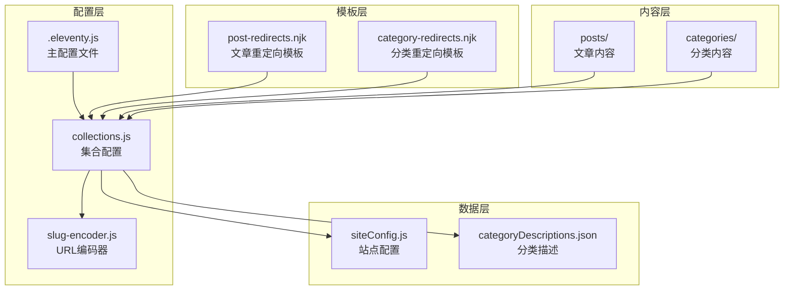
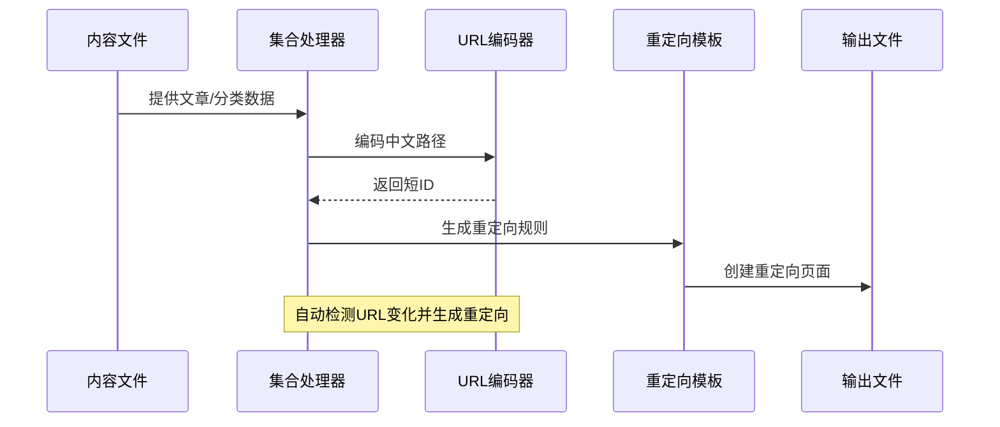
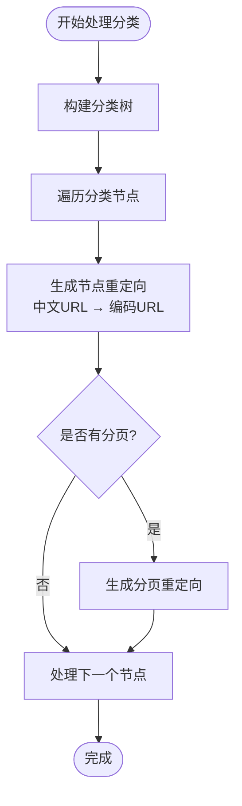
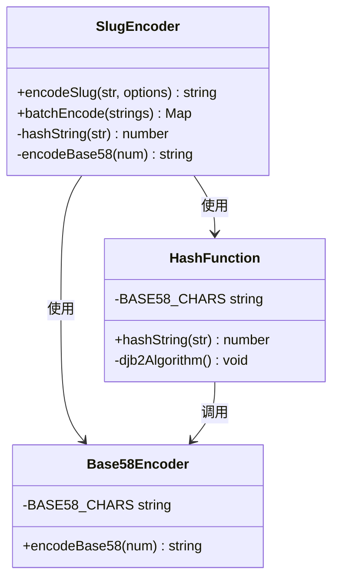

# 重定向系统

<cite>
**本文档引用的文件**
- [.eleventy.js](file://.eleventy.js)
- [collections.js](file://eleventy/config/collections.js)
- [slug-encoder.js](file://eleventy/utils/slug-encoder.js)
- [post-redirects.njk](file://src/content/pages/post-redirects.njk)
- [category-redirects.njk](file://src/content/pages/category-redirects.njk)
- [siteConfig.js](file://src/content/settings/siteConfig.js)
- [categoryDescriptions.json](file://src/content/settings/categoryDescriptions.json)
- [package.json](file://package.json)
</cite>

## 目录
1. [简介](#简介)
2. [项目结构](#项目结构)
3. [核心组件](#核心组件)
4. [架构概览](#架构概览)
5. [详细组件分析](#详细组件分析)
6. [依赖关系分析](#依赖关系分析)
7. [性能考虑](#性能考虑)
8. [故障排除指南](#故障排除指南)
9. [结论](#结论)

## 简介

本项目实现了完整的重定向系统，主要用于处理网站URL结构变更时的平滑过渡。系统通过自动生成旧URL到新URL的重定向规则，确保用户访问历史链接时能够正确跳转到新的页面位置。

重定向系统主要包含两个核心部分：
- **文章重定向**：处理文章URL从基于文件名的旧格式迁移到基于编码的短ID新格式
- **分类重定向**：处理分类页面URL从中文路径迁移到短编码路径

## 项目结构

项目采用标准的11ty静态站点生成器结构，重定向系统分布在以下几个关键位置：



**图表来源**
- [.eleventy.js:11-146](file://.eleventy.js#L11-L146)
- [collections.js:229-462](file://eleventy/config/collections.js#L229-L462)

**章节来源**
- [.eleventy.js:1-146](file://.eleventy.js#L1-L146)
- [collections.js:1-468](file://eleventy/config/collections.js#L1-L468)

## 核心组件

### 重定向集合生成器

系统通过两个专门的集合来生成重定向规则：

#### 文章重定向集合 (`postRedirects`)
- **输入**：所有文章内容文件
- **输出**：从旧URL到新URL的重定向映射
- **触发条件**：当文章URL发生变化时自动创建重定向

#### 分类重定向集合 (`categoryRedirects`)
- **输入**：所有分类节点和分页
- **输出**：从中文URL到编码URL的重定向映射
- **触发条件**：当分类路径或分页结构变化时自动创建重定向

### URL编码系统

系统使用BV风格的短ID编码器，将中文路径转换为短字符串ID：

- **算法**：字符串 → 哈希数字 → Base58编码
- **特点**：去除了容易混淆的字符（0OIl），确保URL友好性
- **前缀**：文章使用'p'前缀，分类使用'c'前缀

**章节来源**
- [collections.js:330-398](file://eleventy/config/collections.js#L330-L398)
- [slug-encoder.js:49-64](file://eleventy/utils/slug-encoder.js#L49-L64)

## 架构概览

重定向系统的整体架构分为四个层次：



**图表来源**
- [collections.js:330-398](file://eleventy/config/collections.js#L330-L398)
- [post-redirects.njk:1-22](file://src/content/pages/post-redirects.njk#L1-L22)
- [category-redirects.njk:1-22](file://src/content/pages/category-redirects.njk#L1-L22)

## 详细组件分析

### 集合配置系统

#### 文章重定向生成逻辑

```mermaid
flowchart TD
Start([开始处理文章]) --> GetPosts[获取所有文章]
GetPosts --> ExtractPath[提取文件路径]
ExtractPath --> ParseFileName[解析文件名]
ParseFileName --> GenerateOldURL[生成旧URL<br/>/posts/{fileSlug}/]
GenerateOldURL --> GetNewURL[获取新URL<br/>post.url]
GetNewURL --> CompareURLs{URL是否相同?}
CompareURLs --> |否| CreateRedirect[创建重定向条目]
CompareURLs --> |是| SkipRedirect[跳过]
CreateRedirect --> AddToCollection[添加到集合]
SkipRedirect --> NextArticle[处理下一篇文章]
AddToCollection --> NextArticle
NextArticle --> End([完成])
```

**图表来源**
- [collections.js:365-398](file://eleventy/config/collections.js#L365-L398)

#### 分类重定向生成逻辑



**图表来源**
- [collections.js:330-363](file://eleventy/config/collections.js#L330-L363)

### URL编码器实现

URL编码器采用多步骤算法确保稳定性和唯一性：



**图表来源**
- [slug-encoder.js:8-98](file://eleventy/utils/slug-encoder.js#L8-L98)

**章节来源**
- [slug-encoder.js:1-98](file://eleventy/utils/slug-encoder.js#L1-L98)

### 重定向模板系统

#### 文章重定向模板

文章重定向模板提供了完整的客户端重定向解决方案：

- **HTML重定向**：使用`<meta http-equiv="refresh">`标签
- **JavaScript重定向**：提供即时跳转能力
- **SEO优化**：设置`<link rel="canonical">`标签
- **用户体验**：显示跳转状态和目标链接

#### 分类重定向模板

分类重定向模板与文章模板类似，但针对分类页面的特点进行了优化。

**章节来源**
- [post-redirects.njk:1-22](file://src/content/pages/post-redirects.njk#L1-L22)
- [category-redirects.njk:1-22](file://src/content/pages/category-redirects.njk#L1-L22)

## 依赖关系分析

重定向系统的关键依赖关系如下：

```mermaid
graph LR
subgraph "外部依赖"
A[@11ty/eleventy<br/>3.1.2]
B[markdown-it<br/>14.1.0]
C[markdown-it-footnote<br/>4.0.0]
D[markdown-it-github-alerts<br/>1.0.1]
end
subgraph "内部模块"
E[.eleventy.js]
F[collections.js]
G[slug-encoder.js]
H[post-redirects.njk]
I[category-redirects.njk]
end
A --> E
B --> E
C --> E
D --> E
E --> F
F --> G
F --> H
F --> I
G --> H
G --> I
```

**图表来源**
- [package.json:24-30](file://package.json#L24-L30)
- [.eleventy.js:11-29](file://.eleventy.js#L11-L29)

**章节来源**
- [package.json:1-37](file://package.json#L1-L37)
- [.eleventy.js:1-146](file://.eleventy.js#L1-L146)

## 性能考虑

### 编码性能优化

1. **哈希算法选择**：使用djb2算法确保快速计算
2. **Base58编码**：减少字符集大小，提高URL可读性
3. **批量处理**：支持批量编码以减少重复计算

### 重定向生成效率

1. **懒加载**：只在需要时生成重定向集合
2. **缓存机制**：利用11ty的缓存系统减少重复计算
3. **增量更新**：只重新生成变化的重定向规则

## 故障排除指南

### 常见问题及解决方案

#### 重定向未生效

**可能原因**：
- 重定向集合未正确注册
- 模板文件路径错误
- 权限问题导致文件无法生成

**解决步骤**：
1. 检查集合注册是否在配置文件中正确调用
2. 验证模板文件的permalink设置
3. 确认输出目录权限

#### URL编码冲突

**可能原因**：
- 不同字符串产生相同的编码结果
- 编码器配置错误

**解决步骤**：
1. 检查编码器的碰撞处理逻辑
2. 验证输入字符串的唯一性
3. 调整编码器参数

#### 性能问题

**可能原因**：
- 重定向集合过大
- 编码计算过于频繁

**解决步骤**：
1. 优化集合过滤条件
2. 实现适当的缓存策略
3. 考虑分批处理大量数据

**章节来源**
- [collections.js:64-72](file://eleventy/config/collections.js#L64-L72)
- [slug-encoder.js:71-90](file://eleventy/utils/slug-encoder.js#L71-L90)

## 结论

本重定向系统通过自动化的方式解决了静态站点URL结构变更带来的兼容性问题。系统具有以下优势：

1. **完全自动化**：无需手动维护重定向规则
2. **智能检测**：自动识别URL变化并生成相应重定向
3. **SEO友好**：提供完整的SEO优化支持
4. **性能优化**：采用高效的编码算法和缓存策略

通过合理的架构设计和实现细节，该系统能够有效支持大型静态站点的URL迁移需求，确保用户体验不受影响的同时保持网站的SEO表现。