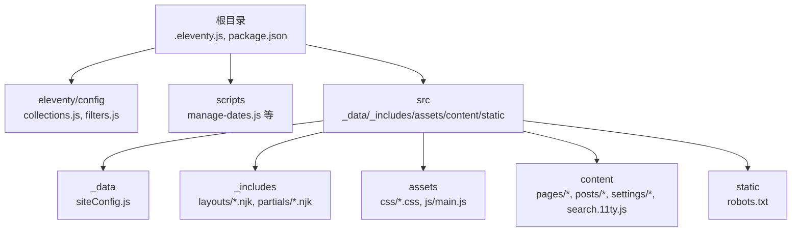
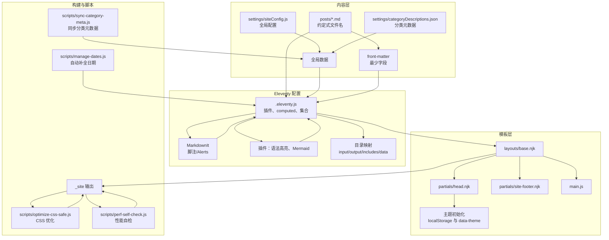
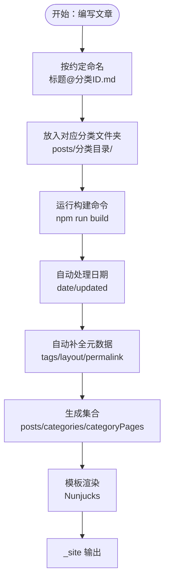
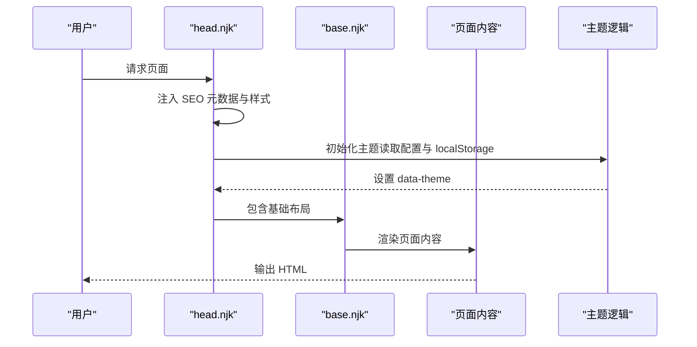
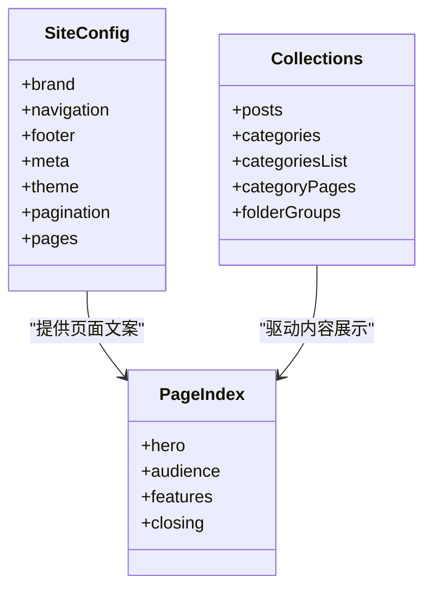
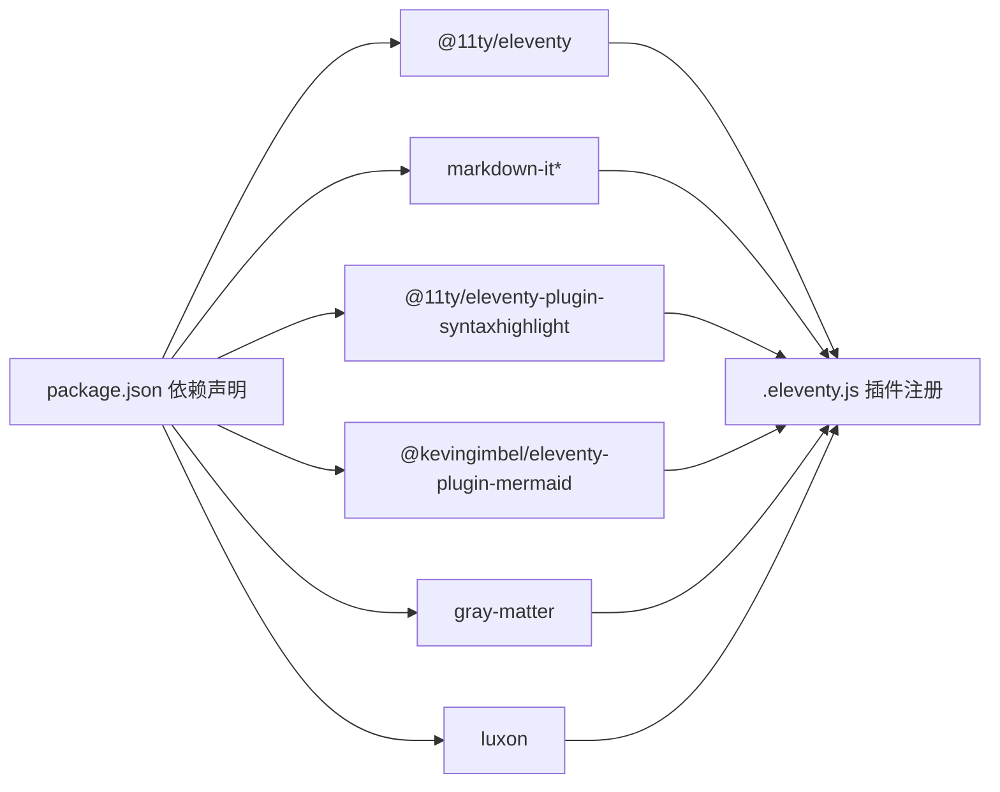

# 项目概述

<cite>
**本文档引用的文件**
- [package.json](file://package.json)
- [.eleventy.js](file://.eleventy.js)
- [collections.js](file://eleventy/config/collections.js)
- [filters.js](file://eleventy/config/filters.js)
- [base.njk](file://src/_includes/layouts/base.njk)
- [head.njk](file://src/_includes/partials/head.njk)
- [siteConfig.js](file://src/_data/siteConfig.js)
- [siteConfig.js](file://src/content/settings/siteConfig.js)
- [categoryDescriptions.json](file://src/content/settings/categoryDescriptions.json)
- [index.njk](file://src/content/pages/index.njk)
- [演示案例 01：前端开发者个人主页@xs.md](file://src/content/posts/项目速览/演示案例 01：前端开发者个人主页@xs.md)
- [style.css](file://src/assets/css/style.css)
- [manage-dates.js](file://scripts/manage-dates.js)
- [README.md](file://README.md)
</cite>

## 目录
1. [引言](#引言)
2. [项目结构](#项目结构)
3. [核心组件](#核心组件)
4. [架构总览](#架构总览)
5. [详细组件分析](#详细组件分析)
6. [依赖关系分析](#依赖关系分析)
7. [性能考虑](#性能考虑)
8. [故障排除指南](#故障排除指南)
9. [结论](#结论)
10. [附录](#附录)

## 引言
本项目是一个基于 Eleventy 静态站点生成器的个人网站搭建演示站，旨在为不同类型的个人网站（如主页、作品集、博客）提供可参考的页面文案、内容组织范式与主题定制方案。项目通过约定式文件命名、自动化元数据处理与 Nunjucks 模板系统，帮助用户以最小的技术成本快速搭建与迭代个人站点。

项目主要用途包括：
- 提供个人网站搭建的参考案例与模板
- 展示内容组织的最佳实践
- 提供主题与样式定制的思路与实现路径
- 通过自动化流程降低写作与维护成本

技术栈选择的优势：
- Eleventy 的静态生成能力：构建速度快、产物可控、SEO 友好
- Markdown 内容管理：专注内容创作，无需关注页面结构
- Nunjucks 模板系统：灵活的布局与组件复用
- 自动化脚本：统一处理日期、分类元数据与构建流程

适用场景与目标用户：
- 自由职业者、设计师、摄影师、插画师、个人开发者等需要展示个人品牌与作品的用户
- 希望快速搭建演示站或原型站的创作者
- 对 SEO、性能与可维护性有要求的个人站点运营者

## 项目结构
项目采用“内容驱动 + 配置集中 + 模板复用”的组织方式，核心目录与职责如下：
- docs：文档说明
- eleventy/config：Eleventy 插件与配置扩展（集合、过滤器、透传复制）
- scripts：构建与维护脚本（日期管理、分类元数据同步、CSS 优化、性能自检）
- src：站点源码
  - _data：全局数据（如站点配置）
  - _includes：模板与布局（layouts、partials）
  - assets：样式与脚本（CSS、JS）
  - content：内容层（pages、posts、settings、search）
  - static：静态资源（如 robots.txt）
- tests：测试用例
- 根目录配置：package.json、.eleventy.js、.gitignore、.npmrc

图表来源
- [.eleventy.js:36-181](file://.eleventy.js#L36-L181)
- [package.json:1-35](file://package.json#L1-L35)

章节来源
- [.eleventy.js:36-181](file://.eleventy.js#L36-L181)
- [package.json:1-35](file://package.json#L1-L35)

## 核心组件
- Eleventy 配置与插件
  - MarkdownIt 配置与插件（脚注、GitHub Alerts）
  - 语法高亮插件
  - Mermaid 图表插件
  - 全局数据与 computed 字段（标题、分类、布局、永久链接、发布时间、更新时间、标签、页面样式）
  - 目录透传复制与集合注册
- 数据与配置
  - 全局站点配置（品牌、导航、页脚、元数据、主题、分页、页面文案）
  - 分类元数据（分类描述与子分类映射）
- 模板系统
  - 基础布局与头部、页脚部件
  - 页面级样式注入与主题切换
- 内容组织
  - 约定式文件命名（标题@分类ID.md）
  - 自动化日期与元数据处理
  - 分类树与分页集合
- 构建与脚本
  - 一键构建链路（更新日期、清理、同步元数据、构建、CSS 优化、性能自检）
  - 分类元数据同步与校验

章节来源
- [.eleventy.js:36-181](file://.eleventy.js#L36-L181)
- [siteConfig.js:1-2](file://src/_data/siteConfig.js#L1-L2)
- [siteConfig.js:1-168](file://src/content/settings/siteConfig.js#L1-L168)
- [categoryDescriptions.json:1-60](file://src/content/settings/categoryDescriptions.json#L1-L60)
- [base.njk:1-20](file://src/_includes/layouts/base.njk#L1-L20)
- [head.njk:1-27](file://src/_includes/partials/head.njk#L1-L27)
- [collections.js:219-371](file://eleventy/config/collections.js#L219-L371)
- [filters.js:1-43](file://eleventy/config/filters.js#L1-L43)
- [manage-dates.js:1-85](file://scripts/manage-dates.js#L1-L85)

## 架构总览
下图展示了从内容到输出的整体架构：内容层通过 Eleventy 的集合与过滤器进行组织，模板层负责渲染，构建脚本完成自动化处理与优化，最终输出静态站点。

图表来源
- [.eleventy.js:36-181](file://.eleventy.js#L36-L181)
- [base.njk:1-20](file://src/_includes/layouts/base.njk#L1-L20)
- [head.njk:1-27](file://src/_includes/partials/head.njk#L1-L27)
- [manage-dates.js:1-85](file://scripts/manage-dates.js#L1-L85)

章节来源
- [.eleventy.js:36-181](file://.eleventy.js#L36-L181)
- [base.njk:1-20](file://src/_includes/layouts/base.njk#L1-L20)
- [head.njk:1-27](file://src/_includes/partials/head.njk#L1-L27)
- [manage-dates.js:1-85](file://scripts/manage-dates.js#L1-L85)

## 详细组件分析

### 内容组织与自动化元数据
- 约定式文件命名：通过“标题@分类ID.md”实现标题与分类的自动提取，减少 front-matter 工作量
- 自动化日期与元数据：构建前自动补全/更新 date 与 updated，自动设置 tags、layout、permalink 等
- 分类与子分类：根据文件夹层级与子分类 ID 生成分类树，支持面包屑与分页

图表来源
- [README.md:33-82](file://README.md#L33-L82)
- [.eleventy.js:56-157](file://.eleventy.js#L56-L157)
- [collections.js:219-316](file://eleventy/config/collections.js#L219-L316)
- [manage-dates.js:16-68](file://scripts/manage-dates.js#L16-L68)

章节来源
- [README.md:33-82](file://README.md#L33-L82)
- [.eleventy.js:56-157](file://.eleventy.js#L56-L157)
- [collections.js:219-316](file://eleventy/config/collections.js#L219-L316)
- [manage-dates.js:16-68](file://scripts/manage-dates.js#L16-L68)

### 模板系统与主题定制
- 基础布局：统一的 HTML 结构、头部、主体与页脚
- 主题切换：通过 data-theme 属性与 localStorage 实现明暗主题切换
- 页面样式注入：按页面动态加载样式表，支持覆盖与扩展
- 头部部件：集中管理 SEO 元数据、字体与样式表

图表来源
- [head.njk:1-27](file://src/_includes/partials/head.njk#L1-L27)
- [base.njk:1-20](file://src/_includes/layouts/base.njk#L1-L20)

章节来源
- [head.njk:1-27](file://src/_includes/partials/head.njk#L1-L27)
- [base.njk:1-20](file://src/_includes/layouts/base.njk#L1-L20)

### 页面与集合
- 首页：展示站点标语、受众画像、核心入口与行动号召
- 分类与详情：按分类树展示文章列表、分页与面包屑
- 页面样式：通过 pageStyles 注入特定页面的样式资源

图表来源
- [siteConfig.js:1-168](file://src/content/settings/siteConfig.js#L1-L168)
- [collections.js:219-371](file://eleventy/config/collections.js#L219-L371)
- [index.njk:1-94](file://src/content/pages/index.njk#L1-L94)

章节来源
- [siteConfig.js:1-168](file://src/content/settings/siteConfig.js#L1-L168)
- [collections.js:219-371](file://eleventy/config/collections.js#L219-L371)
- [index.njk:1-94](file://src/content/pages/index.njk#L1-L94)

### 示例文章与页面样式
- 示例文章：通过“演示案例 01：前端开发者个人主页@xs.md”展示如何在不同角色场景下组织页面内容
- 页面样式：通过 style.css 统一引入基础、布局、组件、告警与代码样式

章节来源
- [演示案例 01：前端开发者个人主页@xs.md:1-28](file://src/content/posts/项目速览/演示案例 01：前端开发者个人主页@xs.md#L1-L28)
- [style.css:1-6](file://src/assets/css/style.css#L1-L6)

## 依赖关系分析
- Eleventy 核心：@11ty/eleventy
- Markdown 解析：markdown-it、markdown-it-footnote、markdown-it-github-alerts
- 语法高亮：@11ty/eleventy-plugin-syntaxhighlight
- Mermaid 支持：@kevingimbel/eleventy-plugin-mermaid
- 数据处理：gray-matter
- 时间处理：luxon

图表来源
- [package.json:22-33](file://package.json#L22-L33)
- [.eleventy.js:4-11](file://.eleventy.js#L4-L11)

章节来源
- [package.json:22-33](file://package.json#L22-L33)
- [.eleventy.js:4-11](file://.eleventy.js#L4-L11)

## 性能考虑
- 构建链路优化：通过单一构建命令串联日期更新、清理、同步元数据、构建、CSS 优化与性能自检，减少人工干预
- 样式组织：通过 style.css 统一引入，便于后续按需裁剪与缓存
- 主题切换：通过 data-theme 与 localStorage，避免运行时复杂计算
- 分页与集合：合理设置分页大小，降低单页渲染压力

## 故障排除指南
- 文章文件名格式错误：必须包含“@”符号，格式为“标题@分类ID.md”，否则构建时报错
- 缺失 slug：若未设置 slug，系统会尝试使用文件名派生；若仍不可用，需手动设置
- 更新时间未生效：确认文件修改时间与发布日期间隔超过阈值，且文件确实被修改
- 分类元数据缺失：运行分类元数据同步脚本，补充 categoryDescriptions.json 中的描述

章节来源
- [.eleventy.js:56-72](file://.eleventy.js#L56-L72)
- [.eleventy.js:102-111](file://.eleventy.js#L102-L111)
- [manage-dates.js:32-55](file://scripts/manage-dates.js#L32-L55)
- [README.md:120-137](file://README.md#L120-L137)

## 结论
本项目以 Eleventy 为核心，结合约定式命名、自动化元数据与 Nunjucks 模板系统，提供了一套可复用、可定制的个人网站搭建方案。通过清晰的页面结构、完善的分类与分页机制，以及一键化的构建流程，既能满足初学者快速上手的需求，也能为有经验的开发者提供可扩展的技术基座。

## 附录
- 开发与构建命令参考见根目录 README
- 站点配置与分类元数据位置见“站点配置”与“分类简介”说明