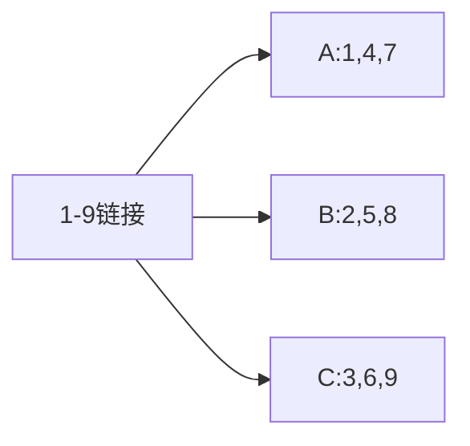
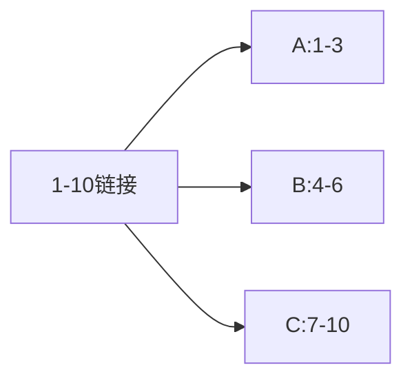
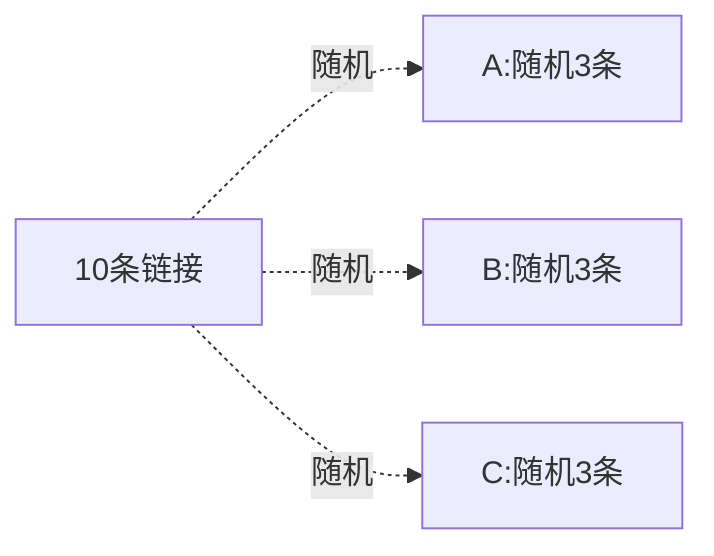

## 上货分配规则说明

### 共同上货

- 放入 59 条链接，选择 A、B、C 3 个店铺
- 每个店铺**全部使用这 59 条链接**
- 最终：3 个任务，每个任务都含 59 条商品

### 平均上货 - 循环分配

- 放入 9 条链接，3 个店铺
- 按顺序轮流分配：1→A，2→B，3→C，4→A，5→B…

### 平均上货 - 整批顺序分配

- 放入 10 条链接，3 个店铺
- 按顺序整段划分，最后一个店铺拿剩余

### 平均上货 - 整批随机分配

- 放入 10 条链接，3 个店铺
- 每个店铺从总链接中**随机抽取固定条数**

