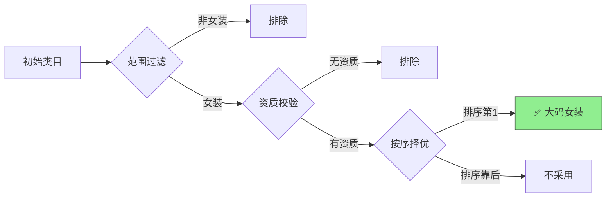

## 功能位置

## 功能用途：
业务背景：
因发布类目为官方推荐类目，无法自行指定。但官方有时会出现推荐异常，推送与实际发布内容不符的类目。

- 例：发布零食，却被推荐至零食收纳架类目

- 例：发布普通内衣，却被推送至成人类目

基于上述问题，**可通过该功能先选定理想的发布类目。若官方推荐的类目包含所选类目，即可正常发布**；若全部推荐类目均不符合指定范围或无对应资质，则跳过上传流程。

---

## 场景举例

当您指定商品发布类目后，系统将按照「**先过滤范围→再校验资质→最后按序择优**」的规则，自动为商品匹配合规的发布类目，确保商品可正常上架。

