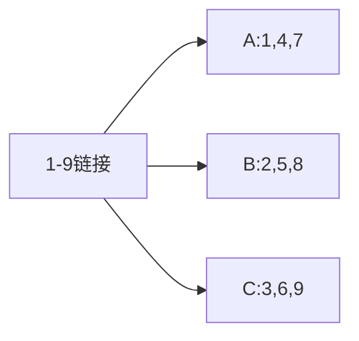
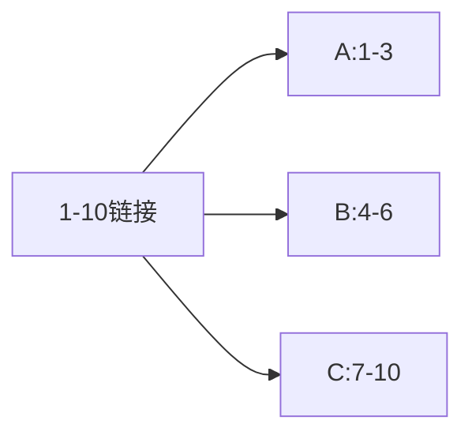
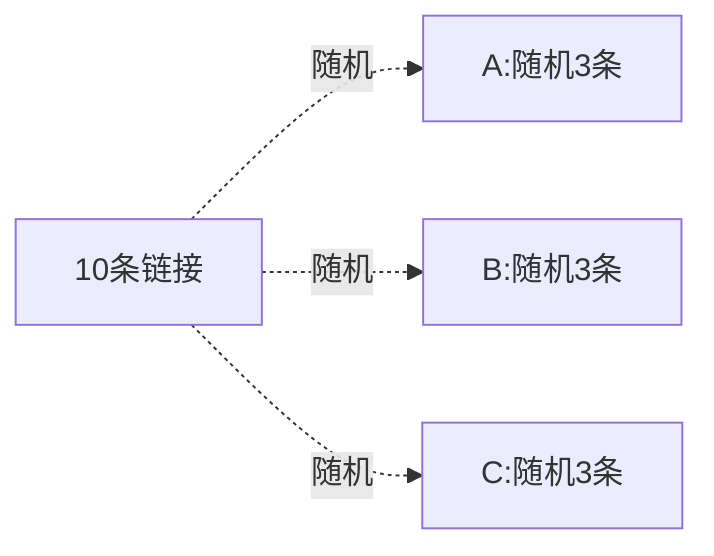

## 价格运算公式（非梯度）

> [!NOTE]商品价格是怎么运算出来的？
> 答：通过商品原价进行锚定并执行运算的。任务参数如下图

### 场景假设

如原商品包含两个SKU：

1. 小号：原价19元，促销价12元

2. 大号：原价29元，促销价19元

经运算后结果分别为：
小号：按促销价12元计算（12×1+100=112）
大号：按促销价19元计算（19×1+100=119）

## 价格运算公式 （梯度价格公式）

> [!NOTE]商品价格是怎么运算出来的？
>
> 答：通过商品原价进行锚定并执行运算的。任务参数如下图

### 场景假设：

如原商品包含两个SKU：

1. 小号：原价19元，促销价12元
2. 大号：原价29元，促销价19元

经运算得出结果如下：
小号：商品原价为19元，代入第一条价格公式，按促销价12元计算（12×2+0=24）
大号：商品原价为29元，代入第二条价格公式，按一口价29元计算（29×3+0=57）

---

## 商家编码

> [!NOTE]商家编码有什么用？
> 答：用于查询原商品信息的 ； 部分拍单软件 会以此进行上家信息查询。
>
> **存放位置**：前往店铺后台，找到对应商品 并进行编辑

---

## 复制方案：链接分配形式

## 上货分配规则说明

### 共同上货

- 放入 59 条链接，选择 A、B、C 3 个店铺
- 每个店铺**全部使用这 59 条链接**
- 最终：3 个任务，每个任务都含 59 条商品

### 平均上货 - 循环分配

- 放入 9 条链接，3 个店铺
- 按顺序轮流分配：1→A，2→B，3→C，4→A，5→B…

### 平均上货 - 整批顺序分配

- 放入 10 条链接，3 个店铺
- 按顺序整段划分，最后一个店铺拿剩余

### 平均上货 - 整批随机分配

- 放入 10 条链接，3 个店铺
- 每个店铺从总链接中**随机抽取固定条数**

