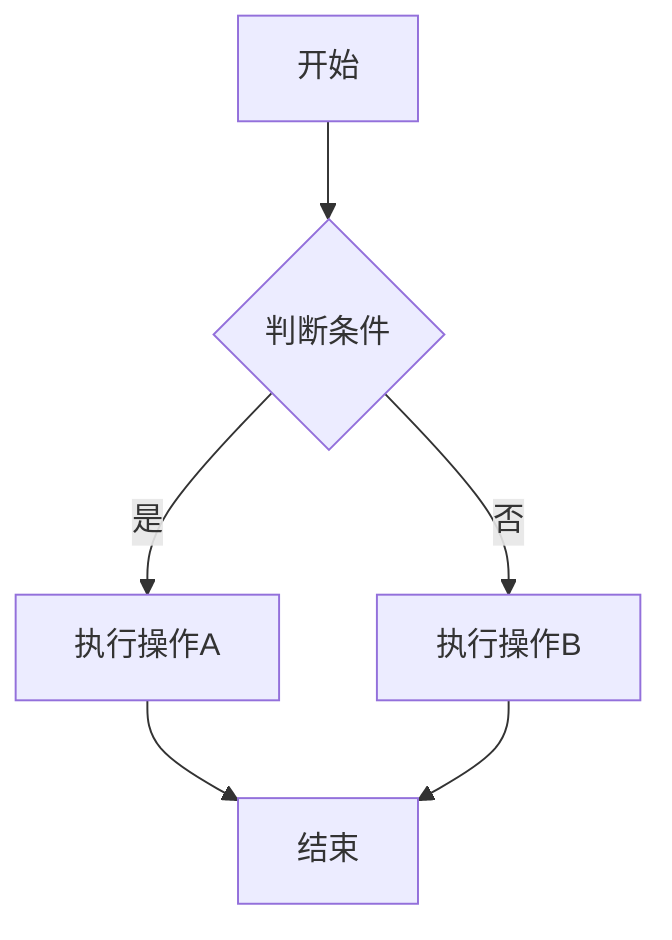
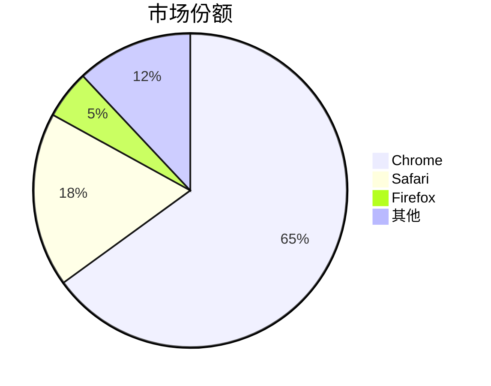

# Markdown 语法完整演示

这是一篇展示所有 Markdown 语法的文档，用于测试主题的渲染效果。

## 1. 标题 Heading

### 三级标题

#### 四级标题

##### 五级标题

###### 六级标题

---

## 2. 文本格式

**这是加粗文本**

*这是斜体文本*

***这是加粗斜体文本***

~~这是删除线文本~~

==这是高亮文本==

^这是上标^

~这是下标~

---

## 3. 按键和键盘快捷键

### 单个按键

- 按 `Enter` 键确认
- 按 `Space` 键继续
- 按 `Esc` 键退出
- 按 `Delete` 键删除
- 按 `Tab` 键切换

### 组合按键

- 保存文件：`Ctrl` + `S`
- 复制内容：`Ctrl` + `C`
- 粘贴内容：`Ctrl` + `V`
- 撤销操作：`Ctrl` + `Z`
- 刷新页面：`Ctrl` + `R` 或 `F5`
- 打开终端：`Ctrl` + `` ` ``
- 切换窗口：`Alt` + `Tab`

### macOS 组合键

- 保存文件：`Cmd` + `S`
- 复制内容：`Cmd` + `C`
- 粘贴内容：`Cmd` + `V`
- 切换应用：`Cmd` + `Tab`

---

## 4. 列表

### 无序列表

- 第一个列表项
- 第二个列表项
  - 嵌套列表项 A
  - 嵌套列表项 B
- 第三个列表项

* 使用星号的列表
* 另一个星号项

+ 使用加号的列表
+ 另一个加号项

### 有序列表

1. 第一步
2. 第二步
3. 第三步

### 任务列表

- [x] 已完成的任务
- [x] 第二个已完成
- [ ] 待办事项
- [ ] 第三个待办

---

## 5. 引用

> 这是单行引用
> 可以换行继续

> ## 引用中可以放标题
> 
> - 也可以放列表
> - 第二项
> 
> **加粗文本**和*斜体文本*

---

## 6. 代码

### 行内代码

在命令行中输入 `npm install` 来安装依赖。

使用 `const x = 1` 定义常量。

### 代码块

```javascript
// JavaScript 示例
function greet(name) {
  console.log(`Hello, ${name}!`);
  return true;
}

const arr = [1, 2, 3];
const doubled = arr.map(x => x * 2);
```

```python
# Python 示例
def greet(name: str) -> str:
    """打招呼函数"""
    return f"Hello, {name}!"

numbers = [1, 2, 3]
doubled = [x * 2 for x in numbers]
```

```bash
# Bash 脚本
npm run build
git commit -m "fix: 修复问题"
curl -X POST https://api.example.com
```

```html
<!-- HTML 示例 -->
<div class="container">
  <h1>标题</h1>
  <p>段落文本</p>
</div>
```

```css
/* CSS 示例 */
.button {
  background-color: #3498db;
  color: white;
  padding: 10px 20px;
  border-radius: 4px;
}
```

---

## 7. 表格

### 基础表格

| 语言 | 年份 | 创始人 |
|------|------|--------|
| JavaScript | 1995 | Brendan Eich |
| Python | 1991 | Guido van Rossum |
| Rust | 2010 | Graydon Hoare |
| Go | 2009 | Google 团队 |

### 对齐表格

| 左对齐 | 居中 | 右对齐 |
|:-------|:----:|-------:|
| 内容1 | 内容2 | 内容3 |
| 内容4 | 内容5 | 内容6 |

### 复杂表格

| 功能 | 按键 | 说明 |
|------|------|------|
| 保存 | `Ctrl` + `S` | 保存当前文件 |
| 打开 | `Ctrl` + `O` | 打开文件对话框 |
| 关闭 | `Ctrl` + `W` | 关闭当前窗口 |
| 新建 | `Ctrl` + `N` | 创建新文件 |

---

## 8. 分割线

---

上面是分割线

***

下面是另一条分割线

---

## 9. 链接

### 普通链接

[访问 GitHub](https://github.com)

[百度](https://www.baidu.com)

### 引用链接

这是一个 [示例链接][example]，可以在下方定义。

[example]: https://example.com "示例链接标题"

### 图片


---

## 10. 脚注

这里有一个脚注[^1]。

这里有另一个脚注[^2]。

[^1]: 这是第一个脚注的内容。
[^2]: 这是第二个脚注的内容，可以包含**格式**和*斜体*。

---

## 11. 定义列表

Markdown
: 一种轻量级标记语言

Eleventy
: 简单的静态站点生成器

JavaScript
: 一种脚本语言，主要用于 Web 开发

---

## 12. 警告框 (GitHub Alerts)

> [!NOTE]
> 这是一个提示框，用于突出显示有用的信息。

> [!TIP]
> 这是一个技巧框，提供有用的建议。

> [!IMPORTANT]
> 这是一个重要提示，提醒用户注意关键信息。

> [!WARNING]
> 这是一个警告，提醒用户注意潜在问题。

> [!CAUTION]
> 这是一个谨慎提示，警告用户可能的风险。

---

## 13. Mermaid 图表





---

## 14. 嵌套列表

1. 第一级
   - 第二级 A
     - 第三级 A1
     - 第三级 A2
   - 第二级 B
2. 第二级
   - 嵌套项

---

## 结束语

以上就是 Markdown 语法的完整演示，包括：

- 各种文本格式
- 按键和快捷键展示
- 代码高亮
- 表格和列表
- 引用和分割线
- 链接和图片
- 脚注和定义列表
- 警告框
- Mermaid 图表

> [!TIP]
> 你可以基于这个模板创建更多内容！
按 <kbd>Ctrl</kbd>+<kbd>C</kbd> 复制，<kbd>Enter</kbd> 确认